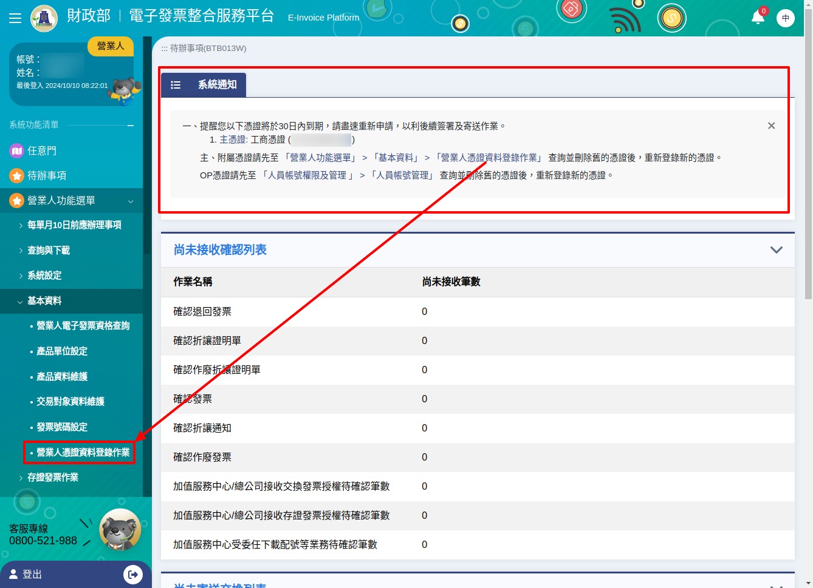
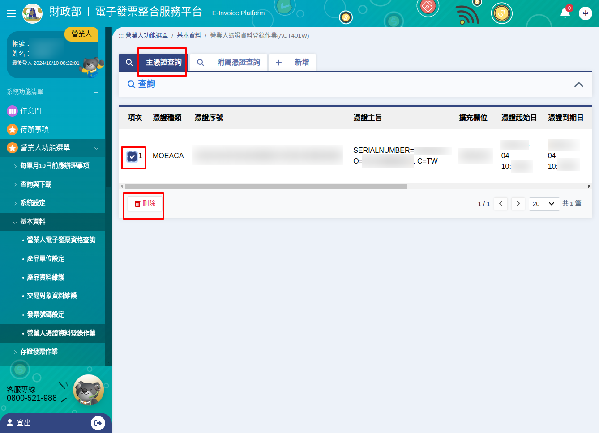
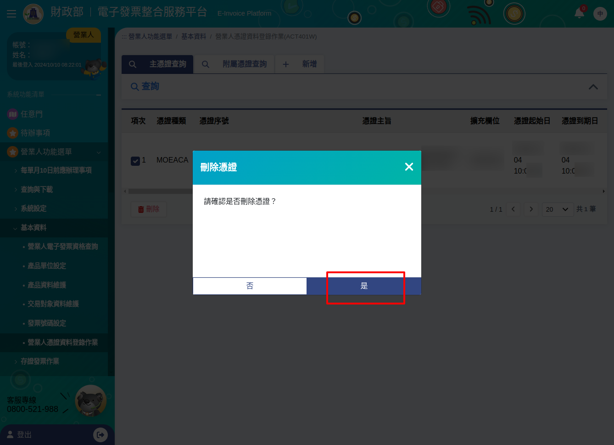
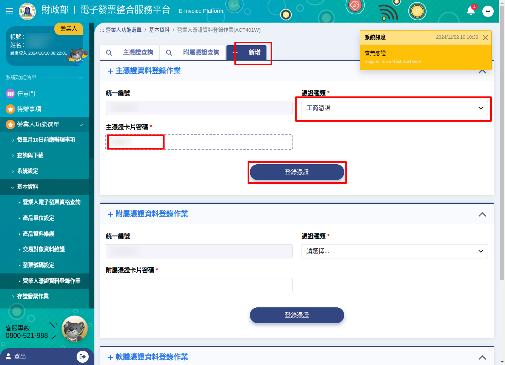
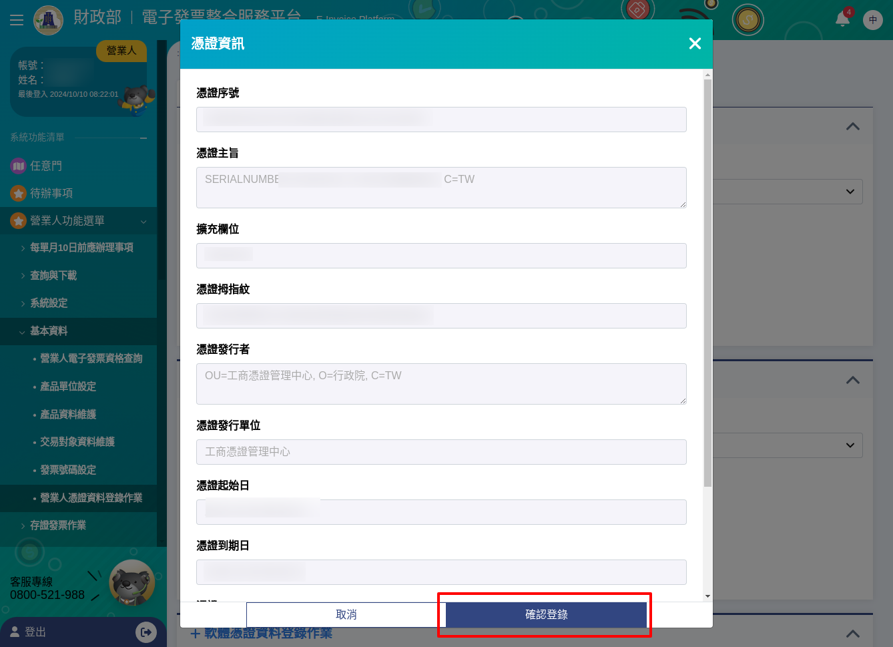

.. _營業人憑證資料登錄作業:

主憑證、附屬憑證登錄作業
-------------------------------------------------------------------------------

路徑位置: *營業人功能選單 > 基本資料 > 營業人憑證資料登錄作業* 。

主憑證有:

* 工商憑證
* 工商憑證(附卡授權)
* 政府憑證
* 組織及團體憑證
* 自然人憑證

附屬憑證有:

* 工商憑證(附卡或附卡授權)
* 政府憑證(附卡)
* 組織及團體憑證(附卡)
* 自然人憑證
* 軟體憑證

主憑證僅能登錄一張，若已存在又要新增新的主憑證，須先刪除當前主憑證再新增，這通常發生在憑證失效須更新的情況。新增附屬憑證時，須使用登錄的主憑證驗證權限。

主憑證、附屬憑證都可用來簽章電子發票，如果公司比較大，負責開發票的人比較多，\
其他人也可以使用「工商憑證附卡」或是個人的「自然人憑證」來做簽章。

主憑證登錄作業
-------------------------------------------------------------------------------

主憑證若用的是「工商憑證」，而工商憑證有效期為 5 年且無法續用，所以每過 5 年，\
主憑證就需要新增新的工商憑證。

主憑證快到期前 60 天， EI 會主動寄信通知，或是管理員在登入 EI 大平台時，也會顯示訊息。

    EI 大平台的系統通知

在 *主憑證查詢* 頁籤，會列出目前的主憑證，如無紀錄，可直接新增，若主憑證快到期或已到期，\
則是先刪除現有主憑證紀錄，再新增新的有效主憑證。

    勾選快到期或已到期主憑證，再按下刪除鈕

    再次確認是否刪除?

    新增時，主憑證須有效，且卡片密碼須正確

    成功讀取主憑證卡片後，再確認登錄

登錄主憑證後，即可在 EI 大平台上，新增附屬憑證或是開立 B2B 電子發票。