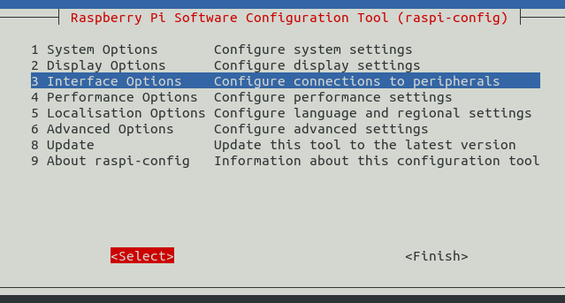
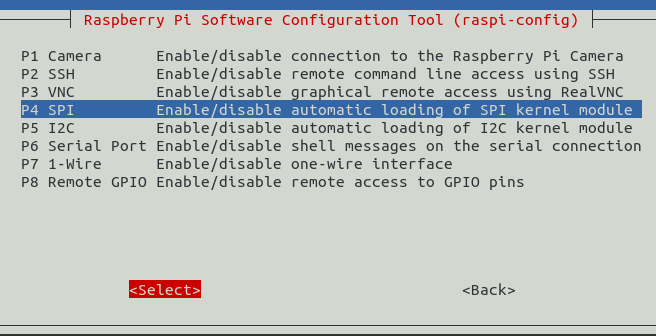
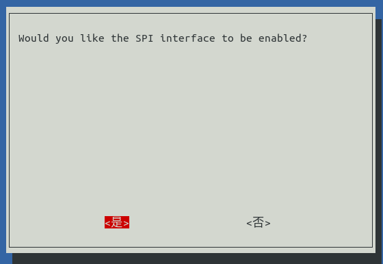
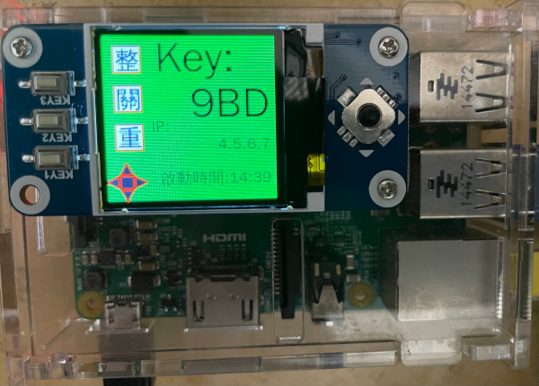

EPW / TKW / TE 架構
===============================================================================

TE 是一個 django-based 的 python app ，可直接以 Web Api 方式執行，或是導入至其他 django-based 的專案中。\
TE 支援 WebSocket 模式，當 EPW 系統開機後，會連線至 TE Web Api 或 CEC 中，由 TE 提供的 Web Api 。\
當 TE 有列印發票的指令，其包含的發票資料格式為 JSON ，會透過 WebSocket 傳至 EPW ， EPW 再將發票 JSON 轉譯為 esc 指令，\
再送至系統 OS 所控管的 thermal esc printer 。

當 TE 要上傳發票至 EI 大平台時，一樣先由 TKW 以 WebSocket 模式連線至 TE Web Api 或 CEC 中，由 TE 提供的 Web Api 。\
TE 以 WebSocket 模式傳送要上傳的發票 JSON 給 TKW ， TKW 會將發票 JSON 轉成 MIG 標準的 xml ，並存入 Turnkey 系統，\
由 Turnkey 系統負責與 EI 大平台的發票上傳作業。

安裝設定 EPW
-------------------------------------------------------------------------------

建議使用 raspberry pi + Linux OS 為 EPW 的伺服器，\
雖然 EPW 是由 django-based 程式碼及相關 python 函式庫所組成的應用程式，\
要在其他 x86, x86_64 硬體上執行也是可以運作的。作業系統使用 Linux-based OS 即可直接套用；\
若要在 Windows 上，則需修改部份硬體控制相關的程式碼。\
考慮長期運作的高可用性，還是應以 pi 來執行 EPW 。

EPW 目前僅支援 USB 介面的 ESC/POS 印表機，詳細請參考 python-escpos 的支援清單，而有實機測試過的機型僅有 TM-T88IV 及 TM-T88V 。

安裝 raspberry OS 時，須將時區設為 Asia/Taipei

ESC/POS 印表機設定
^^^^^^^^^^^^^^^^^^^^^^^^^^^^^^^^^^^^^^^^^^^^^^^^^^^^^^^^^^^^^^^^^^^^^^^^^^^^^^^

1. 將執行 EPW 的用戶帳號加入到 lp, lpadmin 群組
    * .. code-block:: sh

        $ sudo adduser <EPW_account> lp
        $ sudo adduser <EPW_account> lpadmin
#. 自動讓 ESC/POS 印表機在插入 USB 後，權限可分享至 lp 群組
    * .. code-block:: text

        # in /etc/udev/rules.d/50-usb_escpos_printer.rules
        # 04b8, 0202 是 TM-T88IV 及 TM-T88V 的裝置參數，其他型請參照原廠文件
        SUBSYSTEMS=="usb", ATTRS{idVendor}=="04b8", ATTRS{idProduct}=="0202", GROUP="lp", MODE="0666"

Set up EPW Service
^^^^^^^^^^^^^^^^^^^^^^^^^^^^^^^^^^^^^^^^^^^^^^^^^^^^^^^^^^^^^^^^^^^^^^^^^^^^^^^

.. code-block:: sh

    $ sudo update-alternatives --install /usr/bin/python python $(readlink -f $(which python3.7)) 3 # set python3 as default
    $ sudo apt install build-essential libssl-dev libffi-dev python3-dev cargo aptitude python-virtualenv python3-virtualenv sqlite3 ttf-wqy-zenhei mlocate
    $ git clone git@github.com:ho600-ltd/django-taiwan-einvoice.git
    $ virtualenv -p python3 django-taiwan-einvoice.py3env
    $ source django-taiwan-einvoice.py3env/bin/activate
    $ pip install -r django-taiwan-einvoice/requirements.txt
    $ pip install -r django-taiwan-einvoice/escpos_web/requirements.txt
    $ pip install ipython
    $ cd django-taiwan-einvoice/escpos_web/
    $ ./manage.py migrate
    $ ./manage.py shell # create "te_web object". The url, slug, hash_key should be set from TE service
    $ cp -rf django-taiwan-einvoice/escpos_web/*.conf /etc/supervisor/conf.d/ # then update the wss url
    $ sudo apt install supervisor
    $ sudo supervisorctl reread
    $ sudo supervisorctl start all

Display with waveshare LCD(Optional)
...............................................................................

設定 SPI 介面:

.. code-block:: sh

    $ sudo aptitude upgrade -y
    $ sudo apt-get install libatlas-base-dev
    $ sudo raspi-config
    Choose Interfacing Options -> SPI -> Yes  to enable SPI interface

    選擇介面選項

    選擇 SPI

    啟用 SPI

重開機，以啟用 SPI:

.. code-block:: sh

    $ sudo reboot

安裝 BCM2835 函式庫( http://www.airspayce.com/mikem/bcm2835/bcm2835-1.71.tar.gz )

.. code-block:: sh

    $ wget http://www.airspayce.com/mikem/bcm2835/bcm2835-1.71.tar.gz
    $ tar -zxf bcm2835-1.71.tar.gz
    $ cd bcm2835-1.71
    $ ./configure && make && sudo make check && sudo make install

啟用 lcd_control service:

.. code-block:: sh

    $ sudo cp -rf ~/django-taiwan-einvoice/escpos_web/lcd_control.conf /etc/supervisor/conf.d/
    $ sudo supervisorctl reread
    $ sudo supervisorctl restart all
    lcd_control:asgi0: stopped
    print_receipt:asgi0: stopped
    check_printer_status:asgi0: stopped
    lcd_control:asgi0: started
    print_receipt:asgi0: started
    check_printer_status:asgi0: started

LCD 顯示成果:

    IP: 4.5.6.7 為出口 IP

TE supports ASGI with daphne, supervisor and nginx
^^^^^^^^^^^^^^^^^^^^^^^^^^^^^^^^^^^^^^^^^^^^^^^^^^^^^^^^^^^^^^^^^^^^^^^^^^^^^^^

.. code-block:: sh

    $ sudo apt install nginx supervisor
    $ sudo mkdir /run/daphne/
    $ sudo chown jenkins:jenkins /run/daphne/ # I use jenkins user to execute app
    $ cat << 'EOF' > /usr/lib/tmpfiles.d/daphne.conf
    d /run/daphne 0755 jenkins jenkins
    EOF

.. code-block:: text

    #/etc/supervisor/conf.d/my-site.com.conf
    [fcgi-program:my_site]
    # TCP socket used by Nginx backend upstream
    socket=tcp://localhost:8001

    # Directory where your site's project files are located
    directory=/var/www/my-site.com

    # Each process needs to have a separate socket file, so we use process_num
    # Make sure to update "mysite.asgi" to match your project name
    command=/var/www/my-site.com-py3-env/bin/daphne -u /run/daphne/daphne%(process_num)d.sock --fd 0 --access-log - --proxy-headers my_site.asgi:application

    # Number of processes to startup, roughly the number of CPUs you have
    numprocs=4

    # Give each process a unique name so they can be told apart
    process_name=asgi%(process_num)d

    # Automatically start and recover processes
    autostart=true
    autorestart=true

    # Choose where you want your log to go
    stdout_logfile=/var/www/my-site.com.asgi.log
    redirect_stderr=true

.. code-block:: sh

    $ sudo supervisorctl reread
    $ sudo supervisorctl update

.. code-block:: text

    #/etc/nginx/site-enabled/my-site.conf
    server {
        server_name     www.my-site.com;
        access_log      /var/log/nginx/my-site.log;
        error_log       /var/log/nginx/my-site_error.log;

        listen          443 ssl;       # Listen on port 80 for IPv4 requests

        include         /native-nginx/conf.d/ssl.conf;
        ssl_certificate /native-nginx/certs/my-site.com/fullchain.pem; # managed by Certbot
        ssl_certificate_key /native-nginx/certs/my-site.com/privkey.pem; # managed by Certbot

        add_header      Content-Security-Policy "frame-ancestors 'self' hwww.my-site.com hwww.bio-pipe.com";

        location / {
            proxy_pass http://127.0.0.1:8001;
            proxy_http_version 1.1;
            proxy_set_header Upgrade $http_upgrade;
            proxy_set_header Connection "upgrade";
            proxy_read_timeout 631;
            proxy_send_timeout 631;
            proxy_set_header    Host $host;
            proxy_set_header    X-Real-IP $remote_addr;
            proxy_set_header    X-Forwarded-For $remote_addr;
            proxy_set_header    REMOTE_ADDR $remote_addr;
            proxy_set_header    HTTP_HOST $host;
        }
    }

.. code-block:: sh

    $ sudo nginx -t
    $ sudo systemctl restart nginx

讓 EPW 支援 Web API 關機
^^^^^^^^^^^^^^^^^^^^^^^^^^^^^^^^^^^^^^^^^^^^^^^^^^^^^^^^^^^^^^^^^^^^^^^^^^^^^^^

先讓 EPW 在每次開機時，產製出驗證碼，供 Web API 執行時驗證用:

.. code-block:: sh

    $ sudo su -
    $ cat << 'EOF' > /etc/rc.local
    #!/bin/sh -e

    date "+%Y%m%d%H%M%S.%N Whatever words" | md5sum > /var/run/boot_random_seed

    exit 0

    EOF
    $ exit
    $ chmod a+x /etc/rc.local