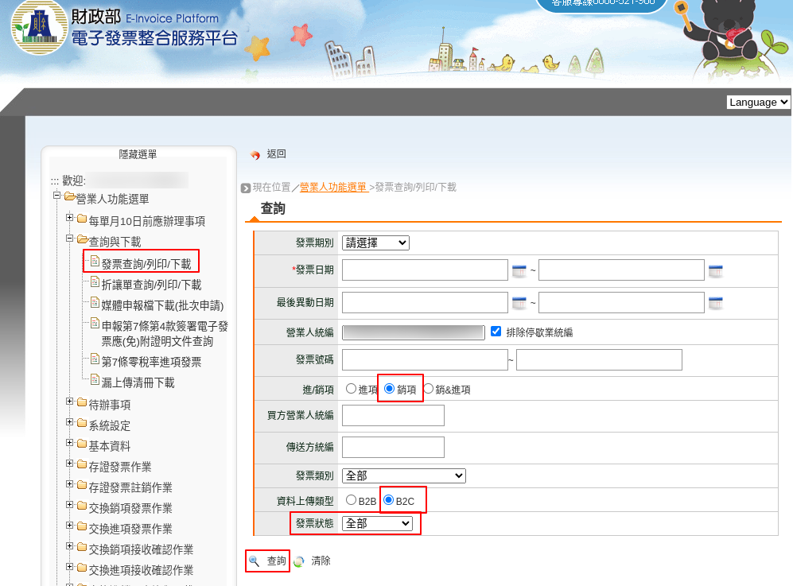

B2C電子發票相關的檢查表及標準作業流程(SOP)
===============================================================================

執行檢查表時，項目有確認請打「勾/✔️」，不確認就打「叉/❌」。

.. note::
    
    SOP 在執行時，因本身設計就有問題的話，請提出討論。 SOP 不是定死的。

匯入字軌號碼
-------------------------------------------------------------------------------

執行時機應在雙數月 20 日至該月月底之間。

===== ==========================================================================
確認  檢查項目
===== ==========================================================================
□     直接從大平台下載的 .csv ，且未經人工編輯
□     比對 .csv 中的營業人統編、期別格式(年3碼/月2碼)、字軌(2位英文字)、起號(8位數)、迄號(8位數)
□     匯入成功後，只保留給「臺灣電子發票管理系統」使用的字軌號碼，其餘則刪除
===== ==========================================================================

以上項目若有「叉」出現，且無法調整得到「勾」，請執行「 **檢核不通過 SOP** 」:

#. 創建「字軌號碼」任務的 ticket ，說明「何項檢查項目」無法通過並附上 .csv 檔，再交由「資訊人員」接手處理

列印發票證明聯
-------------------------------------------------------------------------------

執行時機應在開立電子發票後。

===== ==========================================================================
確認  檢查項目
===== ==========================================================================
□     無載具、無捐贈、無統編的電子發票一定要列印後，才會啟動上傳大平台程序
□     檔頭只顯示「電子發票證明聯」而無「補印」字樣，即為正本
□     只能保留一份「電子發票證明聯正本」，如有多張正本，只留一份，其餘皆須在檔頭證明聯處蓋上「作廢」
□     期別、字軌號碼、開立時間、隨機碼、總計、賣方統編、一維條碼、左/右QRCode皆符合格式範例
□     使用符合財政部規範是「57mm電子發票紙捲」
□     發票總計金額同訂單金額
□     若有買方統編，則須同訂單內的買方統一編號
===== ==========================================================================

以上項目若有「叉」出現，且無法調整得到「勾」，請執行「 **檢核不通過 SOP** 」:

1. 作廢該電子發票，且在證明聯檔頭處蓋上「作廢」
2. 將電子發票所屬訂單改為「手開發票」
#. 創建「發票字軌號碼」任務的 ticket ，說明「何項檢查項目」無法通過，再交由「資訊人員」接手處理

.. _DailyAuditSOP:

每日檢核前一日發票數
-------------------------------------------------------------------------------

執行時機應在開立電子發票後的下一日的下午 13 點 30 分前。例如: 12 月 1 日所開立的發票，應在 12 月 2 日下午 13 點 30 分前檢核。

===== ==========================================================================
確認  檢查項目
===== ==========================================================================
□     X: 開立發票(C0401)、作廢發票(C0501)及註銷發票(C0701)的同步至 EI 大平台作業是否 **完成**
□     Y1: C0401/C0501/C0701的數量是否等於 EI 日報表的統計數， **或是** Y2: 三者總和數等於歷史檢核表的「中心已存證數」
===== ==========================================================================

檢查表執行時，都必須得到 2 個「勾」， 2 個「勾」代表當日檢核通過，但只要有 1 個「叉」就要執行下列「 **檢核不通過 SOP** 」:

1. 創建 YYYY-MM-DD 檢核任務的 ticket ，並註明是 X, Y1, Y2 中那一個項目不通過
#. 請會計(或有大平台權限的人)到大平台的「發票查詢/列印/下載」頁面，查詢該日的 B2C 銷項發票，並將結果頁面截圖保存(如下圖: 大平台搜尋發票.png)
#. 若結果頁面的數據不符合，再使用「發票查詢/列印/下載」頁面中的「非即時查詢」方式下載該日的發票 xlsx 檔
#. 將「結果頁面截圖」及「發票 xlsx 檔(視問題狀況)」上傳至該 ticket ，交由「資訊人員」接手處理

    大平台搜尋發票.png