消費者設定發票載具
===============================================================================

消費者在購買交易中，只要向有支援電子發票的賣家廠商出示「自己的載具條碼」，\
賣家即可將該次交易所產生的電子發票歸入到該載具中。

.. note::

    目前僅有「手機條碼」及「自然人憑證條碼」須在交易前出示，\
    其他載具已被整合進付款工具當中，利用該付款工具支付時，電子發票即自動歸戶。

載具是用來存放電子發票的工具，每一載具會對應一獨特編號，以手機號碼為載具者，\
其對應載具條碼，形式如下:

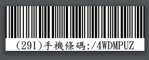

    291 為手機號碼後 3 碼， /4WDMPUZ 為載具條碼，又稱載具隱碼

使用載具儲存電子發票的好處，在於「財政部電子發票整合服務平台」會自動幫發票對獎，\
並將獎金自動匯至所設定的個人銀行帳戶。

另外，所有交易所產生的電子發票全歸戶到一個帳戶中，也方便消費者事後檢視歷史交易明細:

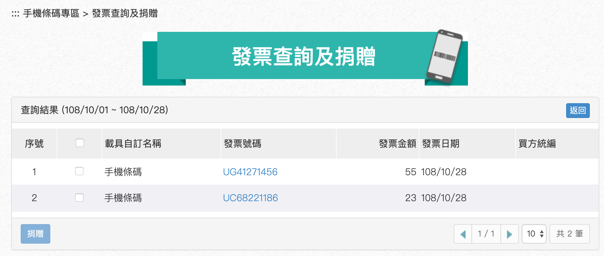

    2019 年 10 月 28 日，有 2 張電子發票

點選發票號碼後，可見明細:

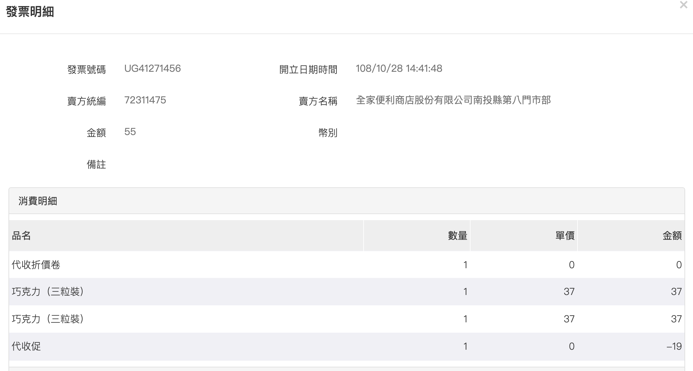

    UG41271456 發票明細有發票號碼、開立時間、賣方統編、購買品名、金額、數量、…等

目前支援的發票載具類別有:

* **手機條碼**
* 自然人憑證條碼
* 悠遊卡
* icash
* 一卡通
* **信用卡/簽帳金融卡**
* **跨境電商電子郵件載具**

本文僅就「手機條碼」、「信用卡/簽帳金融卡」、「跨境電商電子郵件載具」說明。

利用手機註冊帳戶
-------------------------------------------------------------------------------

請至 `https://www.einvoice.nat.gov.tw/ <https://www.einvoice.nat.gov.tw/>`_ 頁面，\
點選「申請手機條碼」，或是按下「登入」鈕，在登入表單中，選擇「申請手機條碼」。\
註冊帳戶除使用「手機號碼」外，也可使用「自然人憑證」，但後者需要效期內的自然人憑證及讀卡機，\
且系統需安裝相關函式庫、驅動程式，在本文就不敘述了，\
建議有興趣的讀者自行前往消費者的文件下載區塊，\
找尋「自然人憑證條碼操作教學(V1.0) `PDF <https://www.einvoice.nat.gov.tw/home/DownLoad?fileName=1447313310980_0.pdf>`_ 」文件來了解。

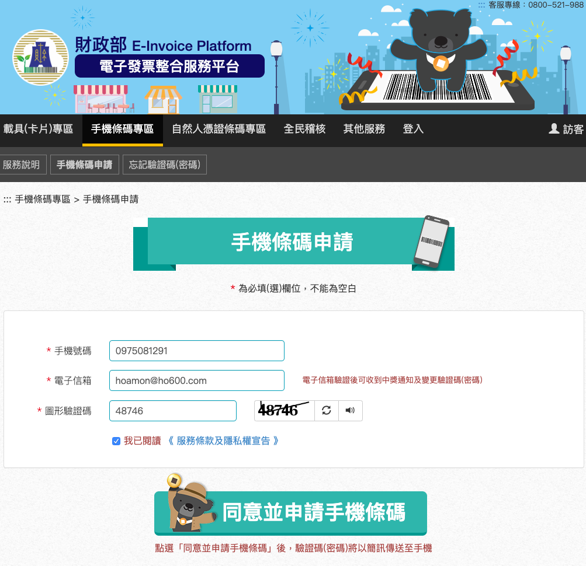

申請手機條碼需:

* 提供「手機號碼」及「電子郵件信箱地址」
* 輸入「圖形驗證碼」
* 閱讀並勾選《 服務條款及隱私權宣告 》

按下「同意並申請手機條碼」按鈕後，\
系統會寄發「登入密碼」簡訊到手機門號，帳號即是你的手機號碼。\
另外，也會寄發信箱確認信，請點選信中之確認連結以完成電子信箱地址驗證程序。

完成電子信箱地址驗證後，方可 **修改** 「登入密碼」，且未來發生「忘記登入密碼」時，\
才能要求系統寄發「重設密碼信」。 **建議** 電子信箱地址驗證程序要即早完成。

登入帳戶
-------------------------------------------------------------------------------

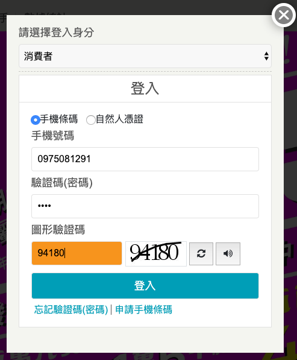
    
登入時，請選擇「消費者身份」，輸入「手機號碼」、「驗證碼(密碼)」、\
「圖形驗證碼」後按下「登入」鈕。

列印手機條碼
-------------------------------------------------------------------------------

登入後，到「手機條碼專區」>「手機條碼列印」頁面。

有 2 種下載格式，「多張手機條碼」專供 A4 文件列印，\
而「條碼印製機專用版本」則是給條碼機印列，兩種的下載格式都是 PDF 。

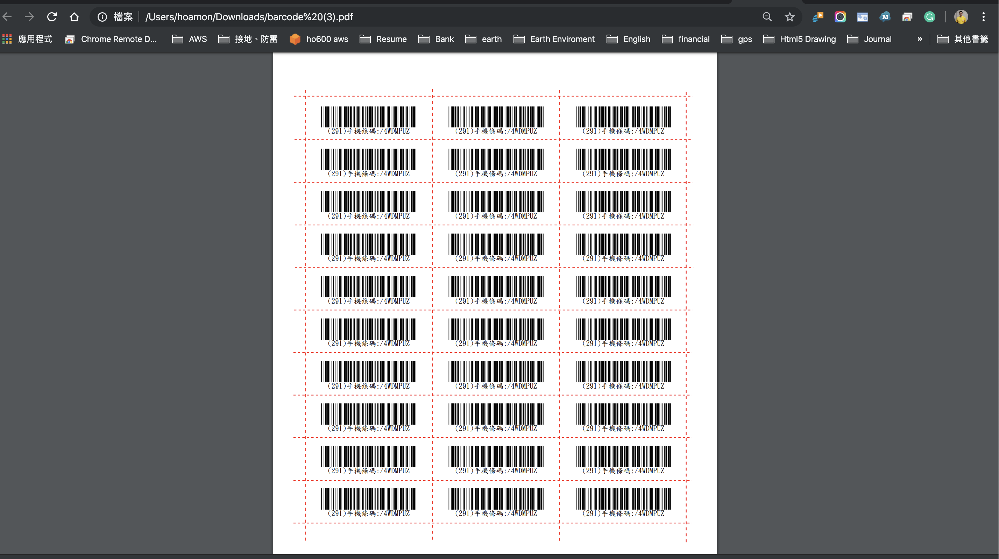

    單張 A4 最多可容納 30 張標籤

標籤可剪下並貼到會帶出門的物品上，如: 手機殼、悠遊卡。交易時，\
出示此組條碼給賣家刷，則該交易的電子發票就會被歸到這組條碼所對應的帳戶內。\
最遲在 48 小時之後，你就可以在個人帳戶中，見到此張發票。

新增「信用卡/簽帳金融卡」為載具
-------------------------------------------------------------------------------

請到「歸戶設定」頁，點選「新增載具」按鈕，如下圖:

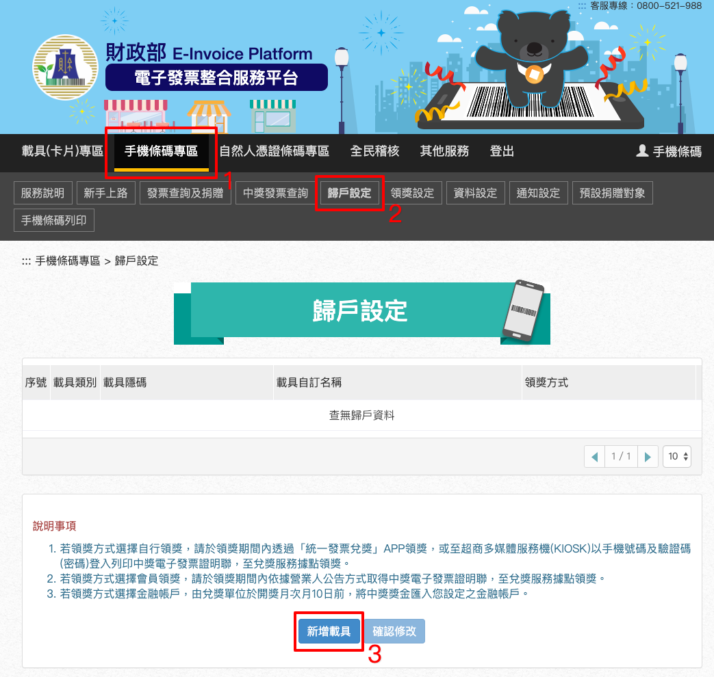

    「手機條碼專區」=>「歸戶設定」=>「新增載具」

在彈出視窗，依欄位填寫如下:

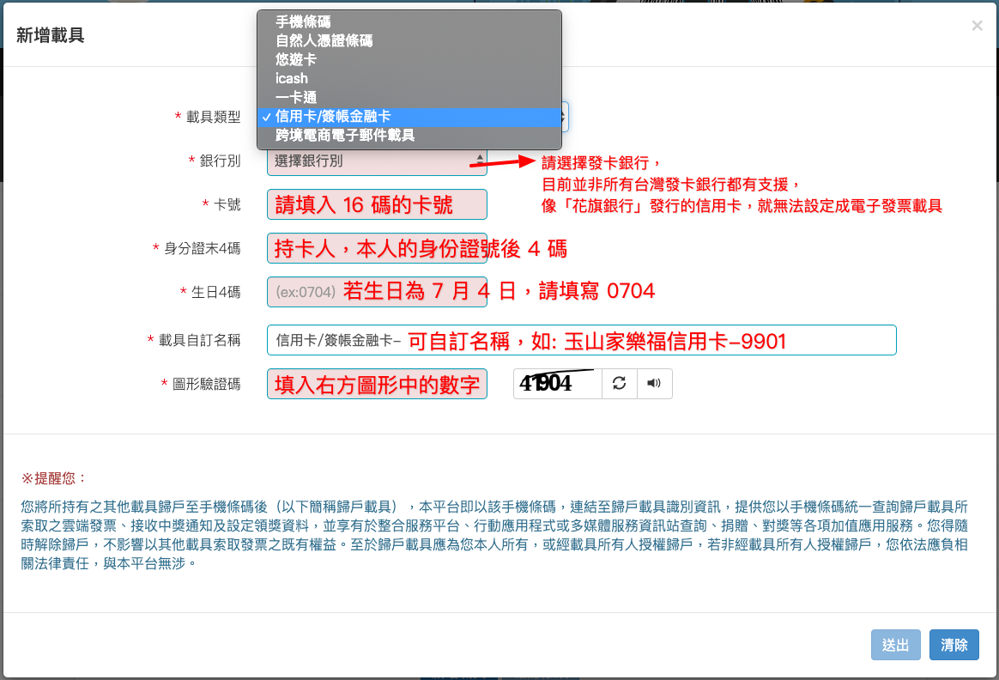

* 載具類型，請選「信用卡/簽帳金融卡」
* 銀行別，請選擇該信用卡的「發卡銀行」
* 卡號，目前有支援的卡別有 VISA/Master/JCB ，所以卡號必然為 16 碼數字，尚不支援 Amex 及銀聯卡
* 身份證末 4 碼，請輸入 4 位數的身份證號後 4 碼
* 生日 4 碼，格式是 MMDD ，也就是 1 月 5 日生，則填 0105
* 載具自訂名稱，以個人好記的名稱來說定
* 圖形驗證碼，若右方圖檔內數字看不清楚，可選擇圖形的「重整按鈕」來更新圖形內數字

以上資料填妥後，按下「送出」鈕，若資訊無誤，則載具即新增完畢。

「載具設定」頁會列出你所建立的載具，如下圖:

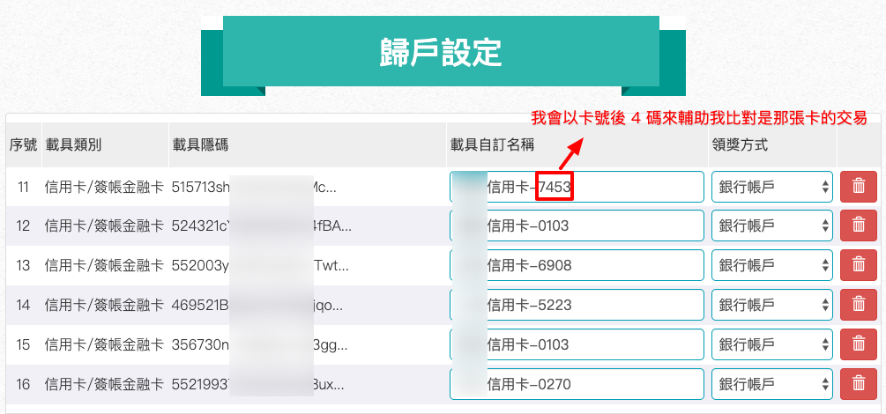

    為方便比對交易是用那一張信用卡支付的，我會以卡號後 4 碼來訂定載具名稱

在「信用卡/簽帳金融卡」的載具中，其載具隱碼不像「手機條碼」一樣要列印出來。\
但凡在交易過程中，只要是使用該信用卡付款，\
那麼所產生的電子發票會直接被歸戶到該張信用卡載具內。

注意的是，在某些「商家 APP」中，也可設定「會員載具」，而且在該 APP 中，\
也可以設定信用卡付款，例如: 全聯行動會員 APP，在此類 APP 中完成的交易，\
其電子發票是被歸戶到「會員載具」，而不是「信用卡/簽帳金融卡」載具中。\
關於「會員載具」的部份，我們會在「商家設定 B2C 電子發票教學」再來說明。

要知道該「信用卡/簽帳金融卡」載具所歸戶的電子發票，\
只要到「發票查詢及捐贈」頁面查詢即可，查詢結果如下圖:

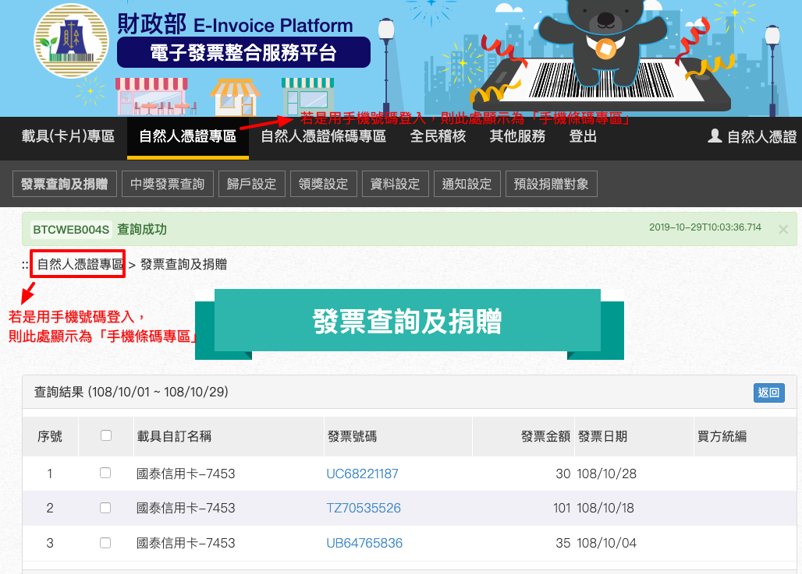

若你想要將「電子發票」捐贈給非營利團體，也可在此查詢頁面操作。

新增「跨境電商電子郵件」為載具
-------------------------------------------------------------------------------

敝司在境外電商申請服務時，會使用 hoamon@ho600.com 來開立帳號，\
對境外電商而言，如果它有支援本國的電子發票服務，\
那它可將交易所產生的電子發票歸戶到 hoamon@ho600.com 這個信箱中。

惟須我們先在「財政部電子發票整合服務平台」中，\
把 hoamon@ho600.com 設定為「跨境電商電子郵件」載具。\
一樣是到「載具設定」頁，去點選「新增載具」按鈕，彈出視窗如下圖:

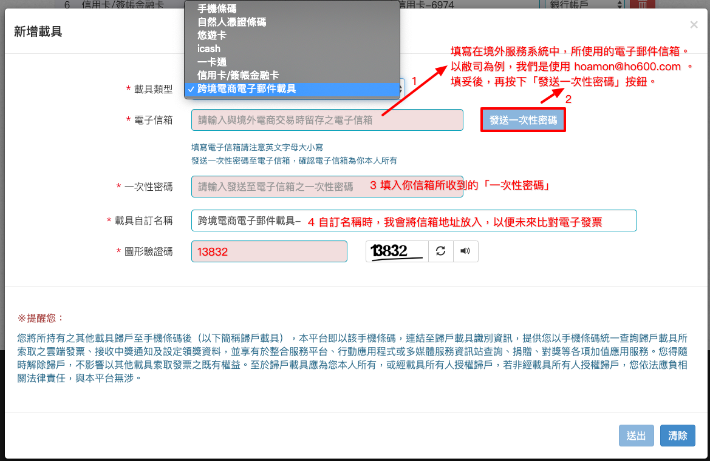

填妥資料後，按下「送出」按鈕，資料無誤則新增完畢。\
即可在「歸戶設定」頁中見到如下圖列表:

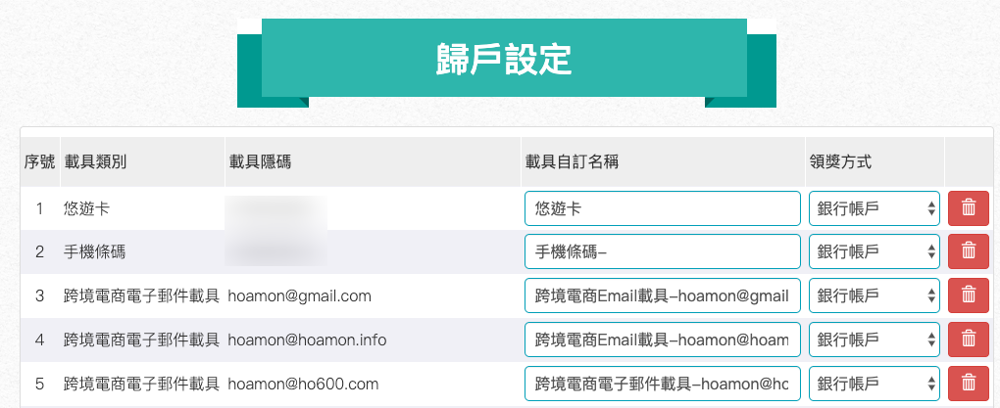

在「發票查詢及捐贈」頁中，可見其載具所對應之電子發票，列表如下:

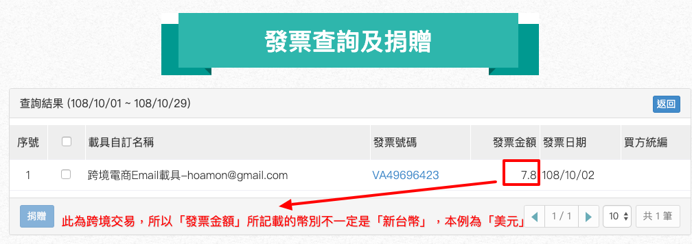

此為跨境交易，所以「發票金額」所記載的幣別不一定是「新台幣」，本例為「美元」。\
交易幣別會明確在「發票明細」中登載。

目前，敝司所接觸的跨境電商有支援本國電子發票服務的廠商，只有 2 家:

* Google Cloud(Google Asia Pacific Pte Ltd，統編為 42523557 )
* Amazon Web Services(Amazon Web Services Inc.，統編為 42527272 )
