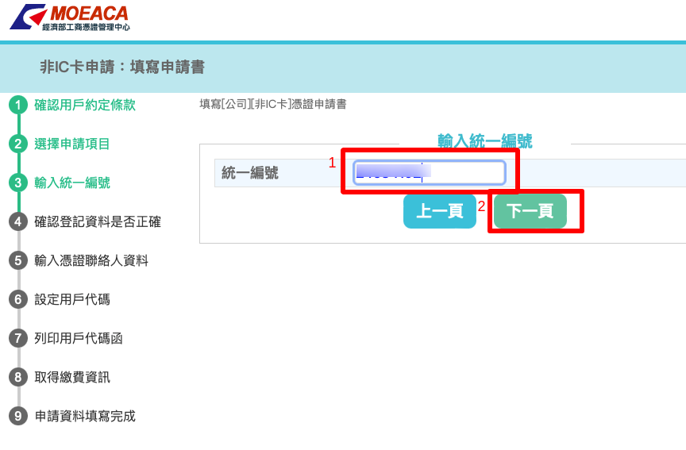

申請及製作軟體憑證供正式區、測試區使用
===============================================================================

電子發票在開立時，需使用憑證加簽，若 Turnkey 系統是安裝在個人電腦上，\
則發票在上傳 EI (大平台)前，可透過讀卡機使用「各式實體憑證: 工商憑證、自然人憑證、…」來加簽電子發票 XML 檔。

若不希望長期將實體憑證插在讀卡機上，又或是 Turnkey 系統是安裝在遠端伺服器上，\
那就建議使用軟體憑證來完成發票加簽作業。

申請「有效」的軟體憑證，請到「非IC申請網址: https://moeacaweb.nat.gov.tw/MoeaeeWeb/apply/apply_3.aspx 」，\
每張有效軟體憑證的效期為 5 年。

首先確認已有使用 Turnkey 系統生成 XXX.csr 請求檔，以及手邊有工商憑證正卡或附卡。

    點擊「線上填寫申請資料」

    點擊「我同意條款內容」
    

    選擇「非IC卡申請」，類別則依實際情況來選擇。點擊「下一頁」後會讀取所插入工商憑證中的統一編號資訊

    確認統一編號

    確認公司相關資訊

    填寫聯絡人各項資料

    自定用戶代碼，並選擇 XXX.csr 檔

.. figure:: create_software_certification/08.png

    備份「用戶代碼」

    確認資料後，前往付費系統

    輸入「用戶代碼」

    選擇付費方式

    填寫此筆繳費發票的買受人資訊

    再次確認付費方式

    此為信用卡繳費的頁面

    信用卡繳費成功

.. figure:: create_software_certification/16.png

    點擊「列印申請書及郵寄信封地址條」連結

    再次輸入「用戶代碼」

    直接列印或先下載 PDF 再列印

最後，將此紙本申請書蓋上公司大、小章後，即可掛號郵寄到經濟部中部辦公室。

大約 1 星期後，程序無誤即會發出軟體憑證(yyy.cer)。