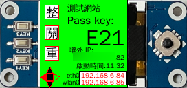

發票機(EPW 伺服器)使用手冊
===============================================================================

.. note::

    若無使用 Waveshare LCD ，則 EPW 相關的操作資訊(Pass Key 及 IP 地址)就須向系統安裝人員詢問。

    若只使用單一個「臺灣電子發票管理系統」，則系統安裝人員可寫死連線資訊，也就不用使用 EPW 後台網站來改變所連線的「臺灣電子發票管理系統」。

要操控 EPW 的資訊如下圖:

.. figure:: epw_user_manual/lcd-note.png

    LCD 可顯示 EPW 的 IP 地址、 Pass Key 及目前所連的發票管理系統名稱

從 IP 地址可知，要連線至 EPW 後台的網址為 https://192.168.6.84/ 或 https://192.168.6.85/ 。\
在瀏覽器上輸入後，可見下圖:

    請按「進階」

會再顯示「繼續前往…」的連結:

    請點選連結

輸入帳號、密碼:

    須洽系統管理員

登入成功後，點擊右上方的「選單鈕」:

    選單連結有「感熱式列表機」、「管理網站」、「聯外IP」、「登入者」

先到「感熱式列表機」頁面:

    序號是自動抓取的，也會是惟一值

若要更改連線的「電子發票管理系統」，請到「臺灣電子發票管理網站」頁面:

    紀錄都是系統管理員事先設定

選定要更改的網站，點擊它的「設定鈕」:

    會再出現小視窗

輸入「通行碼」，按下「設定」鈕:

    按下「設定」後，會花 10 秒鐘左右更改連線位置

成功更改後，「勾選圖示」即會顯示在現在使用的網站紀錄上:

    同時只會有一筆「網站紀錄」可顯示「勾選圖示」，若有多值，請再重新設定

如下圖 LCD 面板所示，原先是連線至「測試網站」:

    測試網站

在成功更改後，就會顯示「正式網站」的名稱:

.. figure:: epw_user_manual/live-lcd.png

    正式網站

若是要確認 EPW 是否有正常網路連線，可至「聯外IP」頁面確認:

    無網路時會顯示 ?.?.?.?