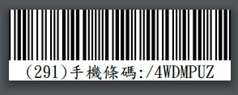

導入財政部電子發票服務之文件集
================================================================================

目的:

* 協助消費者設定發票載具
* 協助營業人自行生成、上傳、撤消電子發票，包含 B2B, B2C 類型
* 協助營業人透過專業代理人完成電子發票相關服務

消費者設定發票載具
--------------------------------------------------------------------------------

消費者在購買交易中，只要出示「載具條碼」，賣家即可將該次交易所產生的電子發票歸入到該載具中，\
所謂載具條碼，形式如下:

    291 為手機號碼後 3 碼， /4WDMPUZ 為載具隱碼

使用載具儲存電子發票的好處，在於財政部電子發票整合服務平台會自動幫發票對獎，\
並將獎金自行匯至所設定的個人銀行帳戶。

營業人
--------------------------------------------------------------------------------

事前準備
--------------------------------------------------------------------------------

財政部電子發票整合服務平台： `營業人身份 <https://www.einvoice.nat.gov.tw/index!changeFocusType?newFocus=F1348636625449>`_ 。

1. 以工商憑證註冊
#. 開立一般帳密登入的帳號