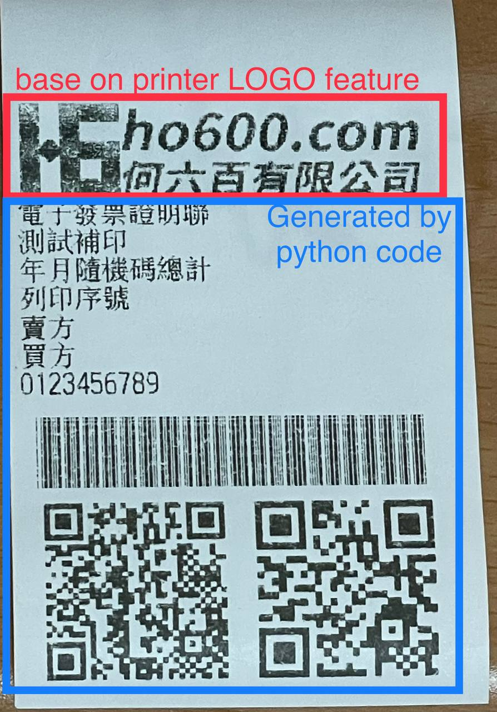

在 Pi 或其他 Linux Distro 安裝設定 EPW 伺服器
===============================================================================

考慮長期運作的高可用性，建議使用 Raspberry Pi + Linux OS 為 EPW 的伺服器。

EPW 是由 Django-based 程式碼及相關 Python3 函式庫所組成的應用程式，\
要在其他 x86, x86_64 硬體上執行也是可以運作的。作業系統使用 Linux-based OS 即可直接套用，\
目前實機使用過的 Linux Distro:

1. Ubuntu-20.04
#. Ubuntu-22.04
#. Raspberry Pi OS(32-bit) Version 10(buster)

EPW 目前僅支援 USB 介面的 ESC/POS 印表機，詳細請參考 python-escpos 的支援清單，\
而有實機測試過的機型有 TM-T88IV, TM-T88V, XP-Q90EC 及 ZJ-5890 ，\
只有 TM-T88IV/TM-T88V 可以列印符合規範的電子發票證明聯，\
而 TM-T88IV 只能設定 80mm 紙寬，要透過 EPW 處理後，方可列印電子發票證明聯於 57mm 紙捲上，但格式會被強制靠左。

Linux Distro 安裝注意事項
-------------------------------------------------------------------------------

* 時區須設為 Asia/Taipei

ESC/POS 印表機設定
-------------------------------------------------------------------------------

1. 將執行 EPW 的用戶帳號加入到 lp, lpadmin 群組
    * .. code-block:: sh

        $ sudo adduser <EPW_account> lp
        $ sudo adduser <EPW_account> lpadmin
#. 自動讓 ESC/POS 印表機在插入 USB 後，權限分享至 lp 群組
    * .. code-block:: text

        # in /etc/udev/rules.d/50-usb_escpos_printer.rules
        # 04b8, 0202 是 Epson TM-T88IV 及 TM-T88V 的裝置參數，其他型請參照原廠文件
        # 0483, 070b 是 Xprinter Q90EC 的裝置參數，其他型請參照原廠文件
        # 0493, 8760 是 ZJiang ZJ-5890 的裝置參數，其他型請參照原廠文件
        SUBSYSTEMS=="usb", ATTRS{idVendor}=="04b8", ATTRS{idProduct}=="0202", GROUP="lp", MODE="0666"
        SUBSYSTEMS=="usb", ATTRS{idVendor}=="0483", ATTRS{idProduct}=="070b", GROUP="lp", MODE="0666"
        SUBSYSTEMS=="usb", ATTRS{idVendor}=="0483", ATTRS{idProduct}=="5743", GROUP="lp", MODE="0666"

安裝基本函式庫
-------------------------------------------------------------------------------

以 Python 3.X 為預設直譯器，本例使用 python3.9 :

.. code-block:: sh

    $ sudo update-alternatives --install /usr/bin/python python $(readlink -f $(which python3.9)) 3 # set python3 as default

安裝工具程式、編譯程式、相依函式庫:

.. code-block:: sh

    $ sudo apt install vim build-essential libssl-dev libffi-dev python3-dev cargo aptitude python3-virtualenv sqlite3 ttf-wqy-zenhei mlocate

更換比較方便使用的 shell(Optional):

.. code-block:: sh

    $ sudo apt install zsh

安裝 zsh 後，設定請參照 zsh with oh-my-zsh: https://gist.github.com/aaabramov/0f1d963d788bf411c0629a6bcf20114d

驗證 ESC/POS 印表機功能
-------------------------------------------------------------------------------

無須安裝任何原廠的 driver, tool, libary, ...。有完整支援 ESC/POS 指令集的印表機，就可直接使用 python-escpos (pure python codes)控制。

安裝 python-escpos==3.0a8 :

.. code-block:: sh

    $ virtualenv -p python3 TEST.py3env
    $ source TEST.py3env/bin/activate
    (TEST.py3env) $ pip install "python-escpos==3.0a8"

將 ESC/POS 印表機的 USB 線接入電腦，再執行 python shell 來測試，本例使用 Epson TM-T88V:

.. code-block:: sh

    (TEST.py3env) $ cat << 'EOF' > libs.py
    import qrcode
    from escpos.printer import Usb
    from PIL import Image
    class UsbWithBarcodeQRCodePair(Usb):
        def barcode(self, code, bc, height=64, width=1, pos="OFF", font="A", align_ct=True, function_type='A', check=True):
            from escpos.escpos import (six, BARCODE_TYPES, NUL,
                                    BarcodeTypeError, BarcodeCodeError, BarcodeSizeError,
                                    BARCODE_WIDTH, BARCODE_HEIGHT,
                                    BARCODE_FONT_A, BARCODE_FONT_B,
                                    TXT_STYLE,
                                    BARCODE_TXT_OFF, BARCODE_TXT_BTH, BARCODE_TXT_ABV, BARCODE_TXT_BLW,)
            
            bc_types = BARCODE_TYPES[function_type.upper()]
            # Align Bar Code()
            if align_ct:
                self._raw(TXT_STYLE['align']['center'])
            # Height
            if 1 <= height <= 255:
                self._raw(BARCODE_HEIGHT + six.int2byte(height))
            else:
                raise BarcodeSizeError("height = {height}".format(height=height))
            # Width
            if 1 <= width <= 6:
                self._raw(BARCODE_WIDTH + six.int2byte(width))
            else:
                raise BarcodeSizeError("width = {width}".format(width=width))
            # Font
            if font.upper() == "B":
                self._raw(BARCODE_FONT_B)
            else:  # DEFAULT FONT: A
                self._raw(BARCODE_FONT_A)
            # Position
            if pos.upper() == "OFF":
                self._raw(BARCODE_TXT_OFF)
            elif pos.upper() == "BOTH":
                self._raw(BARCODE_TXT_BTH)
            elif pos.upper() == "ABOVE":
                self._raw(BARCODE_TXT_ABV)
            else:  # DEFAULT POSITION: BELOW
                self._raw(BARCODE_TXT_BLW)

            self._raw(bc_types[bc.upper()])

            if function_type.upper() == "B":
                self._raw(six.int2byte(len(code)))

            # Print Code
            if code:
                self._raw(code.encode())
            else:
                raise BarcodeCodeError()

            if function_type.upper() == "A":
                self._raw(NUL)

        def qrcode_pair(self, line):
            images = []
            for s in [line['qr1_str'], line['qr2_str']]:
                qr = qrcode.QRCode(version=1,
                                error_correction=qrcode.constants.ERROR_CORRECT_L,
                                box_size=5,
                                border=0)
                qr.add_data(s)
                qr.make(fit=True)
                img = qr.make_image(fill_color="black", back_color="white")
                img = img.resize((154, 154))
                images.append(img)
            qr_image = Image.new("RGB", (347, 180), color='white')
            qr_image.paste(images[0], (13, 13))
            qr_image.paste(images[1], (193, 13))
            self.image(qr_image)

    EOF

    (TEST.py3env) $ python3
    Python 3.10.6 (main, Mar 10 2023, 10:55:28) [GCC 11.3.0] on linux
    Type "help", "copyright", "credits" or "license" for more information.
    >>> 
    from libs import UsbWithBarcodeQRCodePair
    import re, usb.core, usb.util
    for dev in usb.core.find(find_all=True):
        try:
            iProduct = usb.util.get_string(dev, dev.iProduct)
        except:
            continue
        if "TM-T88V" == iProduct:
            t88v = dev
    x, y = t88v[0].interfaces()[0].endpoints()
    if re.search('bEndpointAddress .* IN', str(x)):
        in_ep = x.bEndpointAddress
        out_ep = y.bEndpointAddress
    else:
        out_ep = x.bEndpointAddress
        in_ep = y.bEndpointAddress
    pd = UsbWithBarcodeQRCodePair(t88v.idVendor, t88v.idProduct, in_ep=in_ep, out_ep=out_ep,
                           usb_args={"address": t88v.address, "bus": t88v.bus},
                           profile='default')
    pd.set(align='left')
    if "printer supports CP950":
        #INFO: 印表機使用 Big5 字集
        pd.charcode(code='CP1252')
        pd.textln('電子發票證明聯\n測試補印\n年月隨機碼總計\n列印序號\n賣方\n買方\n9876543210\n\n'.encode('cp950').decode('latin1'))
    elif "printer supports GB18030":
        #INFO: 印表機使用 GB18030 字集
        pd.charcode(code='ISO_8859-2')
        pd.textln('電子發票證明聯\n測試補印\n年月隨機碼總計\n列印序號\n賣方\n買方\n9876543210\n\n'.encode('gb18030').decode('latin2'))
    pd.barcode('99912HO987654321111', 'CODE39')
    pd.qrcode_pair({"qr1_str": "FN350996001111031458100000258000002580000000024634102jbdmlVBHXApivmgZzzzzzz==:e378123456:1:1:1:", "qr2_str": "**何六百文件:1:600"})
    pd.cut()

    列印成果

設定 EPW 基本服務
-------------------------------------------------------------------------------

服務有:

1. 列印發票/收據
2. 檢查感熱式印表機狀態

.. code-block:: sh

    $ git clone git@github.com:ho600-ltd/Django-taiwan-einvoice.git
    $ virtualenv -p python3 Django-taiwan-einvoice.py3env
    $ source Django-taiwan-einvoice.py3env/bin/activate
    $ pip install -r Django-taiwan-einvoice/escpos_web/requirements.txt
    $ cp -rf Django-taiwan-einvoice/escpos_web/capabilities.json Django-taiwan-einvoice.py3env/lib/python3.9/site-packages/escpos/
    $ pip install ipython
    $ cd Django-taiwan-einvoice/escpos_web/
    $ ./manage.py migrate
    $ ./manage.py shell # create "te_web object". The url, slug, hash_key should be getting from TEA service; update "Printer object"
    $ cp -rf Django-taiwan-einvoice/escpos_web/check_printer_status.conf Django-taiwan-einvoice/escpos_web/print_receipt.conf /etc/supervisor/conf.d/ # then update some settings
    $ sudo apt install supervisor
    $ sudo systemctl enable supervisor
    $ sudo supervisorctl reread
    $ sudo supervisorctl update

TEA 以 WebSocket 連線 EPW 時的驗證碼
-------------------------------------------------------------------------------

在 TEA 上設定預設發票機時，必須填寫驗證碼，此驗證碼是登記在 EPW 的 /var/run/boot_random_seed 檔案。

要讓 EPW 在每次開機時，隨機產製出驗證碼供 TEA 驗證用，可透過 /etc/rc.local:

.. code-block:: sh

    $ sudo su -
    $ cat << 'EOF' > /etc/rc.local
    #!/bin/sh -e

    date "+%Y%m%d%H%M%S.%N Whatever words" | md5sum > /var/run/boot_random_seed

    exit 0

    EOF
    $ exit
    $ chmod a+x /etc/rc.local

生成 /var/run/boot_random_seed 後，可在 Waveshare LCD 來觀看驗證碼，\
但若未使用 Waveshare LCD ，則建議寫入固定值到 /var/run/boot_random_seed ，如:

.. code-block:: sh

    echo "31a36a1b579fc1f1349183390d5b0a46  -" >  /var/run/boot_random_seed

這樣驗證碼會保持在 31A ，在 TEA 上就是固定填寫 31A 驗證碼。

在 Pi 中使用 Waveshare LCD 顯示 EPW 資訊(非必要)
-------------------------------------------------------------------------------

設定 SPI 介面:

.. code-block:: sh

    $ sudo aptitude upgrade -y
    $ sudo apt-get install libatlas-base-dev
    $ sudo raspi-config
    Choose Interfacing Options -> SPI -> Yes  to enable SPI interface

.. figure:: install_epw_in_pi/PI_interfaces.png
    :width: 600px

    選擇介面選項

.. figure:: install_epw_in_pi/SPI.png
    :width: 600px

    選擇 SPI

.. figure:: install_epw_in_pi/Enable_SPI.png
    :width: 600px

    啟用 SPI

重開機，以啟用 SPI:

.. code-block:: sh

    $ sudo reboot

安裝 BCM2835 函式庫( http://www.airspayce.com/mikem/bcm2835/bcm2835-1.71.tar.gz )

.. code-block:: sh

    $ wget http://www.airspayce.com/mikem/bcm2835/bcm2835-1.71.tar.gz
    $ tar -zxf bcm2835-1.71.tar.gz
    $ cd bcm2835-1.71
    $ ./configure && make && sudo make check && sudo make install

啟用 lcd_control service:

.. code-block:: sh

    $ sudo cp -rf ~/Django-taiwan-einvoice/escpos_web/lcd_control.conf /etc/supervisor/conf.d/
    $ sudo supervisorctl reread
    $ sudo supervisorctl update
    lcd_control:asgi0: stopped
    print_receipt:asgi0: stopped
    check_printer_status:asgi0: stopped
    lcd_control:asgi0: started
    print_receipt:asgi0: started
    check_printer_status:asgi0: started

LCD 顯示成果:

.. figure:: install_epw_in_pi/Result.jpeg
    :width: 600px

    IP: 4.5.6.7 為出口 IP

.. _設定 EPW Portal(非必要):

設定 EPW Portal(非必要)
-------------------------------------------------------------------------------

若發票機上設定的 TEAWeb 紀錄超過 1 個時，就可以使用 Portal 服務來調整現時要連線的是那一個 tea_web 。\
當然也可以直接 ssh 連入發票機中，使用 django shell 手動設定某個 tea_web.now_use = True 。

設定 Portal 步驟:

.. code-block:: sh

    $ virtualenv -p python3 Django-taiwan-einvoice.py3env
    $ source Django-taiwan-einvoice.py3env/bin/activate
    $ pip install -r Django-taiwan-einvoice/escpos_web/requirements.txt
    $ pip install ipython
    $ cd Django-taiwan-einvoice/escpos_web/
    $ ./manage.py migrate
    $ ./manage.py createsuperuser
    Username (leave blank to use 'XXX'): 
    Email address: XXX@ho600.com
    Password: 
    Password (again): 
    Superuser created successfully.
    $ cp -rf Django-taiwan-einvoice/escpos_web/epw.conf /etc/supervisor/conf.d/ # then update some settings
    $ sudo supervisorctl reread
    $ sudo supervisorctl update

EPW Portal 預設是使用 8443 port，主要是 pi user 權限無法設定在 443 上，如希望以 https://xxx.yyy.zzz/ 而不是 https://xxx.yyy.zzz:8443/ 來瀏覽 Portal 網站，\
則再利用 iptables 作轉埠:

.. code-block:: sh

    $ sudo apt-get install iptables-persistent
    $ sudo iptables -A PREROUTING -t nat -p tcp --dport 443 -j REDIRECT --to-port 8443
    $ sudo sh -c "iptables-save > /etc/iptables/rules.v4"

假使 EPW 拿到的內部 IP 是 192.168.7.88 ，\
則使用與 EPW 同一區網的電腦，在其瀏覽器上瀏覽 https://192.168.7.88/ ，輸入 superuser 帳密，再進入「臺灣電子發票管理網站」頁面:

.. figure:: install_epw_in_pi/epw-001.png
    :width: 600px

    顯示連線網站列表

點擊「設定」按鈕後，跳出視窗:

.. figure:: install_epw_in_pi/epw-002.png
    :width: 600px

    選擇要更改連線的網站，點擊「設定」按鈕

輸入「驗證碼」後按下「設定」即可更新「所連線的臺灣電子發票管理系統」。