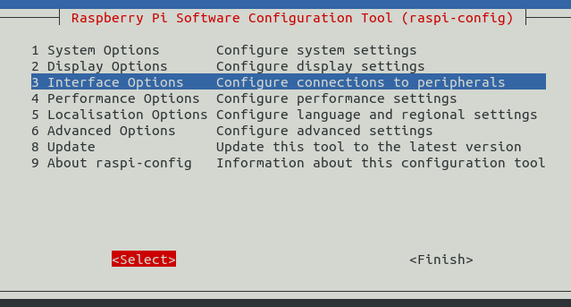
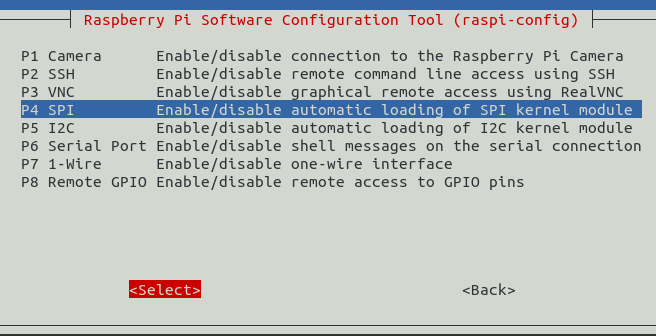
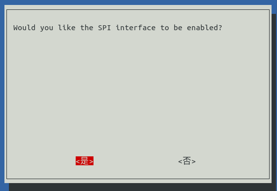
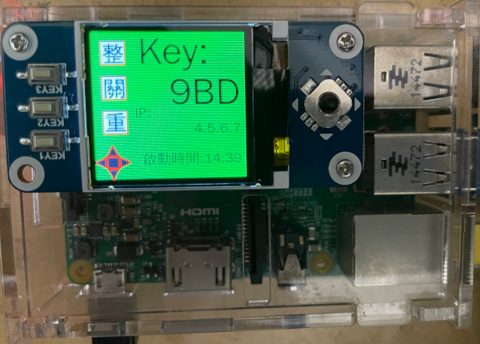
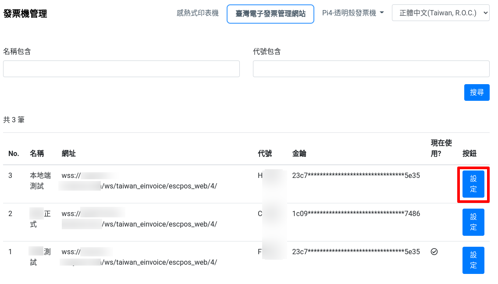
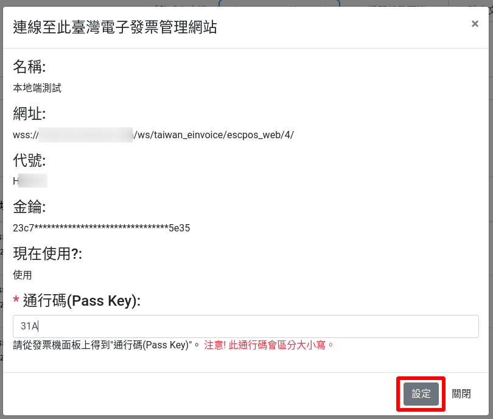

在 PI 安裝設定 EPW 伺服器
===============================================================================

建議使用 Raspberry Pi + Linux OS 為 EPW 的伺服器。\
EPW 是由 Django-based 程式碼及相關 Python3 函式庫所組成的應用程式，\
要在其他 x86, x86_64 硬體上執行也是可以運作的。作業系統使用 Linux-based OS 即可直接套用；\
若要在 Windows 上，則需修改部份硬體控制相關的程式碼。\
考慮長期運作的高可用性，還是應以 Pi 來執行 EPW 。

EPW 目前僅支援 USB 介面的 ESC/POS 印表機，詳細請參考 python-escpos 的支援清單，而有實機測試過的機型僅有 TM-T88IV 及 TM-T88V 。

安裝 Raspberry OS 時，須將時區設為 Asia/Taipei 。

ESC/POS 印表機設定
-------------------------------------------------------------------------------

1. 將執行 EPW 的用戶帳號加入到 lp, lpadmin 群組
    * .. code-block:: sh

        $ sudo adduser <EPW_account> lp
        $ sudo adduser <EPW_account> lpadmin
#. 自動讓 ESC/POS 印表機在插入 USB 後，權限可分享至 lp 群組
    * .. code-block:: text

        # in /etc/udev/rules.d/50-usb_escpos_printer.rules
        # 04b8, 0202 是 TM-T88IV 及 TM-T88V 的裝置參數，其他型請參照原廠文件
        SUBSYSTEMS=="usb", ATTRS{idVendor}=="04b8", ATTRS{idProduct}=="0202", GROUP="lp", MODE="0666"

設定 EPW 基本服務
-------------------------------------------------------------------------------

服務有:

1. 列印發票/收據
2. 檢查感熱式印表機狀態

.. code-block:: sh

    $ sudo update-alternatives --install /usr/bin/python python $(readlink -f $(which python3.9)) 3 # set python3 as default
    $ sudo apt install vim build-essential libssl-dev libffi-dev python3-dev cargo aptitude python3-virtualenv sqlite3 ttf-wqy-zenhei mlocate zsh
        * set up zsh with oh-my-zsh: https://gist.github.com/aaabramov/0f1d963d788bf411c0629a6bcf20114d
    $ git clone git@github.com:ho600-ltd/Django-taiwan-einvoice.git
    $ virtualenv -p python3 Django-taiwan-einvoice.py3env
    $ source Django-taiwan-einvoice.py3env/bin/activate
    $ pip install -r Django-taiwan-einvoice/escpos_web/requirements.txt
    $ cp -rf Django-taiwan-einvoice/escpos_web/capabilities.json Django-taiwan-einvoice.py3env/lib/python3.9/site-packages/escpos/
    $ pip install ipython
    $ cd Django-taiwan-einvoice/escpos_web/
    $ ./manage.py migrate
    $ ./manage.py shell # create "te_web object". The url, slug, hash_key should be getting from TEA service; update "Printer object"
    $ cp -rf Django-taiwan-einvoice/escpos_web/check_printer_status.conf Django-taiwan-einvoice/escpos_web/print_receipt.conf /etc/supervisor/conf.d/ # then update some settings
    $ sudo apt install supervisor
    $ sudo systemctl enable supervisor
    $ sudo supervisorctl reread
    $ sudo supervisorctl update

TEA 以 WebSocket 連線 EPW 時的驗證碼
-------------------------------------------------------------------------------

在 TEA 上設定預設發票機時，必須填寫驗證碼，此驗證碼是登記在 EPW 的 /var/run/boot_random_seed 檔案。

要讓 EPW 在每次開機時，隨機產製出驗證碼供 TEA 驗證用，可透過 /etc/rc.local:

.. code-block:: sh

    $ sudo su -
    $ cat << 'EOF' > /etc/rc.local
    #!/bin/sh -e

    date "+%Y%m%d%H%M%S.%N Whatever words" | md5sum > /var/run/boot_random_seed

    exit 0

    EOF
    $ exit
    $ chmod a+x /etc/rc.local

生成 /var/run/boot_random_seed 後，可在 Waveshare LCD 來觀看驗證碼，\
但若未使用 Waveshare LCD ，則建議寫入固定值到 /var/run/boot_random_seed ，如:

.. code-block:: sh

    echo "31a36a1b579fc1f1349183390d5b0a46  -" >  /var/run/boot_random_seed

這樣驗證碼會保持在 31A ，在 TEA 上就是固定填寫 31A 驗證碼。

使用 Waveshare LCD 顯示 EPW 資訊(非必要)
-------------------------------------------------------------------------------

設定 SPI 介面:

.. code-block:: sh

    $ sudo aptitude upgrade -y
    $ sudo apt-get install libatlas-base-dev
    $ sudo raspi-config
    Choose Interfacing Options -> SPI -> Yes  to enable SPI interface

    選擇介面選項

    選擇 SPI

    啟用 SPI

重開機，以啟用 SPI:

.. code-block:: sh

    $ sudo reboot

安裝 BCM2835 函式庫( http://www.airspayce.com/mikem/bcm2835/bcm2835-1.71.tar.gz )

.. code-block:: sh

    $ wget http://www.airspayce.com/mikem/bcm2835/bcm2835-1.71.tar.gz
    $ tar -zxf bcm2835-1.71.tar.gz
    $ cd bcm2835-1.71
    $ ./configure && make && sudo make check && sudo make install

啟用 lcd_control service:

.. code-block:: sh

    $ sudo cp -rf ~/Django-taiwan-einvoice/escpos_web/lcd_control.conf /etc/supervisor/conf.d/
    $ sudo supervisorctl reread
    $ sudo supervisorctl update
    lcd_control:asgi0: stopped
    print_receipt:asgi0: stopped
    check_printer_status:asgi0: stopped
    lcd_control:asgi0: started
    print_receipt:asgi0: started
    check_printer_status:asgi0: started

LCD 顯示成果:

    IP: 4.5.6.7 為出口 IP

.. _設定 EPW Portal(非必要):

設定 EPW Portal(非必要)
-------------------------------------------------------------------------------

若發票機上設定的 TEAWeb 紀錄超過 1 個時，就可以使用 Portal 服務來調整現時要連線的是那一個 tea_web 。\
當然也可以直接連入 pi 中，使用 django shell 手動設定某個 tea_web.now_use = True 。

設定 Portal 步驟:

.. code-block:: sh

    $ virtualenv -p python3 Django-taiwan-einvoice.py3env
    $ source Django-taiwan-einvoice.py3env/bin/activate
    $ pip install -r Django-taiwan-einvoice/escpos_web/requirements.txt
    $ pip install ipython
    $ cd Django-taiwan-einvoice/escpos_web/
    $ ./manage.py migrate
    $ ./manage.py createsuperuser
    Username (leave blank to use 'XXX'): 
    Email address: XXX@ho600.com
    Password: 
    Password (again): 
    Superuser created successfully.
    $ cp -rf Django-taiwan-einvoice/escpos_web/epw.conf /etc/supervisor/conf.d/ # then update some settings
    $ sudo supervisorctl reread
    $ sudo supervisorctl update

EPW Portal 預設是使用 8443 port，主要是 pi user 權限無法設定在 443 上，如希望以 https://xxx.yyy.zzz/ 而不是 https://xxx.yyy.zzz:8443/ 來瀏覽 Portal 網站，\
則再利用 iptables 作轉埠:

.. code-block:: sh

    $ sudo apt-get install iptables-persistent
    $ sudo iptables -A PREROUTING -t nat -p tcp --dport 443 -j REDIRECT --to-port 8443
    $ sudo sh -c "iptables-save > /etc/iptables/rules.v4"

假使 EPW 拿到的內部 IP 是 192.168.7.88 ，\
則使用與 EPW 同一區網的電腦，在其瀏覽器上瀏覽 https://192.168.7.88/ ，輸入 superuser 帳密，再進入「臺灣電子發票管理網站」頁面:

    顯示連線網站列表

點擊「設定」按鈕後，跳出視窗:

    選擇要更改連線的網站，點擊「設定」按鈕

輸入「驗證碼」後按下「設定」即可更新「所連線的臺灣電子發票管理系統」。