在 Linux 安裝 Turnkey 及 TKW 伺服器
===============================================================================

Turnkey 下載點: https://www.einvoice.nat.gov.tw/EINSM/ein_upload/html/ENV/1536133205094.html

TKW 最低需求: 

1. 支援 Ubuntu 18.4 以上，Redhat ES 7 以上，可支援 64 位元版本
#. 建議搭配 XWindow 及中文字集包，以顯示中文
#. 請確認 OpenJDK 版本為 11
#. 資料庫 MySQL 5.7 或以上、MariaDB 10.9.3 或以上

安裝建議:

1. EI 平台有限制 Turnkey 系統的來源 IP ，所以建議到雲端平台去建立 TKW 伺服器，本文中範例是運作在 AWS
#. 安裝 Turnkey 的系統，建議使用 OpenVPN 連線或是部置在 NAT 的後面，讓 Turnkey 可以 OpenVPN Server 或 NAT Server 的 IP 去跟 EI 連線
#. Turnkey 最好搭配 XWindow ，所以建議使用「Ubuntu 22.04 Server(x86-64)」AMI + xfce4 + xrdp 套件
#. 若需創建多台 Turnkey 系統(如: 不同分店各自擁有 Turnkey 系統)，可多個 Turnkey 系統置於同一 Linux 的不同資料夾中，也可各自裝在獨立的 Linux OS
#. TKW 是以檔案系統與 Turnkey 系統互動，所以多個 Turnkey 系統置於一 Linux 中，可只安裝一個 TKW ，若裝在不同 Linux ，則每個 Linux 至少都裝一個 TKW

設定台北時區:

.. code-block:: sh

    $ sudo timedatectl set-timezone Asia/Taipei

基本函式庫安裝:

.. code-block:: sh

    $ sudo apt update
    $ sudo apt install aptitude
    $ sudo aptitude upgrade -y && sudo reboot
    $ sudo apt install unzip net-tools collectd
    $ curl https://s3.amazonaws.com/amazoncloudwatch-agent/ubuntu/amd64/latest/amazon-cloudwatch-agent.deb -o amazon-cloudwatch-agent.deb
    $ sudo dpkg -i ./amazon-cloudwatch-agent.deb
    $ sudo adduser eit-user
    $ sudo cp -rf .ssh/authorized_keys ~eit-user/.ssh/
    $ sudo chown -R eit-user:eit-user ~eit-user/.ssh
    $ sudo chmod -R 400 ~eit-user/.ssh/
    $ sudo vi /opt/aws/amazon-cloudwatch-agent/bin/config.json # or sudo /opt/aws/amazon-cloudwatch-agent/bin/amazon-cloudwatch-agent-config-wizard
    $ cat /opt/aws/amazon-cloudwatch-agent/bin/config.json
    {
        "agent": {
            "metrics_collection_interval": 60,
            "run_as_user": "root"
        },
        "logs": {
            "logs_collected": {
                "files": {
                    "collect_list": [
                        {
                            "file_path": "/home/eit-user/Django-taiwan-einvoice/turnkey_web.asgi.log",
                            "log_group_name": "WHAT_NAME_ALL_YOU_WANT",
                            "log_stream_name": "turnkey_web.asgi.log",
                            "retention_in_days": 7
                        },
                        {
                            "file_path": "/home/eit-user/EINVTurnkey3.0.2-24634102/linux/log/Turnkey.log",
                            "log_group_name": "WHAT_NAME_ALL_YOU_WANT",
                            "log_stream_name": "Turnkey.log",
                            "retention_in_days": 7
                        },
                        {
                            "file_path": "/home/eit-user/EINVTurnkey3.0.2-24634102/linux/log/Turnkey_mail.log",
                            "log_group_name": "WHAT_NAME_ALL_YOU_WANT",
                            "log_stream_name": "Turnkey_mail.log",
                            "retention_in_days": 7
                        }

                    ]
                }
            }
        },
        "metrics": {
            "aggregation_dimensions": [
                [
                    "InstanceId"
                ]
            ],
            "append_dimensions": {
                "AutoScalingGroupName": "${aws:AutoScalingGroupName}",
                "ImageId": "${aws:ImageId}",
                "InstanceId": "${aws:InstanceId}",
                "InstanceType": "${aws:InstanceType}"
            },
            "metrics_collected": {
                "collectd": {
                    "metrics_aggregation_interval": 60
                },
                "disk": {
                    "measurement": [
                        "used_percent"
                    ],
                    "metrics_collection_interval": 60,
                    "resources": [
                        "*"
                    ]
                },
                "mem": {
                    "measurement": [
                        "mem_used_percent"
                    ],
                    "metrics_collection_interval": 60
                },
                "statsd": {
                    "metrics_aggregation_interval": 60,
                    "metrics_collection_interval": 60,
                    "service_address": ":8125"
                }
            }
        }
    }
    $ sudo /opt/aws/amazon-cloudwatch-agent/bin/amazon-cloudwatch-agent-ctl -a fetch-config -m ec2 -s -c file:/opt/aws/amazon-cloudwatch-agent/bin/config.json
    $ sudo /opt/aws/amazon-cloudwatch-agent/bin/amazon-cloudwatch-agent-ctl -m ec2 -a status
    {
        "status": "running",
        "starttime": "2022-09-07T06:08:59+0000",
        "configstatus": "configured",
        "cwoc_status": "stopped",
        "cwoc_starttime": "",
        "cwoc_configstatus": "not configured",
        "version": "1.247352.0"
    }
    $ sudo apt install xfce4 xrdp
    $ sudo apt install language-pack-zh-hant fonts-arphic-ukai fonts-arphic-uming fonts-ipafont-mincho fonts-ipafont-gothic fonts-unfonts-core

.. ::

    <<從 Turnkey-3 起不再使用 PostgreSQL ，因為它們的表格名、欄位名稱大小寫未跟 MariaDB 保持一致>>

    創建 PostgreSQL 資料庫:

    安裝指令: sudo yum install postgresql

    .. code-block:: sql 

        # create database tkw Encoding='UTF8' LC_Collate='zh_TW.UTF-8' LC_Ctype='zh_TW.UTF-8' template=template1;
        # create user tkw with password 'tkw';
        # alter database tkw owner to tkw;

    .. code-block:: sh 

        $ psql -h dtei-db.ho600.com -U tkw -W tkw < EINVTurnkey2.0.2-linux/DBSchema/PostgreSQL/PostgreSQL.sql

創建 MariaDB 資料庫:

.. code-block:: sql 

    MariaDB> CREATE DATABASE tkw CHARACTER SET = 'utf8' COLLATE = 'utf8_unicode_ci';
    MariaDB> CREATE USER tkw@'%' identified by 'tkw';
    MariaDB> GRANT SELECT, INSERT, UPDATE, DELETE, CREATE, DROP, REFERENCES, INDEX, ALTER, CREATE TEMPORARY TABLES, LOCK TABLES, EXECUTE, CREATE VIEW, SHOW VIEW, CREATE ROUTINE, ALTER ROUTINE, EVENT, TRIGGER on tkw.* to tkw@'%' identified by 'tkw';

執行 Turnkey 前所需的 jdk 函式庫:

.. code-block:: sh

    $ wget https://builds.openlogic.com/downloadJDK/openlogic-openjdk/11.0.19+7/openlogic-openjdk-11.0.19+7-linux-x64.tar.gz

啟動 Turnkey GUI 工具:

.. code-block:: sh

    $ cd ${SOME_WHERE}/EINVTurnkey3.0.2/linux
    $ ./run_ui.sh

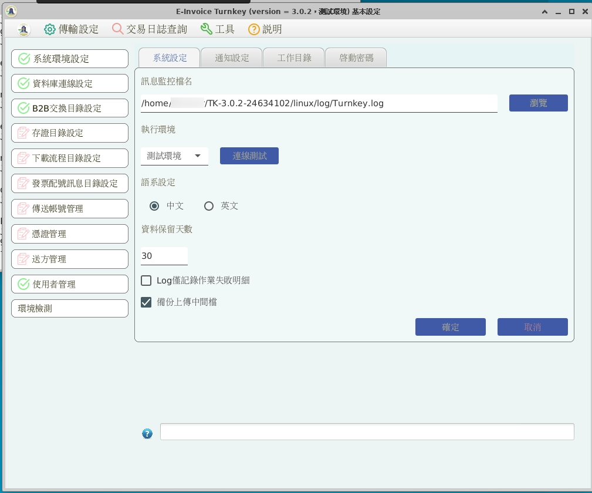

    確定 Turnkey 的「系統設定」、「工作目錄」

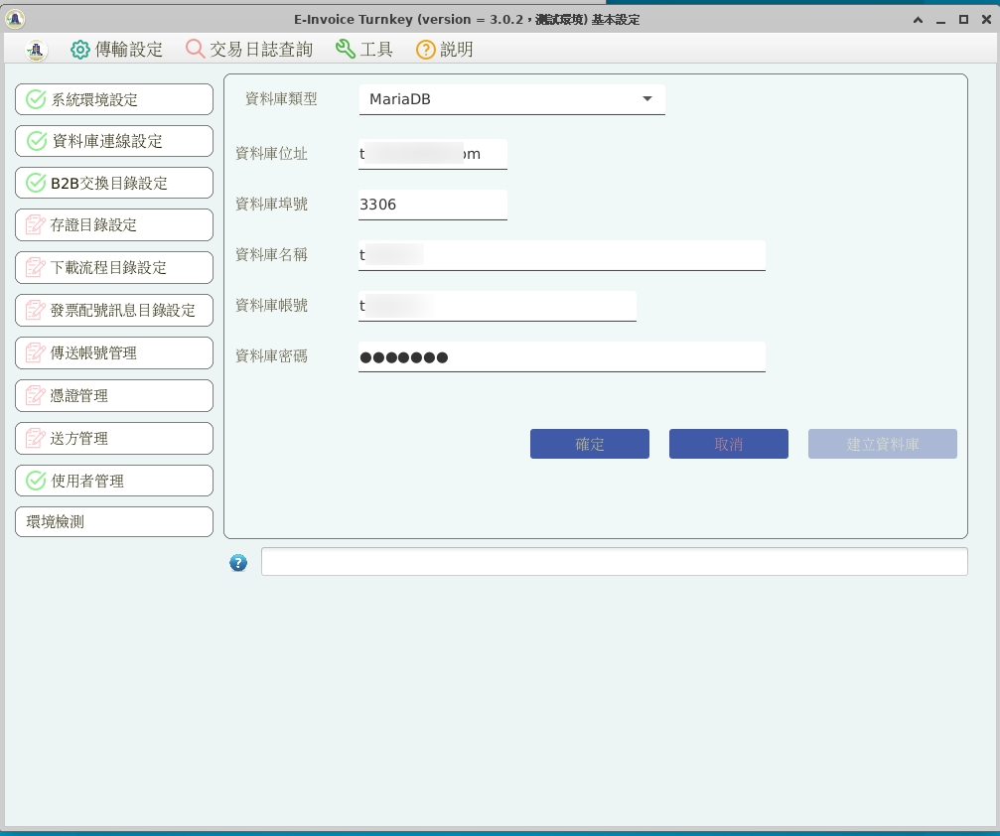

    設定資料庫

來自「財政部電子發票整合服務平台客服中心」的建議，在初始設定 Turnkey 時，\
就要做好「檔案收送」中的 5 種「目錄設定」，就算你的需求只有 B2C ，\
也請一併完成 B2B 交換/存證的目錄設定。\
不然可能會有 `C 狀態拿不到的問題 <https://github.com/ho600-ltd/django-taiwan-einvoice/issues/2>`_ 。

5 種目錄的設定，分別在「B2B交換目錄設定」、「存證目錄設定: B2B/B2C 存證」、「下載流程目錄設定」、「發票配號訊息目錄設定」。

以上 5 種目錄設定都要作到:

1. 確認訊息版本，此版本要與你所生成的 XML MIG 版本相符
#. 按下「確定」
#. 看到「儲存成功」訊息

皆完成後，就能在檔案總管中，看到如下的資料夾:

.. figure:: install_tkw_in_linux/RESULT.png

    有設定過「下載流程目錄」後，才會出現 ReceiveFile 資料夾

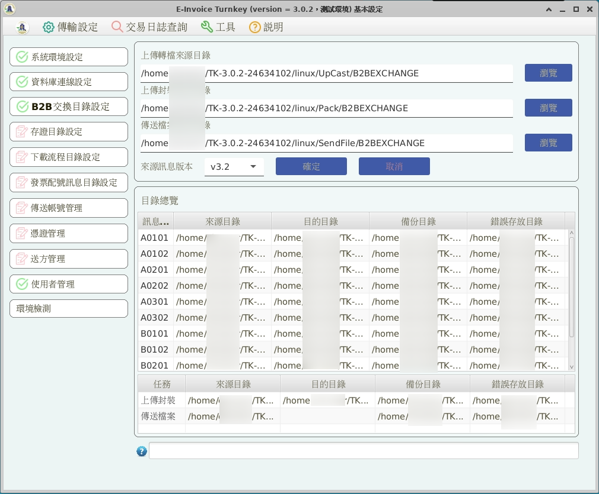

    B2B交換目錄設定

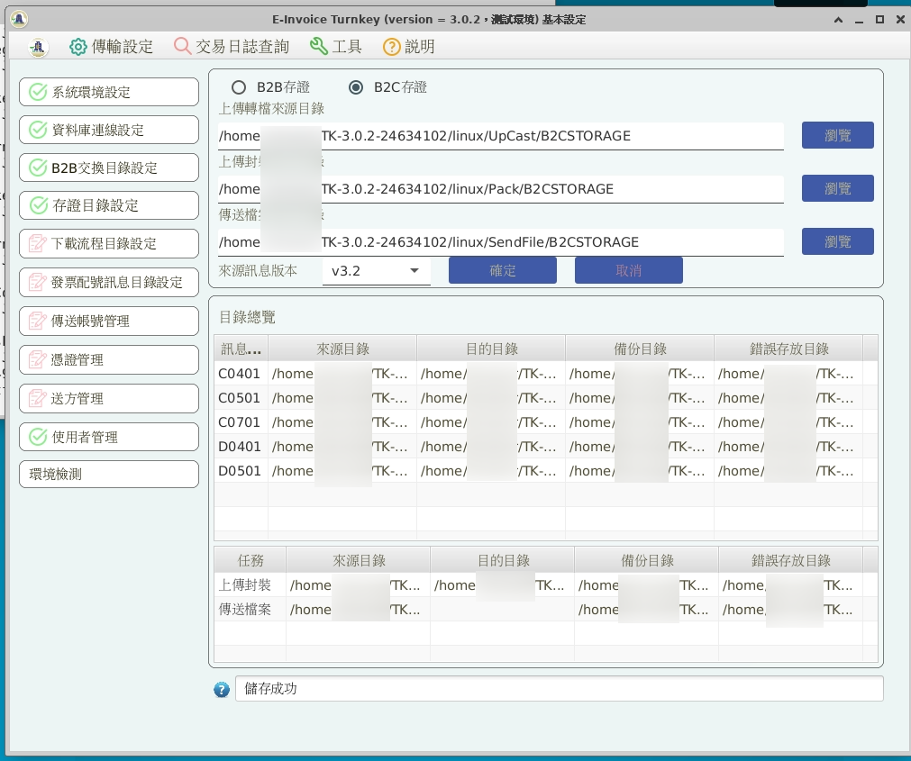

    存證目錄設定

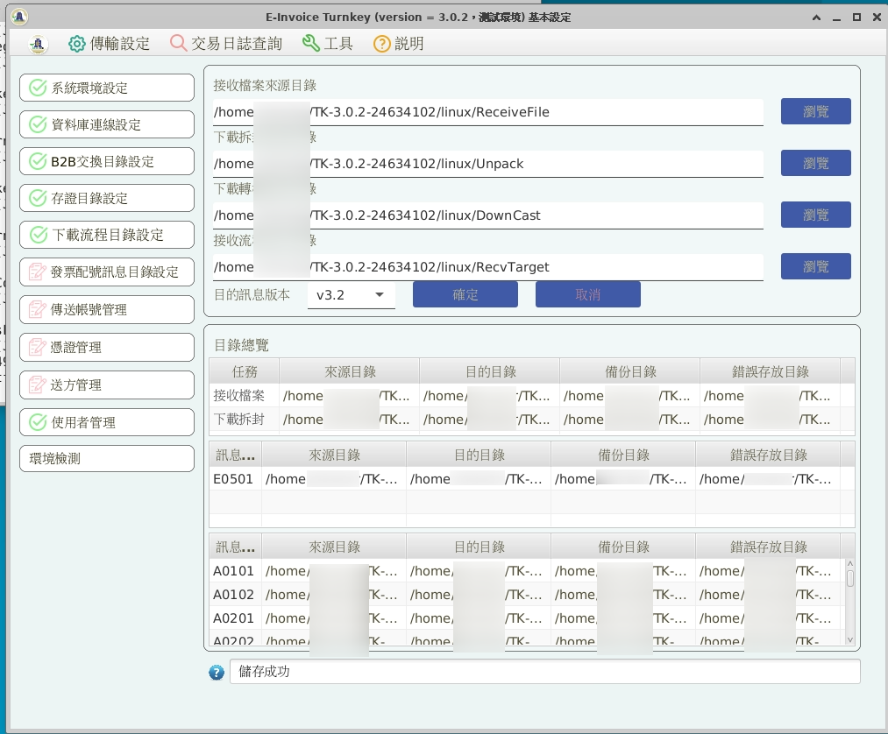

    下載流程目錄設定

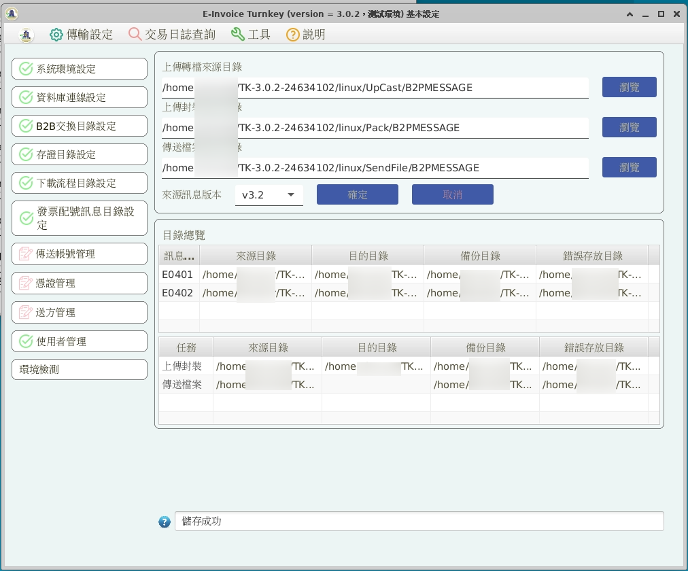

    發票配號訊息目錄設定

設定傳送帳號、軟體憑證、送方管理: 請先準備好「軟體憑證.pfx」及大平台所開立的「傳送帳號、密碼、繞送代碼」。

在選單上，依序執行「1 傳送帳號管理」、「2 憑證管理」、「3 送方管理」

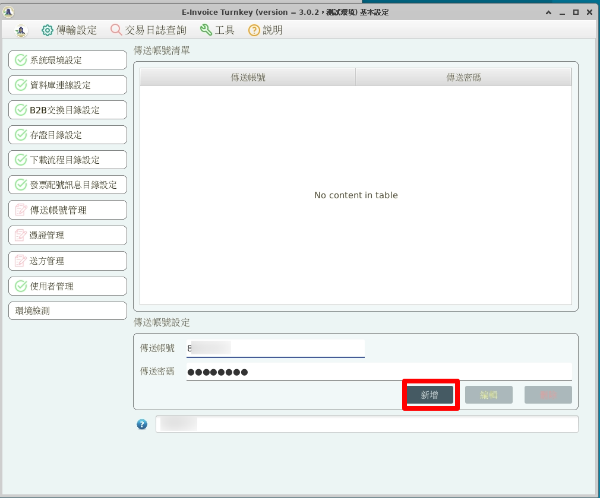

    傳送帳號管理: 填入大平台開立的傳送帳號、密碼

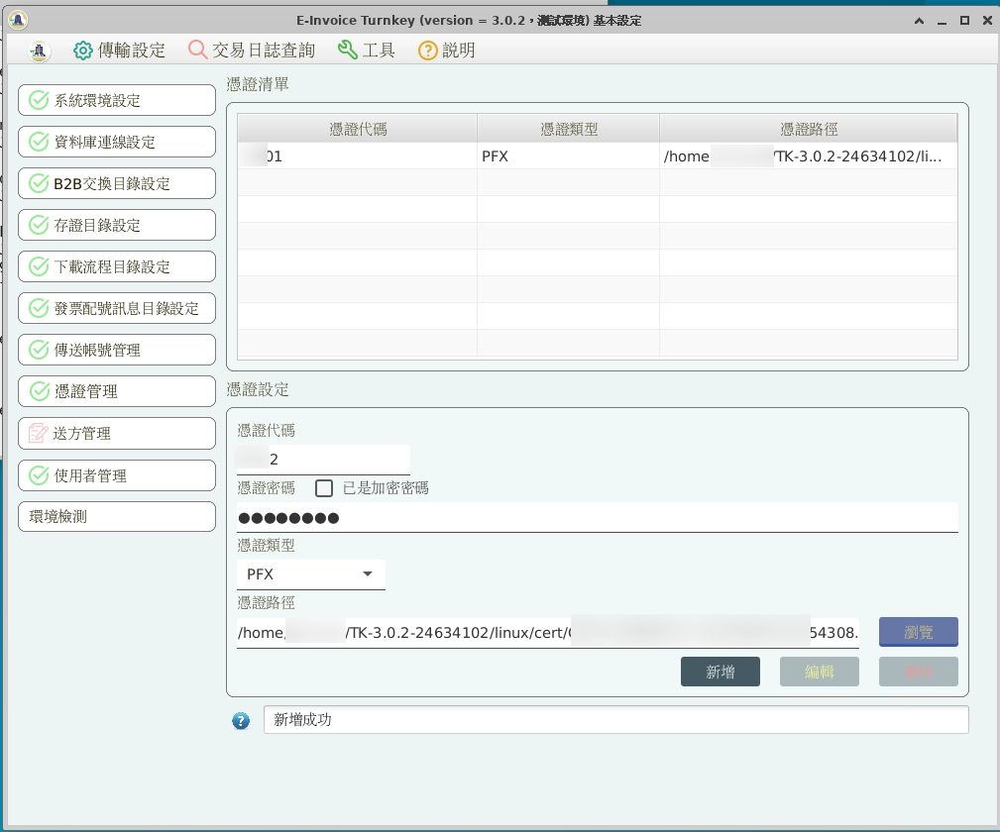

    憑證管理: 自定憑證代碼，填先前設定的憑證密碼、選擇軟體憑證

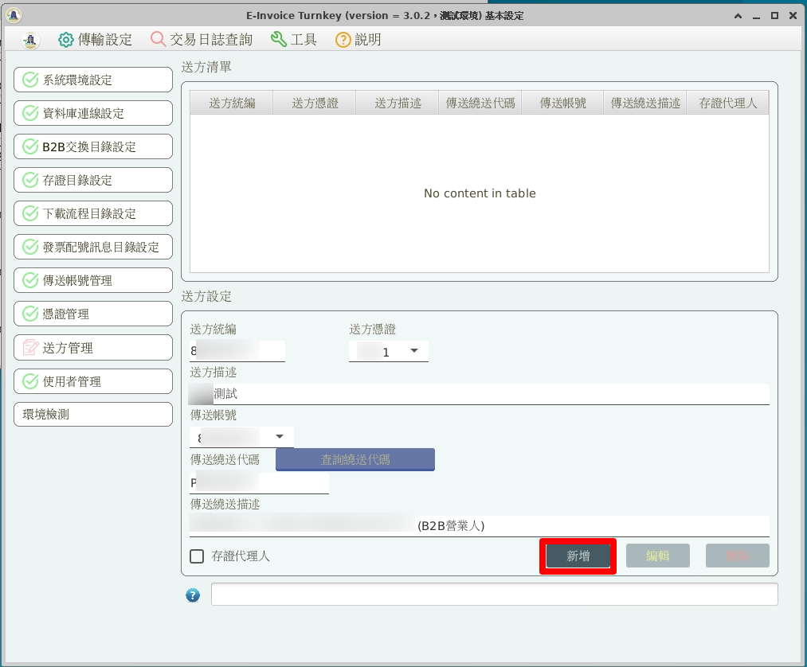

    送方管理: 選擇「憑證、帳號」，填入統編及大平台開立的繞送代碼

.. note::

    軟體憑證.pfx 相對應的 .cer 檔務必先上傳至大平台。

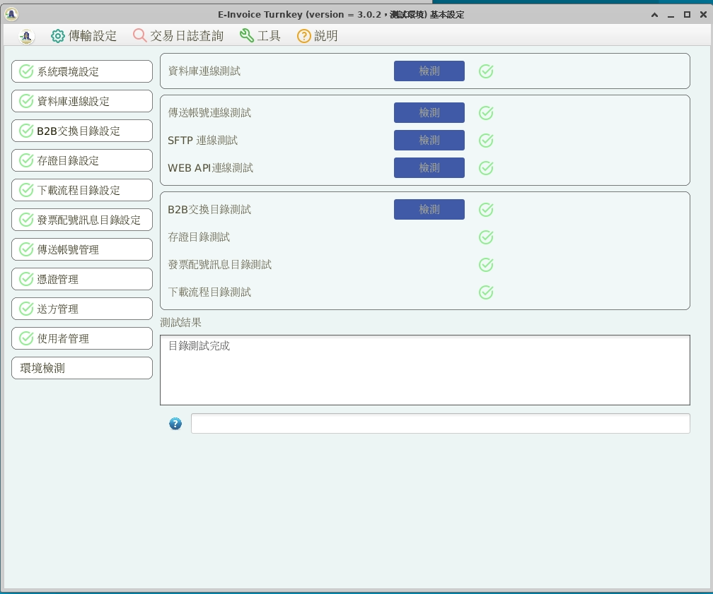

    環境檢測

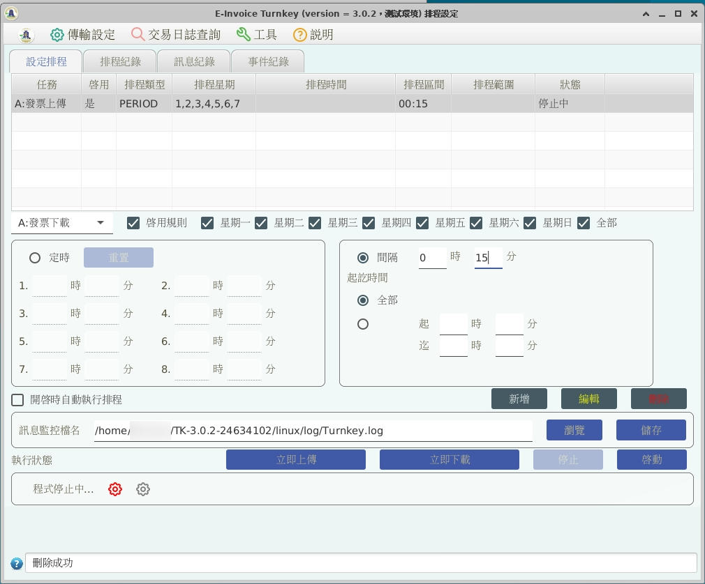

    設定排程: 最基本的方式就是單純設定發票上傳、發票下載的執行間隔時間

如果要在開機時，就直接啟用 Turnkey 排程程式，請建立 /etc/rc.local 執行檔:

.. code-block:: sh

    $ sudo vi /etc/rc.local
    $ cat /etc/rc.local
    #!/bin/bash

    su - eit-user -c "cd /home/eit-user/EINVTurnkey3.0.2-24634102/linux/ && ./run_start.sh &"

    $ sudo chmod a+x /etc/rc.local

安裝 TKW 伺服器
-------------------------------------------------------------------------------

以 Python 3.X 為預設直譯器，本例使用 python3.10 :

.. code-block:: sh

    $ sudo update-alternatives --install /usr/bin/python python $(readlink -f $(which python3.10)) 3 # set python3 as default

安裝工具程式、編譯程式、相依函式庫:

.. code-block:: sh

    $ sudo apt install vim build-essential python3-dev python3-virtualenv mlocate jq mariadb-client libmariadb-dev

更換比較方便使用的 shell(Optional):

.. code-block:: sh

    $ sudo apt install zsh

安裝 zsh 後，設定請參照 zsh with oh-my-zsh: https://gist.github.com/aaabramov/0f1d963d788bf411c0629a6bcf20114d

.. code-block:: sh

    $ sudo apt install gettext
    $ git clone git@github.com:ho600-ltd/Django-taiwan-einvoice.git
    $ virtualenv -p python3 Django-taiwan-einvoice.py3env
    $ source Django-taiwan-einvoice.py3env/bin/activate
    $ pip install --upgrade pip
    $ pip install -r Django-taiwan-einvoice/turnkey_web/requirements.txt
    $ pip install ipython
    $ cd Django-taiwan-einvoice/turnkey_web/
    $ ./manage.py migrate
    $ ./manage.py createsuperuser
    Username (leave blank to use 'XXX'): 
    Email address: XXX@ho600.com
    Password: 
    Password (again): 
    Superuser created successfully.
    $ ./manage.py shell # create "eiturnkey object". The url, slug, hash_key should be set from TEA service
    $ sudo apt install supervisor
    $ cp -rf Django-taiwan-einvoice/turnkey_web/tkw.ini /etc/supervisor/conf.d/ # then update the wss url
    $ sudo systemctl enable supervisor.service
    $ sudo systemctl start supervisor.service
    $ sudo supervisorctl reread
    $ sudo supervisorctl start all

最後再設定 /etc/crontab 即可:

.. code-block:: sh

    */5 *   *  *  * eit-user wget --no-check-certificate "https://localhost:8443/crontab_monitor/single_entry_point_of_view/?me=cron" -O /dev/null

    17  2   *  *  * root su - eit-user -c "cd /home/eit-user/EINVTurnkey3.0.2-24634102/linux/ && ./run_stop.sh" && reboot

執行 /crontab_monitor/single_entry_point_of_view/ 的目的，是將 TEA 所傳入的發票檔轉換成 Turnkey-3 可執行的格式，也同時把 Turnkey-3 執行結果更新至 TEA 可讀取的紀錄。

執行 ./run_stop.sh 則是定時關閉 Turnkey-3 程式並重開機。