在 Linux 安裝 Turnkey 及 TKW 伺服器
===============================================================================

Turnkey 下載點: https://www.einvoice.nat.gov.tw/EINSM/ein_upload/html/ENV/1536133205094.html

最低需求: 

1. 僅支援 Ubuntu 10.4 以上，Redhat ES 5.4 以上，支援 32、64 位元版本
#. 需搭配 Xwindow 及中文字集包，以正常顯示中文
#. 請確認 OpenJDK 版本為 8

安裝建議:

1. EI 平台有限制 Turnkey 系統的來源 IP ，所以建議到雲端平台去建立 TKW 伺服器，本文中範例是運作在 AWS
#. 安裝 Turnkey 的系統，建議使用 OpenVPN 連線或是部置在 NAT 的後面，讓 Turnkey 可以 OpenVPN Server 或 NAT Server 的 IP 去跟 EI 連線
#. Turnkey 須搭配 Xwindow ，所以建議使用「Amazon Linux 2 with .Net Core, PowerShell, Mono, and MATE Desktop Environment」AMI，有 LTS 支援
#. 若需創建多台 Turnkey 系統(如: 不同分店各自擁有 Turnkey 系統)，可多個 Turnkey 系統置於同一 Linux 的不同資料夾中，也可各自裝在獨立的 Linux OS
#. TKW 是以檔案系統與 Turnkey 系統互動，所以多個 Turnkey 系統置於一 Linux 中，可只安裝一個 TKW ，若裝在不同 Linux ，則每個 Linux 至少都裝一個 TKW

基本函式庫安裝:

.. code-block:: sh

    $ sudo yum install cjkuni-uming-fonts.noarch google-noto-sans-traditional-chinese-fonts.noarch java-1.8.0-openjdk
    $ sudo yum install amazon-cloudwatch-agent collectd # for CloudWatchMonitoringScripts
    $ sudo vi /opt/aws/amazon-cloudwatch-agent/bin/config.json # or sudo /opt/aws/amazon-cloudwatch-agent/bin/amazon-cloudwatch-agent-config-wizard
    $ cat /opt/aws/amazon-cloudwatch-agent/bin/config.json
    {
        "agent": {
            "metrics_collection_interval": 60,
            "run_as_user": "root"
        },
        "logs": {
            "logs_collected": {
                "files": {
                    "collect_list": [
                        {
                            "file_path": "/home/ec2-user/django-taiwan-einvoice/turnkey_web.asgi.log",
                            "log_group_name": "turnkey_web.asgi.log",
                            "log_stream_name": "${instance_id}",
                            "retention_in_days": 7
                        }
                    ]
                }
            }
        },
        "metrics": {
            "aggregation_dimensions": [
                [
                    "InstanceId"
                ]
            ],
            "append_dimensions": {
                "AutoScalingGroupName": "${aws:AutoScalingGroupName}",
                "ImageId": "${aws:ImageId}",
                "InstanceId": "${aws:InstanceId}",
                "InstanceType": "${aws:InstanceType}"
            },
            "metrics_collected": {
                "collectd": {
                    "metrics_aggregation_interval": 60
                },
                "disk": {
                    "measurement": [
                        "used_percent"
                    ],
                    "metrics_collection_interval": 60,
                    "resources": [
                        "*"
                    ]
                },
                "mem": {
                    "measurement": [
                        "mem_used_percent"
                    ],
                    "metrics_collection_interval": 60
                },
                "statsd": {
                    "metrics_aggregation_interval": 60,
                    "metrics_collection_interval": 60,
                    "service_address": ":8125"
                }
            }
        }
    }
    $ sudo /opt/aws/amazon-cloudwatch-agent/bin/amazon-cloudwatch-agent-ctl -a fetch-config -m ec2 -s -c file:/opt/aws/amazon-cloudwatch-agent/bin/config.json
    $ sudo /opt/aws/amazon-cloudwatch-agent/bin/amazon-cloudwatch-agent-ctl -m ec2 -a status
    {
        "status": "running",
        "starttime": "2022-09-07T06:08:59+0000",
        "configstatus": "configured",
        "cwoc_status": "stopped",
        "cwoc_starttime": "",
        "cwoc_configstatus": "not configured",
        "version": "1.247352.0"
    }

.. ::

    <<從 Turnkey-3 起不再使用 PostgreSQL ，因為它們的表格名、欄位名稱大小寫未跟 MariaDB 保持一致>>

    創建 PostgreSQL 資料庫:

    安裝指令: sudo yum install postgresql

    .. code-block:: sql 

        # create database tkw Encoding='UTF8' LC_Collate='zh_TW.UTF-8' LC_Ctype='zh_TW.UTF-8' template=template1;
        # create user tkw with password 'tkw';
        # alter database tkw owner to tkw;

    .. code-block:: sh 

        $ psql -h dtei-db.ho600.com -U tkw -W tkw < EINVTurnkey2.0.2-linux/DBSchema/PostgreSQL/PostgreSQL.sql

創建 MariaDB 資料庫:

安裝指令: sudo yum install mariadb

.. code-block:: sql 

    # CREATE DATABASE tkw CHARACTER SET = 'utf8' COLLATE = 'utf8_unicode_ci';
    # CREATE USER tkw@'%' identified by 'tkw';
    # GRANT SELECT, INSERT, UPDATE, DELETE, CREATE, DROP, REFERENCES, INDEX, ALTER, CREATE TEMPORARY TABLES, LOCK TABLES, EXECUTE, CREATE VIEW, SHOW VIEW, CREATE ROUTINE, ALTER ROUTINE, EVENT, TRIGGER on tkw.* to tkw@'%' identified by 'tkw';

.. code-block:: sh 

    $ mysql -h dtei-db.ho600.com -u tkw -p tkw < EINVTurnkey2.0.2-linux/DBSchema/MySQL/MySQL.sql

設定 Turnkey 所需基本參數:

.. code-block:: sh

    $ cd ${SOME_WHERE}/EINVTurnkey2.0.2-linux/linux
    $ ./runFirst.sct

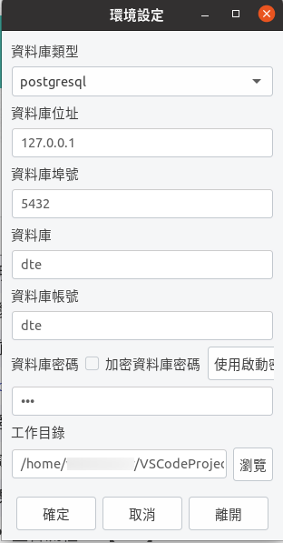

    設定資料庫、工作目錄

執行 Turnkey:

.. code-block:: sh

    $ ./einvTurnkey.sct

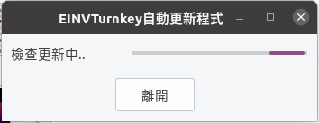

    更新中

成功執行後，可見:

    Turnkey UI

設定軟體憑證、傳送帳號、送方管理
-------------------------------------------------------------------------------

請先準備好「軟體憑證.pfx」及大平台所開立的「傳送帳號、密碼、繞送代碼」。

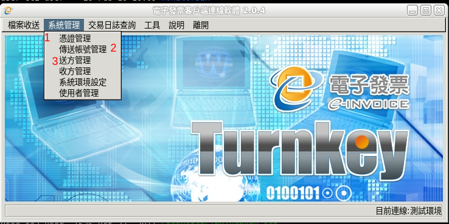

    在選單上，依序執行「1 憑證管理」、「2 傳送帳號管理」、「3 送方管理」

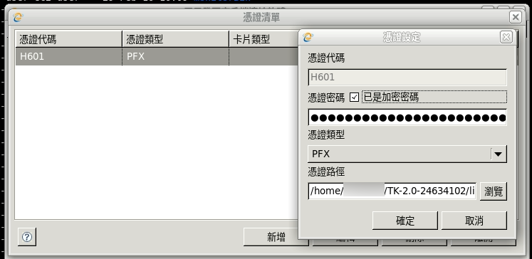

    自定憑證代碼，填先前設定的憑證密碼、選擇軟體憑證

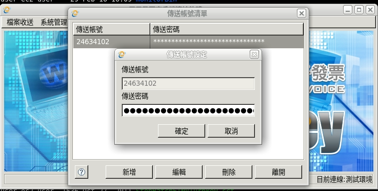

    填入大平台開立的傳送帳號、密碼

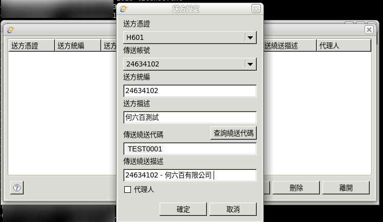

    選擇「憑證、帳號」，填入統編及大平台開立的繞送代碼

.. note::

    軟體憑證.pfx 相對應的 .cer 檔務必先上傳至大平台。

設定「檔案收送」中的 5 類「目錄」
-------------------------------------------------------------------------------

來自「財政部電子發票整合服務平台客服中心」的建議，在初始設定 Turnkey 時，\
就要做好「檔案收送」中的 5 個「目錄設定」，就算你的需求只有 B2C ，\
也請一併完成 B2B 交換/存證的目錄設定。\
不然可能會有 `C 狀態拿不到的問題 <https://github.com/ho600-ltd/django-taiwan-einvoice/issues/2>`_ 。

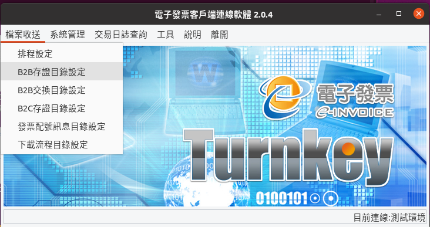

    依序到「檔案收送」的子選單

5 個設定畫面如下:

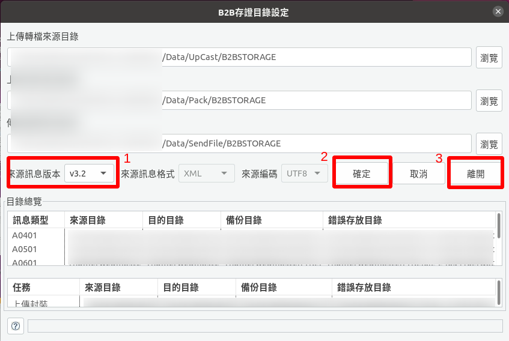

    B2B 存證目錄設定

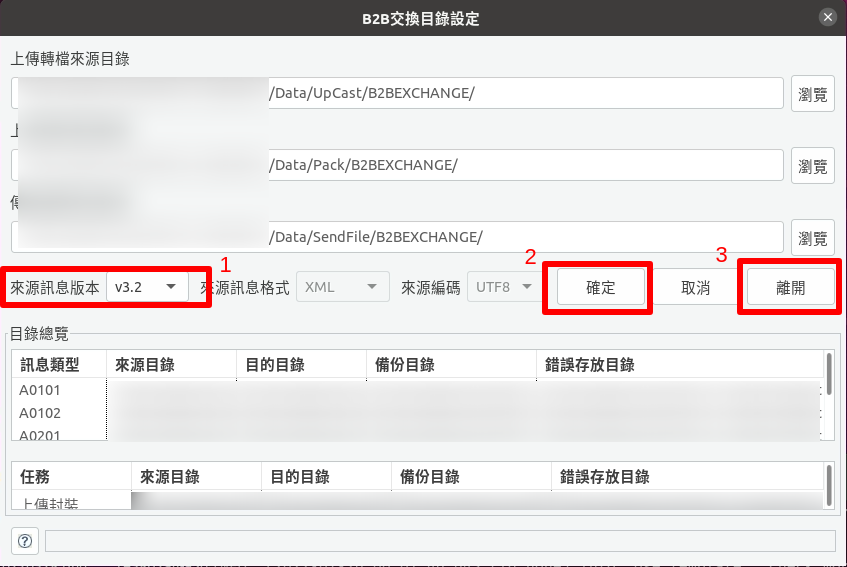

    B2B 交換目錄設定

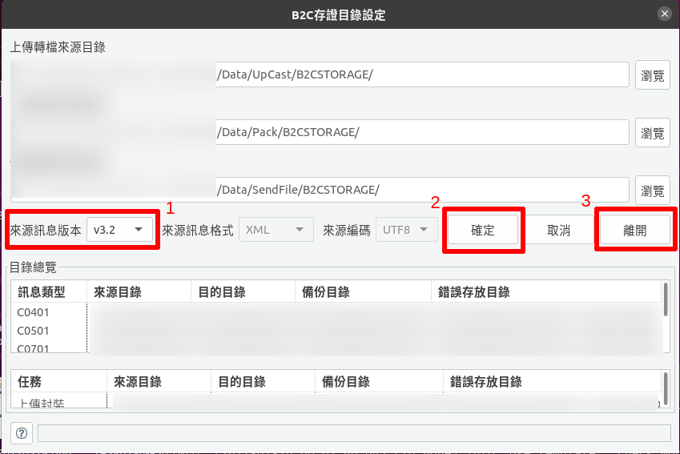

    B2C 存證目錄設定

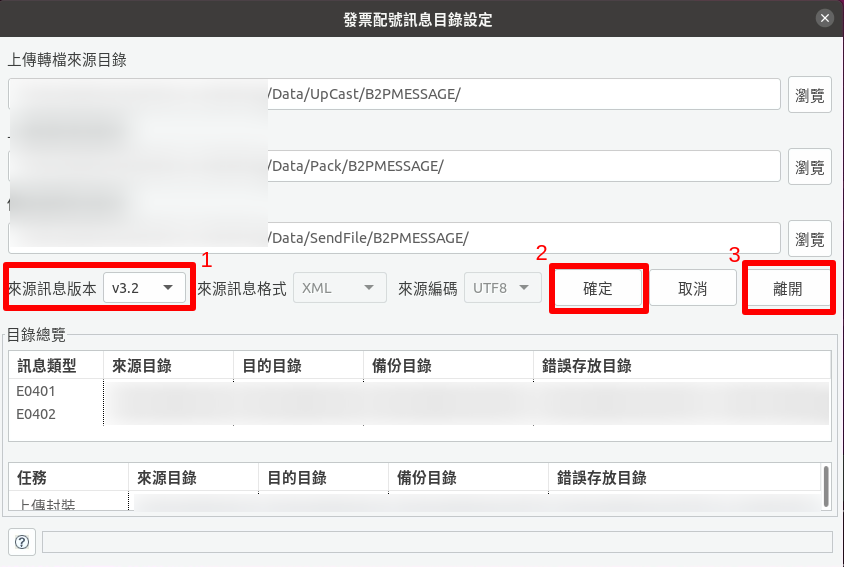

    發票配號訊息目錄設定

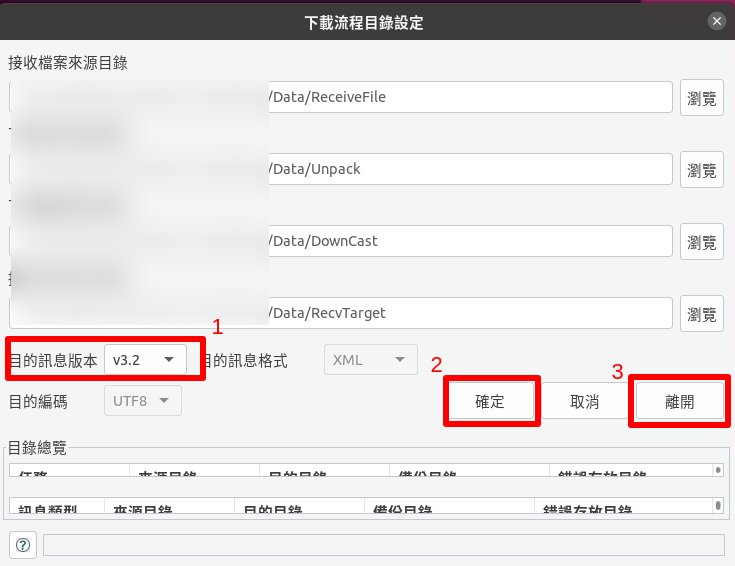

    下載流程目錄設定

以上 5 個子畫面中，都做到:

1. 確認訊息版本，此版本要與你所生成的 XML MIG 版本相符
#. 按下「確定」
#. 按下「離開」

皆完成後，就能在檔案總管中，看到如下的資料夾:

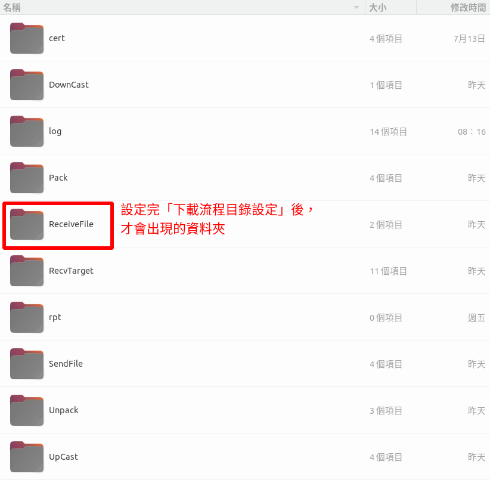

    有設定過「下載流程目錄」後，才會出現 ReceiveFile 資料夾

安裝 TKW 伺服器
-------------------------------------------------------------------------------

.. code-block:: sh

    $ sudo yum install python3-devel python-virtualenv git zsh util-linux-user jq mariadb-devel
        * set up zsh with oh-my-zsh: https://gist.github.com/aaabramov/0f1d963d788bf411c0629a6bcf20114d
    $ git clone git@github.com:ho600-ltd/Django-taiwan-einvoice.git
    $ sudo yum install make glibc-devel gcc patch
    $ virtualenv -p python3 Django-taiwan-einvoice.py3env
    $ source Django-taiwan-einvoice.py3env/bin/activate
    $ pip install --upgrade pip
    $ pip install -r Django-taiwan-einvoice/turnkey_web/requirements.txt
    $ pip install ipython
    $ cd Django-taiwan-einvoice/turnkey_web/
    $ ./manage.py migrate
    $ ./manage.py createsuperuser
    Username (leave blank to use 'XXX'): 
    Email address: XXX@ho600.com
    Password: 
    Password (again): 
    Superuser created successfully.
    $ ./manage.py shell # create "te_web object". The url, slug, hash_key should be set from TEA service
    $ cp -rf Django-taiwan-einvoice/turnkey_web/*.int /etc/supervisor/conf.d/ # then update the wss url
    $ sudo apt install supervisor
    $ sudo systemctl enable supervisord.service
    $ sudo systemctl start supervisord.service
    $ sudo supervisorctl reread
    $ sudo supervisorctl start all
