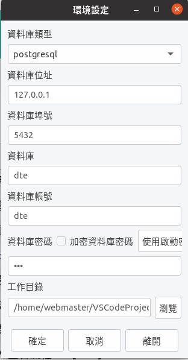
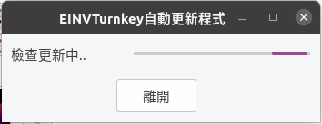

在 Linux 安裝 Turnkey 及 TKW 伺服器
===============================================================================

Turnkey 下載點: https://www.einvoice.nat.gov.tw/EINSM/ein_upload/html/ENV/1536133205094.html

最低需求: 

1. 僅支援 Ubuntu 10.4 以上，Redhat ES 5.4 以上，支援 32、64 位元版本
#. 需搭配 Xwindow 及中文字集包，以正常顯示中文
#. 請確認 OpenJDK 版本為 8

安裝建議:

1. EI 平台有限制 Turnkey 系統的來源 IP ，所以建議到雲端平台去建立 TKW 伺服器，本文中範例是運作在 AWS
#. 安裝 Turnkey 的系統，建議使用 OpenVPN 連線或是部置在 NAT 的後面，讓 Turnkey 可以 OpenVPN Server 或 NAT Server 的 IP 去跟 EI 連線
#. Turnkey 須搭配 Xwindow ，所以建議使用「Amazon Linux 2 with .Net Core, PowerShell, Mono, and MATE Desktop Environment」AMI，有 LTS 支援
#. 若需創建多台 Turnkey 系統(如: 不同分店各自擁有 Turnkey 系統)，可多個 Turnkey 系統置於同一 Linux 的不同資料夾中，也可各自裝在獨立的 Linux OS
#. TKW 是以檔案系統與 Turnkey 系統互動，所以多個 Turnkey 系統置於一 Linux 中，可只安裝一個 TKW ，若裝在不同 Linux ，則每個 Linux 至少都裝一個 TKW

創建 PostgreSQL 資料庫:

.. code-block:: sql 

    # create database dte Encoding='UTF8' LC_Collate='zh_TW.UTF-8' LC_Ctype='zh_TW.UTF-8' template=template1;
    # create  user dte with password 'dte';
    # alter database dte owner to dte;

.. code-block:: sh 

    $ psql -h 127.0.0.1 -U dte -W dte < EINVTurnkey2.0.2-linux/DBSchema/PostgreSQL/PostgreSQL.sql

設定 Turnkey 所需基本參數:

.. code-block:: sh

    $ cd ${SOME_WHERE}/EINVTurnkey2.0.2-linux/linux
    $ ./runFirst.sct

    設定資料庫、工作目錄

執行 Turnkey:

.. code-block:: sh

    $ ./einvTurnkey.sct

    更新中

成功執行後，可見:

    Turnkey UI

安裝 TKW 伺服器
-------------------------------------------------------------------------------

.. code-block:: sh

    $ sudo yum install python3-dev python-virtualenv git zsh util-linux-user jq mysql-devel
        * set up zsh with oh-my-zsh: https://gist.github.com/aaabramov/0f1d963d788bf411c0629a6bcf20114d
    $ git clone git@github.com:ho600-ltd/django-taiwan-einvoice.git
    $ virtualenv -p python3 django-taiwan-einvoice.py3env
    $ source django-taiwan-einvoice.py3env/bin/activate
    $ pip install --upgrade pip
    $ pip install -r django-taiwan-einvoice/turnkey_web/requirements.txt
    $ pip install ipython
    $ cd django-taiwan-einvoice/turnkey_web/
    $ ./manage.py migrate
    $ ./manage.py shell # create "te_web object". The url, slug, hash_key should be set from TE service
    $ cp -rf django-taiwan-einvoice/turnkey_web/*.conf /etc/supervisor/conf.d/ # then update the wss url
    $ sudo apt install supervisor
    $ sudo supervisorctl reread
    $ sudo supervisorctl start all
