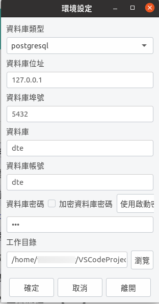

在 Linux 安裝 Turnkey
===============================================================================

下載點: https://www.einvoice.nat.gov.tw/EINSM/ein_upload/html/ENV/1536133205094.html

最低需求: 

1. 僅支援 Ubuntu 10.4 以上，Redhat ES 5.4 以上，支援 32、64 位元版本
#. 需搭配 Xwindow 及中文字集包，以正常顯示中文
#. 請確認 OpenJDK 版本為 8

創建 PostgreSQL 資料庫:

.. code-block:: sql 

    # create database dte Encoding='UTF8' LC_Collate='zh_TW.UTF-8' LC_Ctype='zh_TW.UTF-8' template=template1;
    # create  user dte with password 'dte';
    # alter database dte owner to dte;

.. code-block:: sh 

    $ psql -h 127.0.0.1 -U dte -W dte < EINVTurnkey2.0.2-linux/DBSchema/PostgreSQL/PostgreSQL.sql

設定 Turnkey 所需基本參數:

.. code-block:: sh

    $ cd ${SOME_WHERE}/EINVTurnkey2.0.2-linux/linux
    $ ./runFirst.sct

    設定資料庫、工作目錄

執行 Turnkey:

.. code-block:: sh

    $ ./einvTurnkey.sct

    更新中

成功執行後，可見:

.. figure:: install_turnkey_in_linux/turnkey_ui.png

    Turnkey UI
