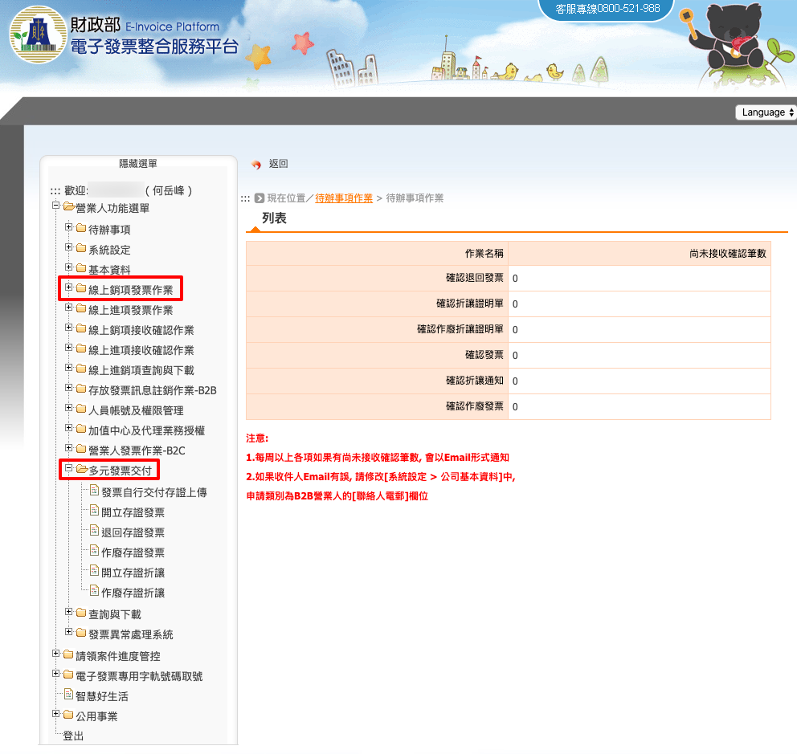
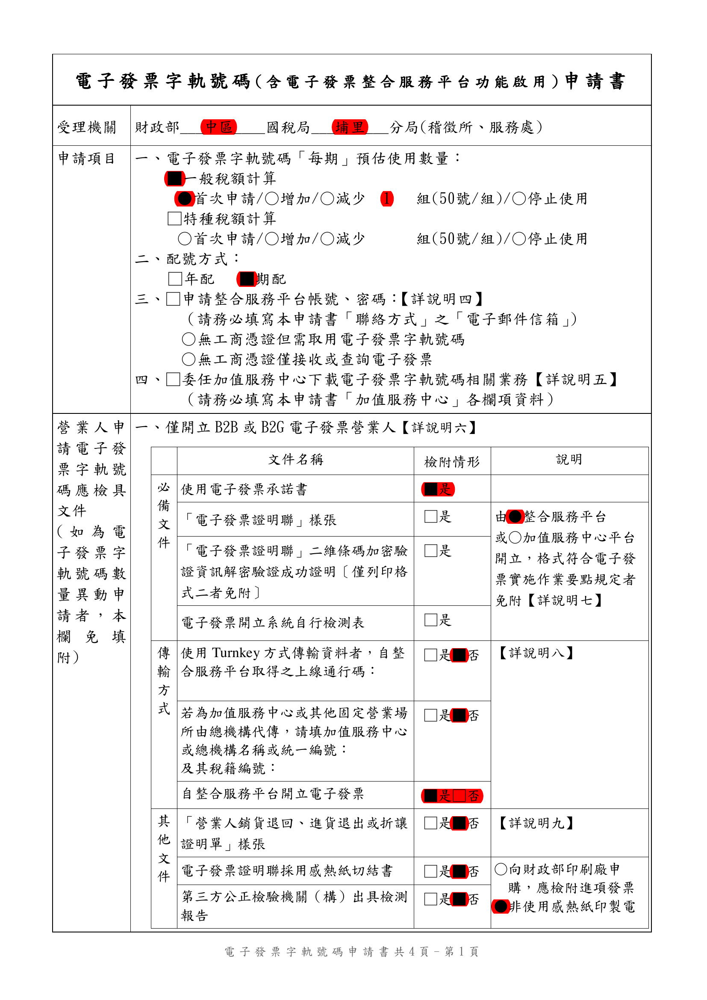
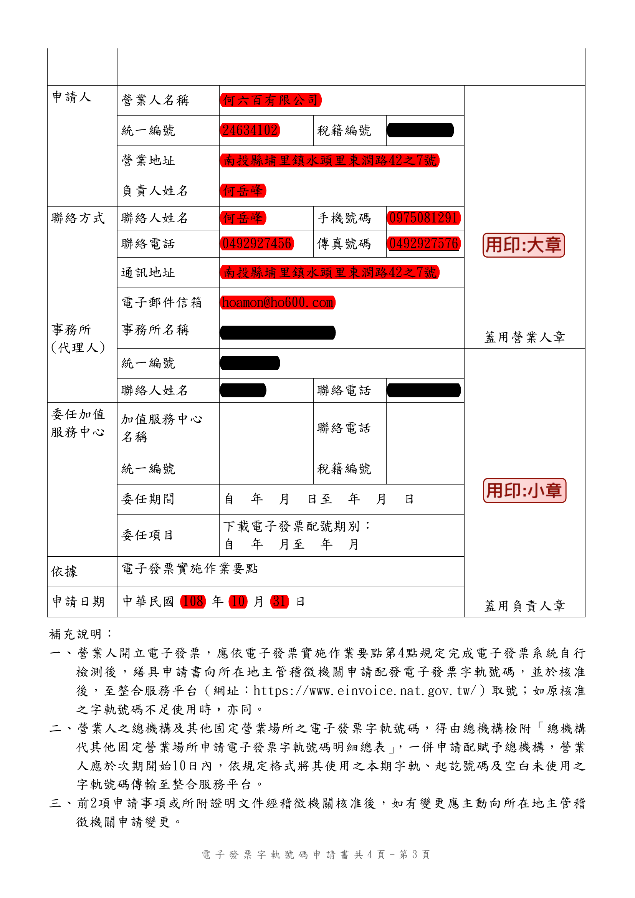
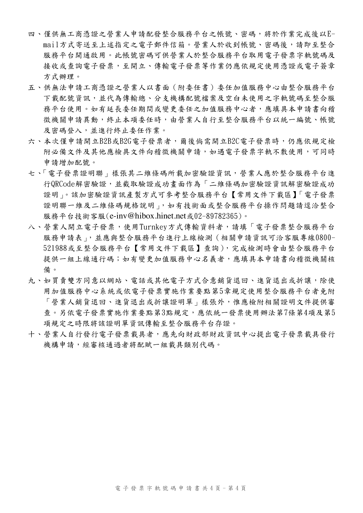
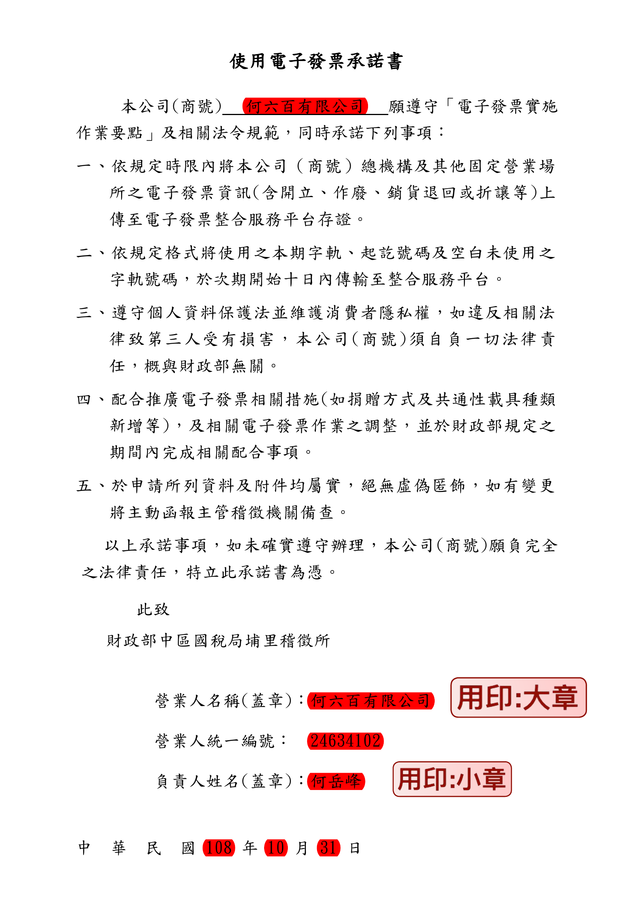

營業人利用「電子發票整合服務平台(2023.12.31以前版本)」開立 B2B 電子發票
===============================================================================

本文閱讀對象雖然是「營業人」，但若是代換成一般組織、團體、政府機關的角色，\
一般來說，也只須在操作步驟上，\
把「工商憑證」換成相對應的「XCA 憑證」或「GCA 憑證」即可類推操作。

使用本文的基本前提條件:

1. 擁有「以營業人身份登入電子發票整合服務平台的管理員權限」
#. 擁有「效期內的負責人之自然人憑證或工商憑證」

必須使用憑證的理由
-------------------------------------------------------------------------------

電子發票與傳統紙本發票相比，可以將電子發票簡化成一堆文字、數字的訊息而己，\
不須要列印成紙本，單用 PDF 、圖檔或是媒體申報電子檔足以擔任「電子發票」讓買受人核銷、\
向稅務機關申報營業稅。

那麼，我們這些有「數位專長」的人，是不是可以「破解電子發票格式」，\
然後就任意「代表台積電開一張發票給聯電」呢?

**當然不行!**

這「憑證」的目的，就是在確保「電子發票」不會「被偽造」且「無法被否認」。

在建立一份合乎電子發票規範(MIG)的數位訊息後，非得用憑證為這串數位訊息作一個簽章，\
而憑證是「通往現實世界的標誌」，自然人向戶政機關、\
營利單位/非營利組織/政府機關向所屬管理機關申請憑證，在申請的當下，\
由「管理機關」認證「什麼人或什麼法人」可使用憑證，\
身份無誤後才授權「他/她/它」可使用該專屬憑證。

這樣該憑證在那張電子發票上所簽署的簽章，即可代表是「什麼人或什麼法人」所開出的，\
於此確保了「電子發票的開立人」是對的人，其「發票內容」也被開立人自證之。

所以要開立合法、有效的「電子發票」，其必要條件就是得使用一張憑證，\
而申辦自然人憑證的工本費目前是 250 元，工商憑證的工本費為 420 元，\
其他憑證的申請費用請自行詢問所屬管理機關。

如何開立 B2B 交換/存證電子發票
-------------------------------------------------------------------------------

本節說明的電子發票開立工作，限定是商家對商家(B2B)的這一種，\
也可把商家換成組織、團體或政府機關，\
發票上的交易對象必須是有「統編」的買家對上有「統編」的賣家。\

利用財政部自己所推出的「整合服務平台」，\
賣家無須開發自己的「開發票系統」，\
即可直接用「整合服務平台」就能開發票給買受人(買家)了。

在「整合服務平台」開立發票的原則:

1. 可提前新增「發票日期」大於「開立日」的發票
#. 只允許寄送未來三日內的發票，如: 在 6 月 4 日時，僅可寄送最晚 6 月 7 日的發票
#. 同本電子發票須順時順號，如: 在 6 月 4 日時，發立號碼尾碼 55 的 6 月 6 日發票，那之後，就不能再開立尾碼 56 、 6 月 5 日的發票，必須在 6 月 6 日(含)之後
#. 只能開立當期發票，如: 7 月 30 日時，只能開立最晚 7 月 31 日的發票，不能開 8 月 1 日發票

本節主要目標，僅在教學如何使用「電子發票整合服務平台」中的「線上銷項發票作業」\
及「多元發票交付」功能，如下圖紅框處:

在「線上銷項發票作業」中的「 :ref:`開立發票` 」作業(B2B 交換)中，\
其發票買受人須在它的「電子發票整合平台」上設定「發票接受方式」，\
而在「多元發票交付」的「 :ref:`開立存證發票` 」作業(B2B 存證)上，\
其發票買受人可為任何擁有統編的公司、非營利組織、政府單位。

雖然，我們可用「工商憑證」直接在「整合服務平台」創建一個具管理者權限的營業人身份帳號，\
但仍須以「紙本文件」向稅務機關申請啟用電子發票開立資格。

所謂「電子發票開立資格」，就如同現今使用的「統一發票購票證」，\
商號、組織得有這一張「購票證」，才能向代售點購買「統一發票」。\
在電子發票作業上，無需「購買發票」這個作業項目，改為「字軌取號」的作業，\
也就是每期在開立發票前，營業人在平台上先要求「配發發票字軌及號碼區間」，\
有了「專屬字軌及發票號碼區間」，營業人才能開出一張擁有獨一無二發票號碼的「電子發票」。

其所須準備的申請文件:

* 電子發票字軌申請書
* 使用電子發票承諾書

* 受理機關: 請填寫貴司所屬之分局、稽徵所或服務處，敝司屬「財政部中區國稅局埔里稽徵所」管轄
* 一般稅額計算/首次申請 1 組: 1 組會有 50 個發票號碼，此數值請按貴司慣例自行評斷
* 配號方式: 期配。 1 期為 2 個月，也是目前敝司購買紙本發票的習慣
* 申請整合服務平台帳號、密碼: 因為敝司採用「工商憑證」自行到「整合服務平台」開立帳號了，\
  所以此部份設定未勾選
* 委任加值服務中心下載…: 本節教學乃以營業人本身為操作主體並在大平台操作 B2B 交換/存證相關作業，所以無須委任加值服務中心
* 本節操作乃營業人用最精簡方式(單純使用大平台)開立 B2B 電子發票，所以在檢具文件方面，只須要提供「使用電子發票承諾書」

.. figure:: merchant_only_b2b/serial_number_02.png
    :width: 500px
    :align: center

申請人、聯絡方式、事務所、申請日期，請依貴司本身資料填寫，並蓋大章、小章。

再附上「使用電子發票承諾書」，內容主要是提醒每期未開立之空白發票，\
記得 **在次期 10 日內傳輸至整合服務平台** 。還有不要亂開發票，遵守相關法律，\
財政部是不會幫忙負責的…。這份承諾書 **強烈建議** 要全部瀏覽一遍，\
再蓋上貴司之大、小章。

以上兩份文件，可親送或郵寄到所屬營業稅管理單位。\
接下來，便坐等「電子發票字軌號碼」申請通過。

實際開立發票操作流程(基本篇)
^^^^^^^^^^^^^^^^^^^^^^^^^^^^^^^^^^^^^^^^^^^^^^^^^^^^^^^^^^^^^^^^^^^^^^^^^^^^^^^

營業人在開立 B2B 電子發票上的主要操作，所關係的頁面如下:

* 營業人功能選單
    * 系統設定
        * :ref:`公司基本資料`
    * 基本資料
        * :ref:`主憑證資料登錄作業`
        * :ref:`附屬憑證資料登錄作業`
        * :ref:`交易對象資料維護`
        * :ref:`產品單位設定`
        * :ref:`產品資料維護`
        * :ref:`營業人電子發票資格查詢`
    * 多元發票交付
        * :ref:`開立存證發票`
        * :ref:`發票自行交付存證上傳`
        * :ref:`作廢存證發票`
    * 查詢與下載
        * :ref:`發票查詢/列印/下載`
    * 線上銷項發票作業
        * :ref:`開立發票`
* 電子發票專用字軌號碼取號
    * 電子發票專用字軌號碼取號
        * :ref:`電子發票專用字軌號碼取號(營業人)`
    * 電子發票上傳作業
        * :ref:`上傳未使用空白發票號碼`

在營業人管理者登入後，先到「 :ref:`公司基本資料` 」頁去填寫聯絡電話、電子信箱、地址等資訊，\
再到「 :ref:`主憑證資料登錄作業` 」登錄「工商憑證或負責人的自然人憑證」，\
每一張開立的電子發票都須被主憑證簽章，才能算是一張合格的電子發票。\
若公司組織較大，能開立電子發票的員工比較多，\
也可以讓這些員工各自使用自身的自然人憑證或工商憑證附卡做電子發票簽章。\
這部份請參考「 :ref:`附屬憑證資料登錄作業` 」。

再來是到「 :ref:`交易對象資料維護` 」去登記「發票的買受人資料」，\
若是該買受人也會銷售商品給我們，那它的交易對象類別就選「買賣方」。

再來到「 :ref:`產品單位設定` 」去定義商品所用的單位名稱，如: 式、組、包、盒、…等。

再到「 :ref:`產品資料維護` 」去定義商品，敝司主要是銷售軟體業務，所以商品只有 2 種: 系統開發費、系統維護費。

做到這裡為止的設定，我們總算可以開立發票了。

首先是先到「 :ref:`電子發票專用字軌號碼取號(營業人)` 」頁面，領取當期可使用的電子發票字軌及號碼。

有可使用的字軌、號碼後，才能開立發票，開立方式分兩種。

第一種是使用多元發票交付，進入「 :ref:`開立存證發票` 」的頁面，去存檔發票，\
存檔後再到「 :ref:`發票自行交付存證上傳` 」頁面，\
依「存檔日期」查詢發票，選擇發票後，再「寄送」該張發票，\
此處的「寄送」實指「用主憑證或附屬憑證為它簽章」，\
待簽章完成後，會立即存證上傳至財政部。

因為這種「自行交付存證上傳」的動作，僅僅只是「賣家自行為電子發票簽章」，\
買受人並沒有自動接送該張電子發票的管道，\
所以賣家得在平台上把該張發票的 PDF 檔下載下來，再自行轉交給買受人。\
PDF 檔的下載位置是在「 :ref:`發票查詢/列印/下載` 」的頁面內。

第二種開立方式則有賴買受人啟用電子發票接受的設定。\
買受人有啟用就能使用「線上銷項發票作業 > :ref:`開立發票` 」頁面來開立電子發票給該名買受人。\
如果不確定買受人有沒有啟用電子發票接受設定的話，可到「 :ref:`營業人電子發票資格查詢` 」頁面，\
以它的統編來查詢。

以上是簡要說明「開立電子發票」的基本觀念，可直接點選其「頁面」連結，\
每一個頁面的操作流程，都有以截圖方式詳加說明。

關於電子發票作業的次要操作所關係的頁面如下:

* 營業人功能選單
    * 基本資料
        * :ref:`營業人接收方式設定`
    * 待辦事項
        * :ref:`待辦事項`

在進項電子發票上，若是供應商開立發票給我們，\
則需要我們在「 :ref:`營業人接收方式設定` 」頁面中設定一個「自動接受」的管道，\
可以是在「Web(整合服務平台)」 、「透過加值服務中心」或是「電子信箱」來接受「進項電子發票」。

在「 :ref:`待辦事項` 」頁面中，會列出與買受人或是自身為買受人的待確認發票張數，\
什麼是「待確認發票」? 像是開出電子發票給某個客戶，但他卻不接受該張發票，而被他退回。\
或是有某個供應商開出電子發票給我們，而需要我們確認接受。

實際開立發票操作流程(進階篇)
^^^^^^^^^^^^^^^^^^^^^^^^^^^^^^^^^^^^^^^^^^^^^^^^^^^^^^^^^^^^^^^^^^^^^^^^^^^^^^^

.. todo::

    * 批次開立發票