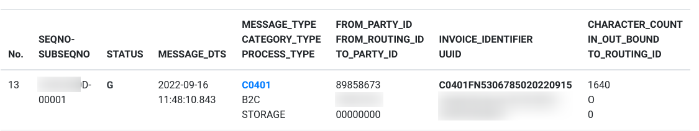

營業人利用「Turnkey系統」開立 B2C 存證電子發票
===============================================================================

本文閱讀對象只針對「營業人」，其他的一般組織、團體、政府機關的角色並不適用。

線上申請 TURNKEY 傳輸
-------------------------------------------------------------------------------

* 提供 2 個固定 IP ， 1 個供正式環境，另 1 個供測試環境
* 通過後，即可到 https://wwwtest.einvoice.nat.gov.tw/ 使用工商憑證開通「營業人」用之 admin 帳號
* 將相關帳密填入 Turnkey 系統，並完成相關設定(軟體憑證、傳送帳號、送方管理、目錄設定、…)
* 開放「電子發票專用字軌號碼取號/電子發票專用字軌號碼取號(營業人)」權限給 developer
* 以 admin 帳號登入 https://wwwtest.einvoice.nat.gov.tw/ ，上傳軟體憑證(.cer)，而軟體憑證私錀+cer檔(.pfx)置入 Turnkey 系統。
    軟體憑證製作方式請參考「財政部電子發票整合服務平台的申請軟體憑證使用手冊」
* 設定三種密碼種子: QRcode, turnkey, 下載清冊。先參照「加解密API使用說明書」來製作密碼種子 Hex (ex: 密碼種子是 24634102 ，則密碼種子 Hex 是 FE05F029154F6AA67A78B338ED2F6601 ):
    * 密碼種子 Hex 的製作:
        .. code-block:: sh

            $ ./genKey.sh  

            ===Enter [q] to exit program===
            Enter passphrase: 24634102
            [2021/08/26 16:33:26][INFO][][]  - begin gen key...
            [2021/08/26 16:33:26][INFO][][]  - end gen key...(OK)
            [2021/08/26 16:33:26][INFO][][]  - com.tradevan.geinv.kms.dist.DistKMSService begin init...
            [2021/08/26 16:33:26][INFO][][]  - com.tradevan.geinv.kms.dist.DistKMSService begin init...(OK)
            Result(Hex)==>FE05F029154F6AA67A78B338ED2F6601
    * 使用密碼種子 Hex 作 AES 加密:
        .. code-block:: sh

            $ python3 assets/qrcode_aes_encrypt.py FE05F029154F6AA67A78B338ED2F6601 XF000012349876
            CamotDNRUN8bVyY5S1BhFQ==
    * 到「營業人功能選單」/「人員帳號及權限管理」的各項密碼種子管理頁面登錄該相應密碼種子
* 從大平台取得當期字軌號碼區間

.. note::

    在使用 Turnkey 傳輸時，因為有綁定 IP ，原本有測試看能不能用 HTTPS, SSL Proxy 方式來讓 Turnkey 裝在公司內部網路，\
    但使用 AWS 上的 HTTPS, SSL Proxies 作轉換。其中測試 ssh 部份的參數如下:

        # ~/.ssh/config

        Host tsftp.einvoice.nat.gov.tw

        Ciphers 3des-cbc

        KexAlgorithms diffie-hellman-group1-sha1

        $ sftp -P 2222 -o "ProxyCommand /usr/bin/nc -X connect -x $ProxyHost:$ProxyPort %h %p" $account@tsftp.einvoice.nat.gov.tw

    但 Turnkey 的 Java 程式並未特別作使用 Proxy 設定，且有些動作可能不只使用了 tsftp.einvoice.nat.gov.tw, tgw.einvoice.nat.gov.tw 網址，\
    結果並不成功。

    最終方案是將 Turnkey 裝在 AWS 中，並為它套上 Web API ，這樣電商系統可利用 Web API 去通知 Turnkey 上傳發票資訊，\
    無須與 Turnkey 系統安裝在同一台伺服器中。

手動製作電子發票 MIG XML
-------------------------------------------------------------------------------

1. 從當期字軌號碼區間挑一字軌號碼: FN53067850
2. 確定發票明細
3. 確定買受人、載具、是否捐贈
4. 依 MIG-3.2 版編寫 C0401 XML 檔，也可拿「電子發票資料交換標準文件與範例」中的範例來修改使用

XML 範例如下:

.. code-block:: xml

    <Invoice xmlns="urn:GEINV:eInvoiceMessage:C0401:3.2" xmlns:xsi="http://www.w3.org/2001/XMLSchema-instance" xsi:schemaLocation="urn:GEINV:eInvoiceMessage:C0401:3.2 C0401.xsd">
    <Main>
        <InvoiceNumber>FN53067850</InvoiceNumber>
        <InvoiceDate>20220915</InvoiceDate>
        <InvoiceTime>11:40:14</InvoiceTime>
        <Seller>
            <Identifier>89858673</Identifier>
            <Name>昶茂微生物開發股份有限公司</Name>
            <Address>臺中市大里區仁德里仁禮街33號</Address>
            <PersonInCharge>郭基發</PersonInCharge>
            <TelephoneNumber>0424950542</TelephoneNumber>
            <FacsimileNumber>0424758696</FacsimileNumber>
            <EmailAddress>service@bio-enzyme.com</EmailAddress>
            <CustomerNumber>綠大地</CustomerNumber>
            <RoleRemark>總公司</RoleRemark>
        </Seller>
        <Buyer>
            <Identifier>24634102</Identifier>
            <Name>何六百有限公司</Name>
            <Address>南投縣埔里鎮東潤路42-7號</Address>
            <PersonInCharge>何岳峰</PersonInCharge>
            <TelephoneNumber>0492927456</TelephoneNumber>
            <FacsimileNumber>0492927576</FacsimileNumber>
            <EmailAddress>service@ho600.com</EmailAddress>
            <CustomerNumber>何六百</CustomerNumber>
            <RoleRemark>總公司</RoleRemark>
        </Buyer>
        <InvoiceType>07</InvoiceType>
        <DonateMark>0</DonateMark>
        <PrintMark>Y</PrintMark>
        <RandomNumber>7213</RandomNumber>
        <CarrierType>3J0002</CarrierType>
        <CarrierId1>/4WDMPUZ</CarrierId1>
        <CarrierId2>/4WDMPUZ</CarrierId2>
    </Main>
    

        <ProductItem>
            <Description>【綠大地油酵清】水管除油酵素錠三罐</Description>
            <Quantity>1</Quantity>
            <UnitPrice>1380</UnitPrice>
            <Amount>1380</Amount>
            <SequenceNumber>001</SequenceNumber>
        </ProductItem>
    

    <Amount>
        <TaxType>1</TaxType>
        <TaxRate>0.05</TaxRate>
        <TaxAmount>66</TaxAmount>
        <SalesAmount>1314</SalesAmount>
        <TotalAmount>1380</TotalAmount>
        <FreeTaxSalesAmount>0</FreeTaxSalesAmount>
        <ZeroTaxSalesAmount>0</ZeroTaxSalesAmount>
    </Amount>

手動上傳發票至大平台
-------------------------------------------------------------------------------

將手動製作的發票 MIG XML 檔放到「TK 所在目錄/Data/UpCast/B2CSTORAGE/C0401/SRC」資料夾中，\
再啟用 Turnkey 程式，到「檔案收送」/「排程設定」頁面上點擊「立即上傳」。

成功上傳後，即可看見 TURNKEY_MESSAGE_LOG 多一筆紀錄:

    成功上傳的狀態是顯示 G 

過數分鐘後，可再點擊「立即下載」，大平台若是已處理完該張發票且無問題，\
就會將 G 改為 C 狀態。

確認上傳紀錄為 C 狀態後，在大平台就會查詢得到該張 B2C 銷項發票紀錄。