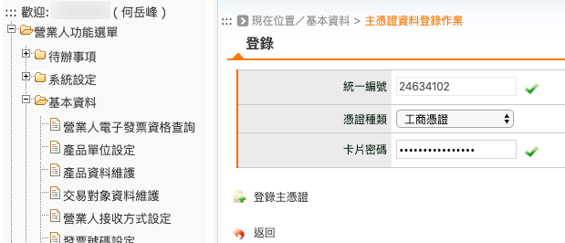
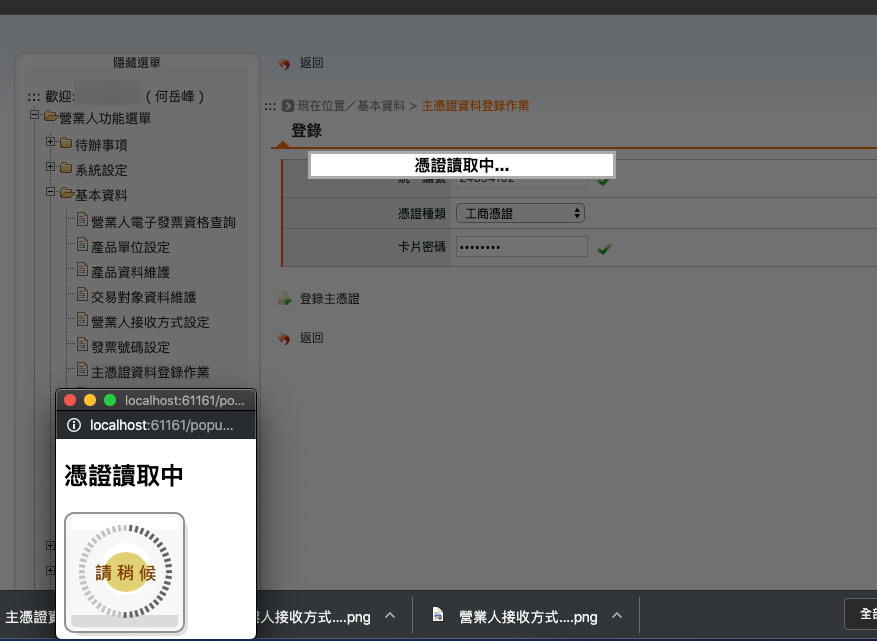
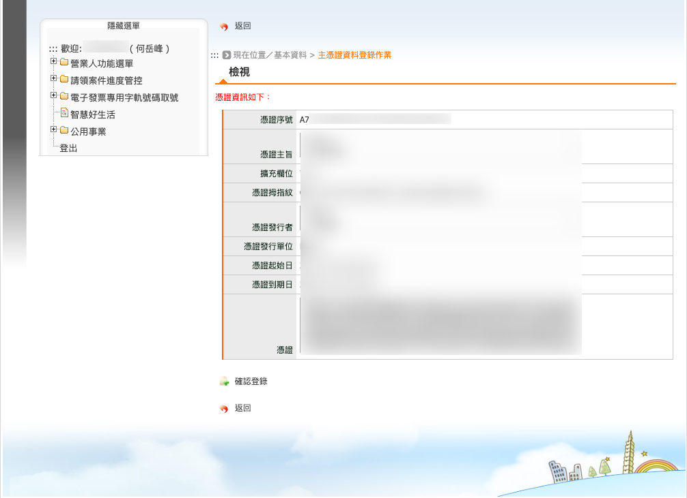

.. _主憑證資料登錄作業:

主憑證資料登錄作業
...............................................................................

路徑位置: *營業人功能選單 > 基本資料 > 主憑證資料登錄作業* 。

這裡的主憑證是用來簽章電子發票所用的主要憑證，如果公司比較大，負責開發票的人比較多，\
其他人也可以使用「工商憑證附卡」或是個人的「自然人憑證」來做簽章，\
請至「 :ref:`附屬憑證資料登錄作業` 」頁面去登錄。

在主憑證的種類選擇上，可以是「工商憑證正卡」、「工商憑證附卡」或是「負責人的自然人憑證」。\
若為一般組織、政府機關，則是使用 XCA 或 GCA 憑證。

在輸入憑證密碼後，請先把憑證插進讀卡機中，才按下「登錄主憑證」。

    憑證讀取中…

倘若這裡有讀取不成功的情形發生，請到 `經濟部工商憑證管理中心的瀏覽器檢測 <https://moeacaweb.nat.gov.tw/MoeaeeWeb/other/checker.aspx>`_ 頁面尋找協助。該中心並有提供諮詢服務電話由專人服務。

憑證讀取成功後，會先顯示它的資訊供你確認，尤其是「憑證到期日」不要過期了。\
確認資訊沒問題的話，就按下「確認登錄」，系統顯示「憑證登錄成功」就完成了。

主憑證僅能登錄一張，若已存在，系統會提醒「請先操作主憑證刪除」。

.. note::

    這裡有一個 macbook os 上的 bug ，在主憑證登錄上，我無法成功登錄「工商憑證」，
    只有「自然人憑證」是可以的。而在 Windows os 上，則兩種都行。