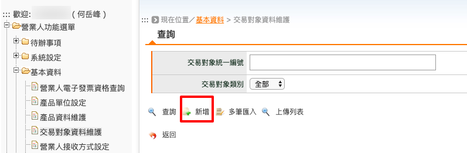
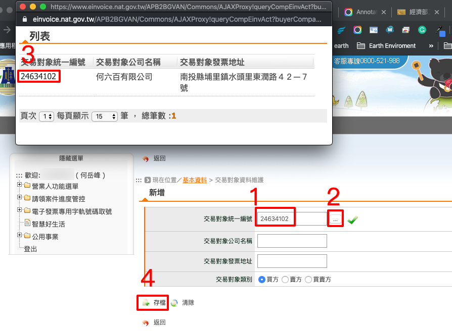
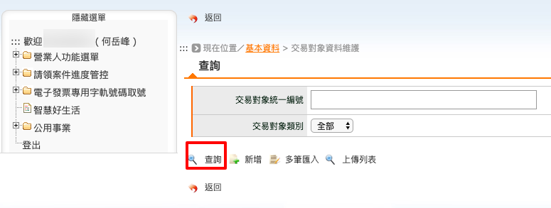
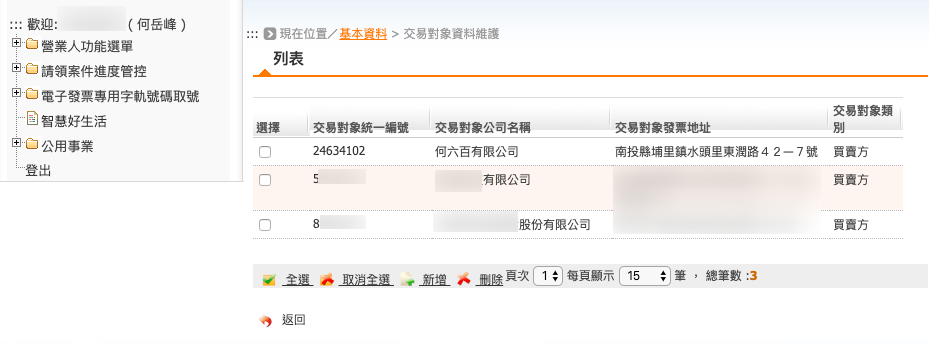

.. _交易對象資料維護:

交易對象資料維護
...............................................................................

路徑位置: *營業人功能選單 > 基本資料 > 交易對象資料維護* 。

要開電子發票給客戶前，必須將它的統一編號登記到「交易對象資料」中。\
這樣在開立發票時，才能在買受人輸入框中選取對象紀錄。

先點選「新增」按鈕。

    新增交易對象資料

再依序填入交易對象資料:

1. 輸入統編
#. 點選右方「...」按鈕
#. 在跳出的小視窗中，點選相符合的統一編號，其詳細資料會自動代表表單輸入框中
#. 按下「存檔」按鈕

完成後，會出現「新增成功」的訊息。

    查詢交易對象資料

要查詢已存檔的交易對象紀錄，只要在「交易對象統一編號」輸入框中輸入它的 8 碼統一編號，\
再按下「查詢」按鈕。若是「交易對象統一編號」輸入框留空，則會秀出全部的交易對象。

    列表交易對象資料