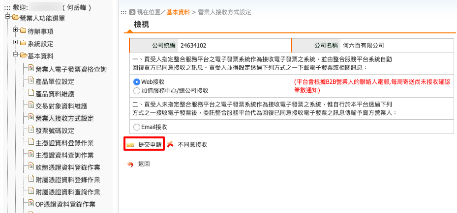

.. _營業人接收方式設定:

營業人接收方式設定
...............................................................................

路徑位置: *營業人功能選單 > 基本資料 > 營業人接收方式設定* 。

電子發票(包含折讓單)的接收方式主要是用在「買受人退回電子發票」、「供應商開立電子發票給我們」、…時，\
須有一管道將該電子發票接收進來，接收後再由我們「確認」，也就是認知到「該電子發票傳給我們」了。

用現在的紙本發票使用流程來舉例，當賣家開出一張發票準備交給你時，你得決定用左手還是右手接收這張發票；\
或是當你開出一張發票給客戶，但客戶拿到發票後，看了兩眼告知: 『品項不對、金額不對』，\
或反悔要取消交易，在他退還該張發票時，你也得決定用左手還是右手接收這張發票。

決定用左手接收或是右手接收可類推此頁面中的「Web接收」及「Email接收」，\
「Web接收」方式是你回到整合服務平台中，使用憑證作逐筆或是批次確認接收電子發票；\
而「Email接收」是由整合服務平台自動幫你確認接收後，再寄送通知信給你，\
而通知信中會附上該張電子發票的 PDF ，且該 PDF 會以你所設定的「密碼(PDF附件加密)」作加密。

    Web 接收

選擇 Web 接收後，按下「提交申請」。

跳出的新視窗會要求提供當前用戶的登入密碼，輸入後按下「確認授權」。\
完成後，會跳出「設定成功」的提醒視窗。即完成「營業人接收方式」的設定。

又或者選擇「Email接收」。此時，請輸入要收通知信的電子信箱，\
及未來通知信中的 PDF 附件加密密碼。請注意，\
這裡的「PDF 附件加密密碼」是不會有機會再顯示給你看的，所以如果你忘了這個密碼，\
那過去使用這組密碼去加密的 PDF ，你就沒機會打開看了。但開不了，也沒什麼關係，\
因為你還是可以回到整合服務平台查詢電子發票。

輸入「營業人信箱」、「密碼」後接下「提交申請」，新視窗會要求使用憑證做「確認授權」。\
這部份是與「Web接受」用「登入密碼」做「確認授權」是不一樣的。

因為在確認接受發票及折讓單的這作業上，就必須使用憑證做確認，\
差別是「Web接受」在每一次確認時用憑證授權，而「Email接受」在一開始選擇套用時授權。