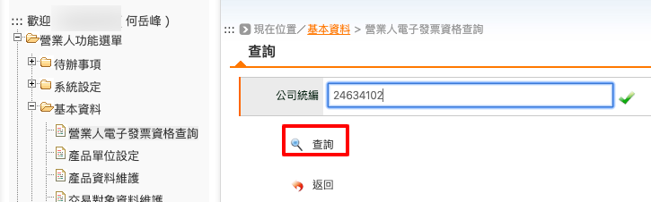
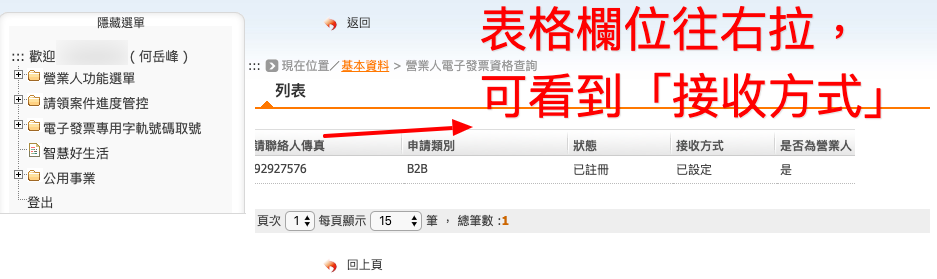

.. _營業人電子發票資格查詢:

營業人電子發票資格查詢
...............................................................................

路徑位置: *營業人功能選單 > 基本資料 > 營業人電子發票資格查詢* 。

要使用「線上銷售發票作業」方式來「 :ref:`開立發票` 」，買受人一定得先設定好「接收方式」，\
我們可以在這個頁面，輸入統一編號來查詢它的設定狀態。

    請輸入要查詢對象的統一編號

    查詢結果，向右拉可見到「接收方式」

何六百有限公司的電子發票接收方式目前是「已設定」。
