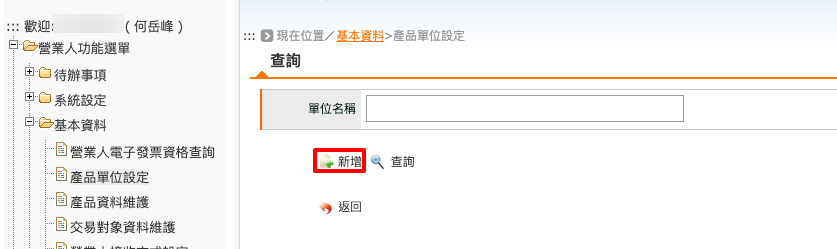
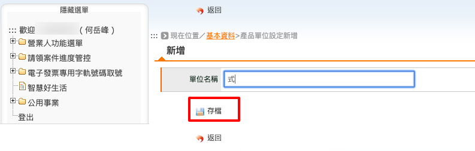
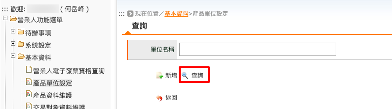
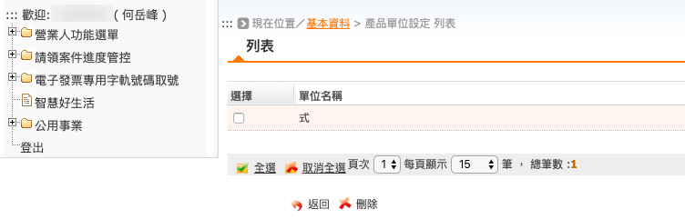

.. _產品單位設定:

產品單位設定
...............................................................................

路徑位置: *營業人功能選單 > 基本資料 > 產品單位設定* 。

在開立發票時，需填寫銷售品項明細，而明細中需包含「品項單位」，如: 式、組、盒、包、…等。

點選「新增」按鈕。

填入「單位名稱」，如: 式。再按下「存檔」即可。

也可查詢已建立的「單位名稱」。

    單位名稱列表

可見到 1 筆單位名稱紀錄。