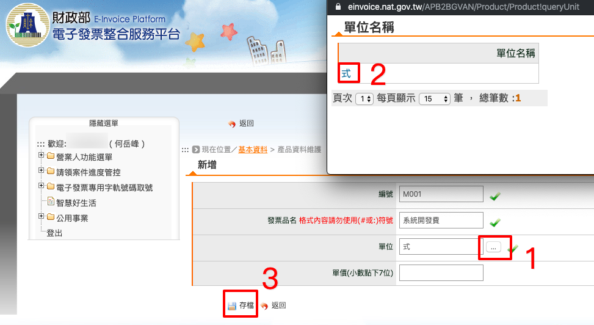
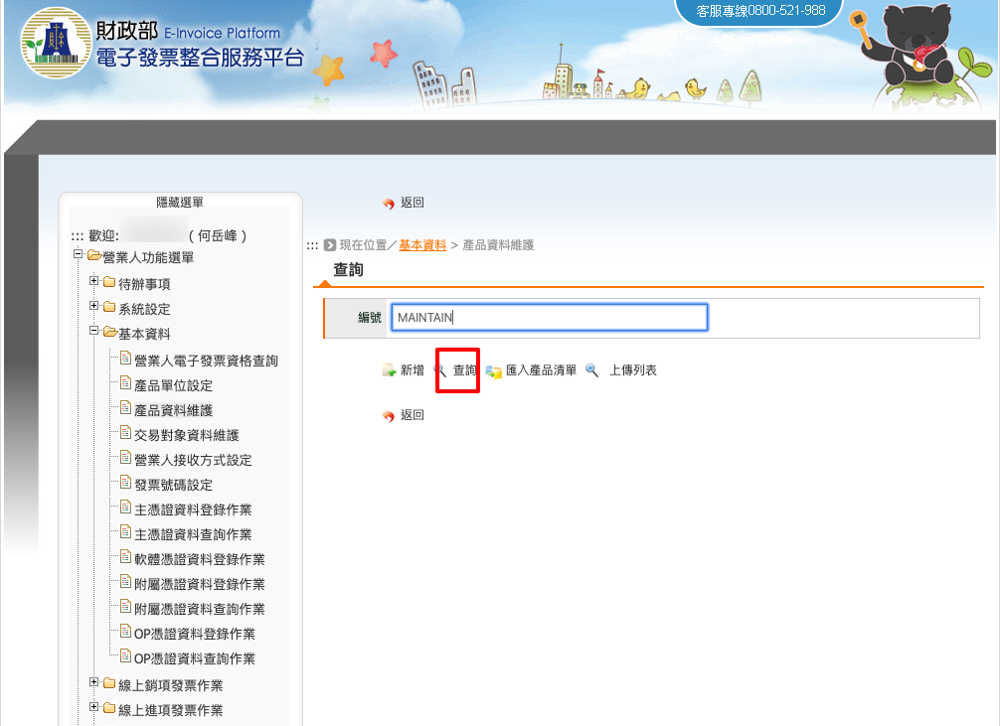

.. _產品資料維護:

產品資料維護
...............................................................................

路徑位置: *營業人功能選單 > 基本資料 > 產品資料維護* 。

在開立發票時，需填寫銷售品項明細，而品項名稱可以事前先定義好，\
或是也可以在開立發票時才撰寫名稱。

敝司的業務內容比較單純，除了少部份有配售到硬體外，\
名稱主要就是 2 種: 系統開發費、系統維護費。事先定義好，開發票比較省事。

按下「新增」按鈕。

有綠勾部份的欄位為必填，編號可自定格式，像是: P001, S02, MAINTAIN01, …等。\
單位則是點選「…」按鈕後，跳出小視窗來選擇。最後按下「存檔」，\
並顯示「存檔完畢」訊息，即代表成功新增。

也可以查詢目前所自定的產品資料。

上圖是目前所自定的產品資料列表。