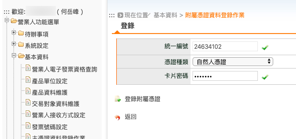
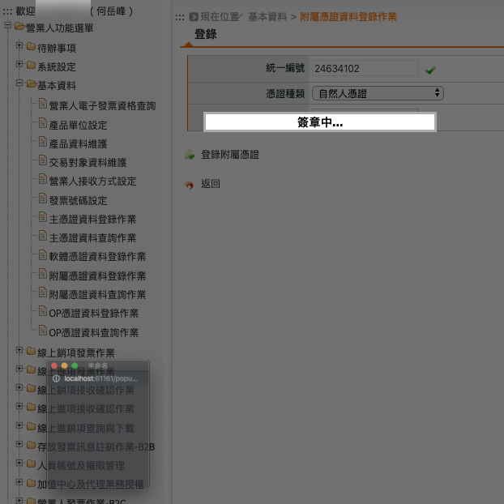
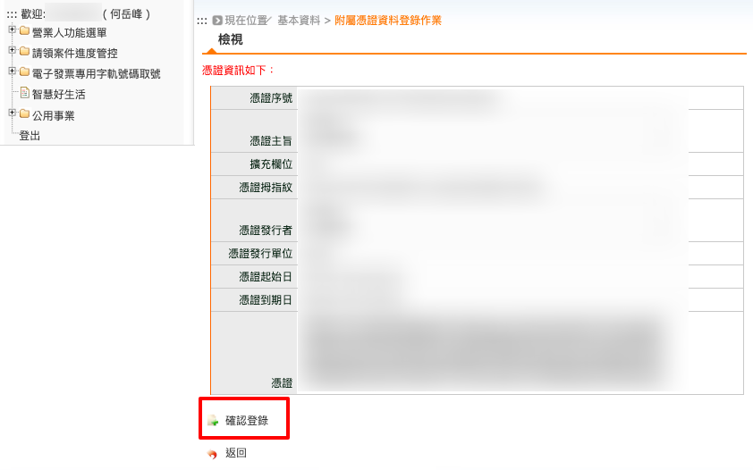

.. _附屬憑證資料登錄作業:

附屬憑證資料登錄作業
...............................................................................

路徑位置: *營業人功能選單 > 基本資料 > 附屬憑證資料登錄作業* 。

附屬憑證可以是「自然人憑證」、「工商憑證附卡」、「GCA憑證附卡」或「XCA憑證附卡」。

在登錄「附屬憑證」時，也必須使用「主憑證」做簽章授權。所以一定是先完成「主憑證登錄」後，\
才能登錄「附屬憑證」，而「附屬憑證」可多登錄多張，這樣如果公司內部有多個人要開電子發票時，\
都是拿「個人的自然人憑證」作簽章，這樣才不會有資安疑慮，\
又若是員工不願意拿個人的自然人憑證運用在公事上，\
那也可以由公司去申請工商憑證附卡，附卡申請數量無上限，每張工本費 420 元。

    選擇使用個人的「自然人憑證」

輸入憑證密碼後，讀取該卡資料:

讀出的憑證資料如下:

按下「確認登錄」後，會再出現「要求插入主憑證」的小視窗，再輸入主憑證密碼後，接下確認，\
即完成「附屬憑證」登錄。