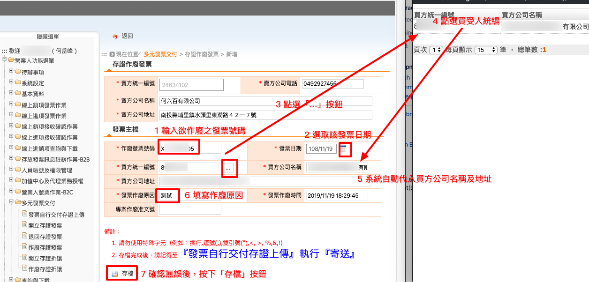
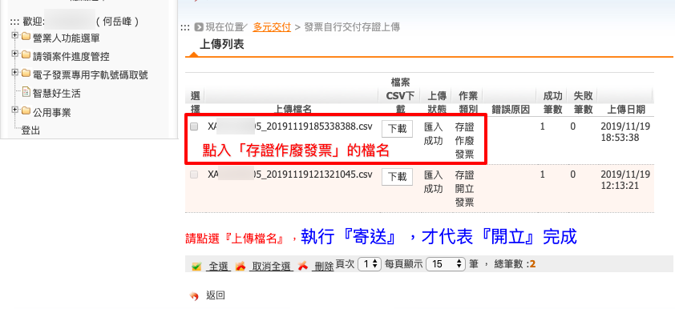
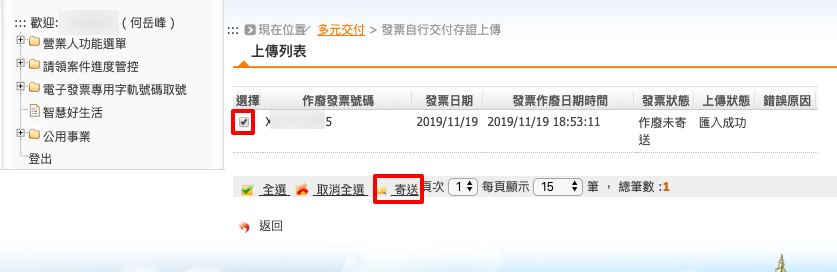
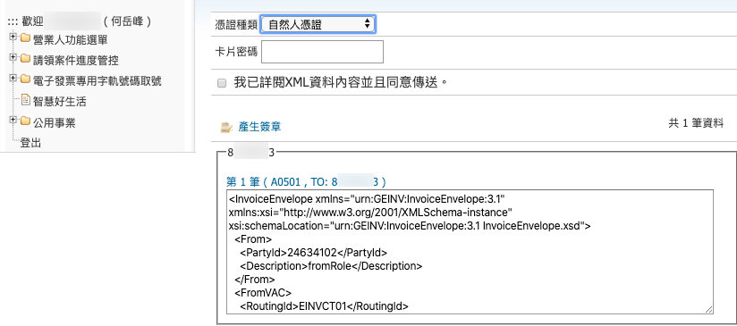
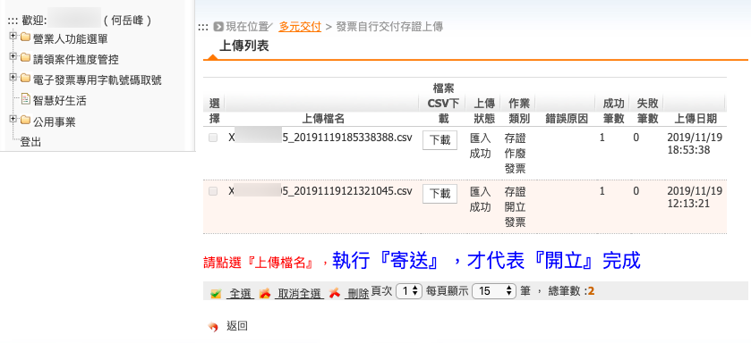
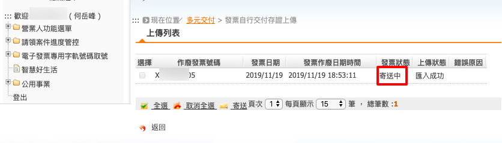
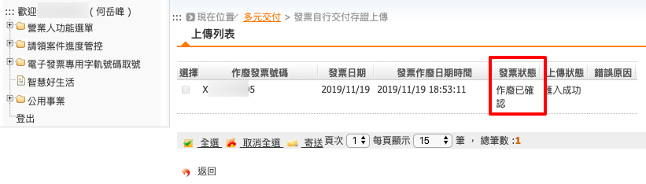

.. _作廢存證發票:

作廢存證發票
...............................................................................

路徑位置: *營業人功能選單 > 多元發票交付 > 作廢存證發票* 。

若是發票已自行交付存證上傳並寄送存證中心，則無法刪除該電子發票，必須採用「作廢存證發票」來沖回營業額。

1. 輸入欲作廢之發票號碼。並注意，之後再開立的發票切勿重覆使用。
#. 選取該張發票的發票日期。並注意，這不是「上傳日期」。
#. 點選「...」按鈕
#. 點選買受人統編的連結
#. 系統會自動代入買方公司名稱及地址
#. 填寫作廢原因
#. 確認資料無誤，則按下「存檔」

存檔成功後，會看到下列列表，這是「 :ref:`發票自行交付存證上傳` 」的頁面。\
如同「先前開立的電子發票」要憑證簽章、存證上傳才會生效，\
所「作廢的電子發票」也需經過相同的流程。

點入該「存證作廢發票」的檔名連結。

勾選欲「存證寄送」的「作廢發票」，並按下「寄送」按鈕。

插入要作簽章的憑證。請注意，這裡的憑證必須是登錄成「主憑證」或「附屬憑證」的憑證。\
輸入憑證卡片密碼，並勾選「我已詳閱XML資料內容並且同意傳送」。再按下「產生簽章」，\
頁面會跳出讀取憑證的小視窗，在跑一段時間後，\
會出現「確定送出 1 筆資料嗎?」，確定後立即送出。

此時會回到「上傳列表」。

再次點入「上傳檔名」的連結中。

    發票狀態: 寄送中

可見到該「作廢發票」的狀態變成「寄送中」。再過一段時間，回來檢查，\
若發票狀態改為「作廢已確認」，即代表成功作廢發票。

    發票狀態: 作廢已確認