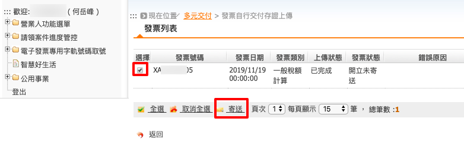

.. _發票自行交付存證上傳:

發票自行交付存證上傳
...............................................................................

路徑位置: *營業人功能選單 > 多元發票交付 > 發票自行交付存證上傳* 。

在「 :ref:`開立存證發票` 」後，其實尚未完成「開立發票」作業，\
需要再使用主憑證或附屬憑證為該張電子發票做一個簽章，並上傳到整合服務平台，\
才算完成「開立電子發票」作業。

    這裡的上傳日期指的是「開立存證發票」時的日期，不是「發票日期」

先依上傳日期查詢紀錄。

再點選「上傳檔案」名稱的連結。如果「存證發票」內容有誤的話，也可以勾選後，按下「刪除」鈕刪除紀錄。

勾選「要寄送的發票」，再按下「寄送」鈕。會跳出「確認寄送 1 筆資料?」視窗，\
確定後會出現「產生簽章」頁面，選擇你要完成簽章的工商憑證或是自然人憑證，\
並插入憑證至讀卡機，輸入卡片密碼，\
勾選「我已詳閱XML資料內容並且同意傳送」，再按下「產生簽章」連結。

會再跳出「確認寄送 1 筆資料?」視窗，確定後讀卡機會讀取憑證。

簽章製作完成並上傳。

上傳完成後，跳出「已處理 1 筆資料」視窗。

確定上傳後回到該電子發票列表頁面，此張電子發票會先處於「寄送中」的狀態，\
因為它還需要送到「存證中心」處理。

待「存證中心」處理完此張電子發票後，狀態會改成「開立已確認」。

到這裡，我們就完成「開立一張電子發票」了。\
因為「自行交付存證的電子發票」並無通知買受人的機制，\
所以必須由賣家自行下載該電子發票的 PDF ，傳給買受人，讓買受人可以做帳。

要下載電子發票的 PDF ，請至「 :ref:`發票查詢/列印/下載` 」處理。
