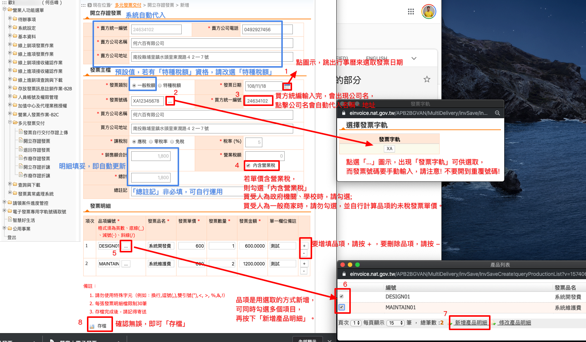

.. _開立存證發票:

開立存證發票
...............................................................................

路徑位置: *營業人功能選單 > 多元發票交付 > 開立存證發票* 。

只要是有統一編號的買受人，都可以使用本節方式開立電子發票給它。

如上圖，填寫發票主檔步驟如下:

1. 選取發票日期。請注意! 發票日期與發票號碼要順時順號開立。
#. 填寫發票號碼。請注意! 這裡的發票號碼並不會有驗證機制，所以請自行將已開立過的發票號碼另外紀錄下來，避免重覆開立。
#. 設定買方統編。務必要先完成「 :ref:`交易對象資料維護` 」的設定，才能在這裡選取它的公司名稱。
#. 勾選「內含營業稅」後，發票明細的金額直接累加起來，就是「總計」的金額。
#. 設定品項。須在「 :ref:`產品資料維護` 」中有設定的，才可以在這裡選取。若要增刪品項，可使用 + 或 - 的按鈕操作。
#. 勾選產品。在跳出的新視窗中，可多值勾選「產品」。
#. 新增產品明細。按下「新增產品明細」的連結，會將所勾選的「產品」帶回原來的主檔頁面。
#. 存檔。確認無誤後，即可存檔。

發票存檔後，會直接轉到「 :ref:`發票自行交付存證上傳` 」的頁面。\
要繼續完成交付存證上傳的動作，請點選上傳檔名的連結。\
若發票內容有誤，可勾選後，按下「刪除」按鈕刪除發票。

    錯誤原因: 『注意:發票資料含有相同買賣方統一編號。』

若發票內容有誤不刪除，執意點入「上傳檔名的連結」後，會看到系統提示的錯誤原因，\
如上圖。那這張有誤的發票可不可做「交付存證上傳」呢? 我猜想，系統應該不會阻止，\
但因為我只敢操作到「憑證簽章」之前的動作，怕真的「上傳」了，稅務單位會來找我聊聊，\
為什麼要犯這種錯呢!

那如何對「正確的發票」做「交付存證上傳」的作業，請見「:ref:`發票自行交付存證上傳` 」頁的說明。
