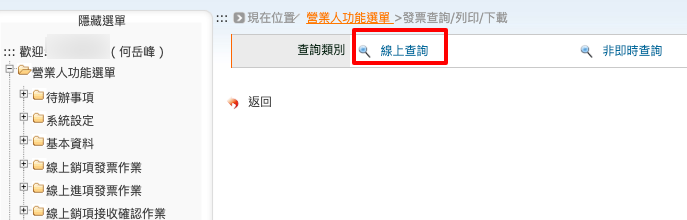
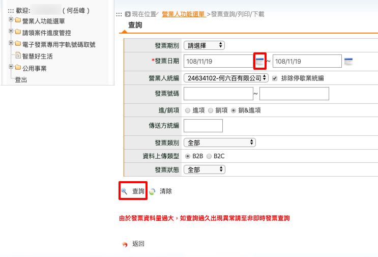
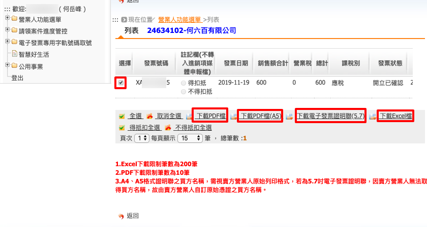
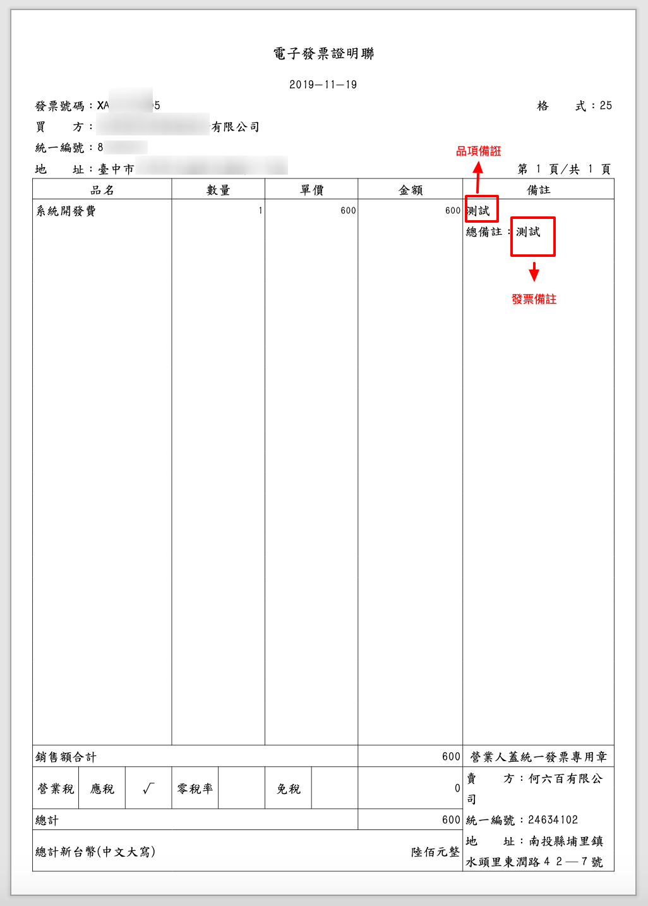
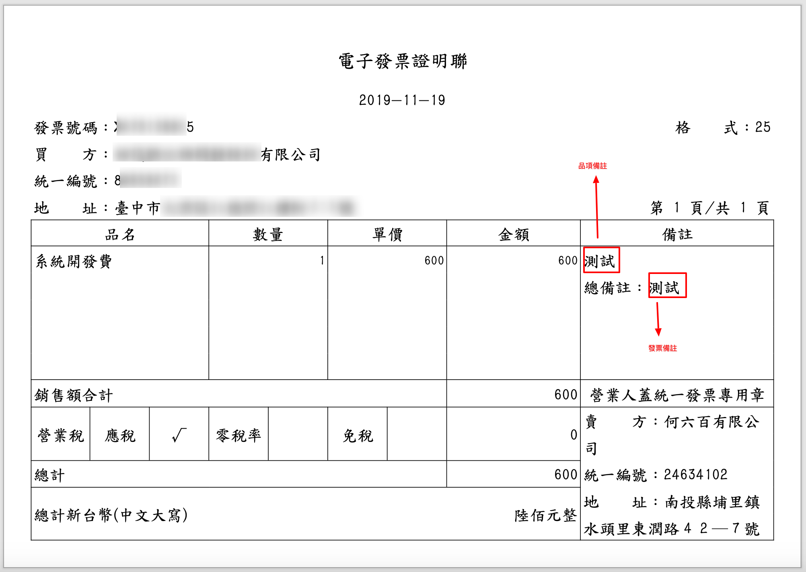
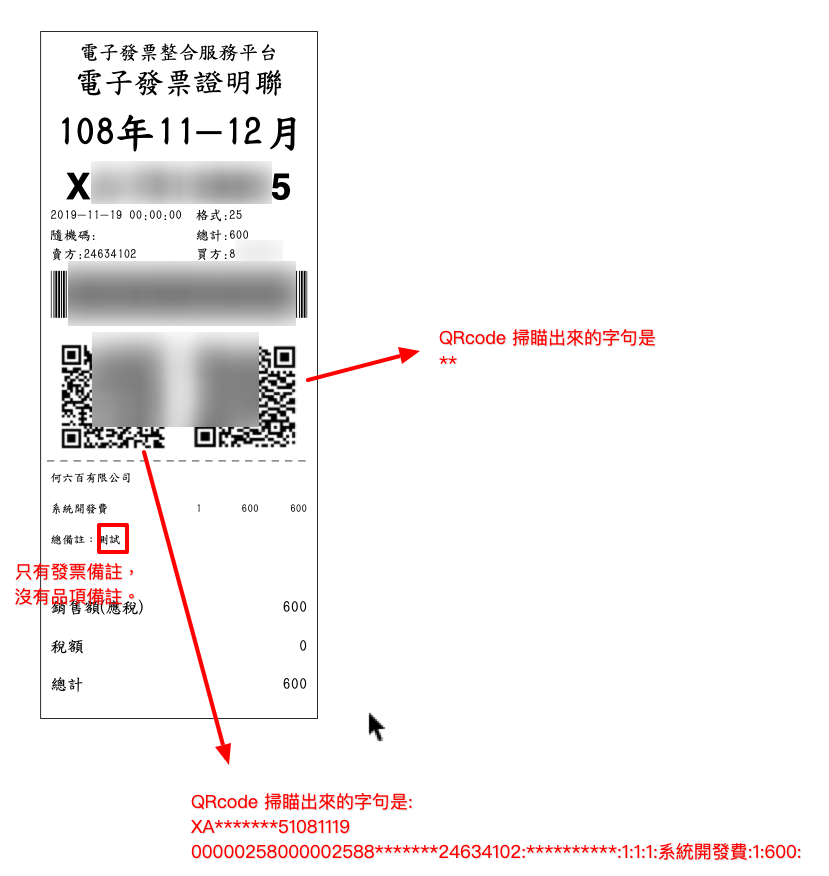
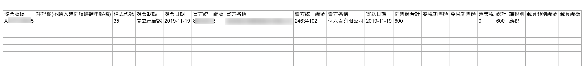

.. _發票查詢/列印/下載:

發票查詢/列印/下載
...............................................................................

路徑位置: *營業人功能選單 > 查詢與下載 > 發票查詢/列印/下載* 。

已發立完成的電子發票，包含「多元發票」或「線上銷售發票」都可以在這裡查詢到。\
若是別的賣家開給你的進項發票，在這裡也可以查詢到。

    點選「線上查詢」

查詢分兩種:

* 線上查詢
* 非即時查詢

前者的查詢結果會立即顯示在網頁上，而第 2 種方法，則是先下條件後，\
待一段時間再回來看查詢結果，通常是在巨量紀錄上使用的。

    發票日期為必要查詢條件

選擇「發票日期」區間後，按下「查詢」按鈕。

    發票列表

在電子發票列表上，勾選目標紀錄，可對該目標進行「下載PDF檔」、「下載PDF檔(A5)」、「下載電子發票證明聯(5.7)」或是「下載Excel檔」。不同格式範例如下:

    PDF 檔

    PDF 檔(A5)

    電子發票證明聯(5.7)

    Excel

可自行寄送「PDF 檔」、「PDF(A5) 檔」或「電子發票證明聯(5.7)」格式的電子檔給買受人。

.. note::

    **請注意** ，開立「自行交付存證」的電子發票後，一定要另外寄電子檔通知買受人，
    不然買受人是不會知曉有這一筆交易。就像開立三聯式發票後，
    把扣抵聯、收執聯放進自己的抽屜中，這樣只有天知、地知、你知及稅務單位知。