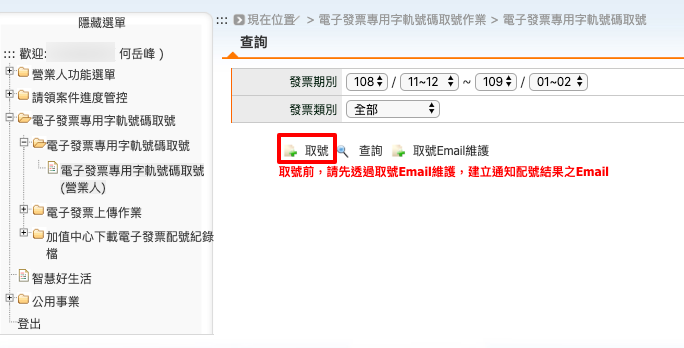
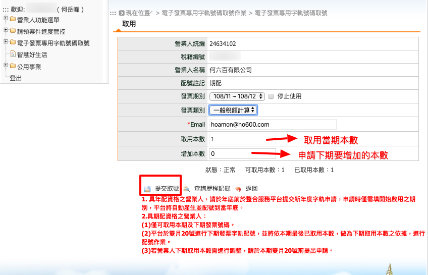

.. _電子發票專用字軌號碼取號(營業人):

電子發票專用字軌號碼取號(營業人)
...............................................................................

路徑位置: *電子發票專用字軌號碼取號 > 電子發票專用字軌號碼取號 > 電子發票專用字軌號碼取號(營業人)* 。

請直接點選「取號」按鈕。

選擇當下的「發票期別」及「發票類別」，並決定要取用的本數。以敝司為例，\
營業項目多為 B2B 類型，所以每個月開不到 10 張發票，所以當初在「申請電子發票字軌號碼」時，\
只設定每期(2個月) 1 本。

確認「取用本數」後，即可按下「提交取號」按鈕。成功的話，即看到頁面出現「已啟用本數: x」的資訊。

若考量每期本數將不敷使用，可在當期雙數月的 20 號之前，提出「增加本數」的申請。