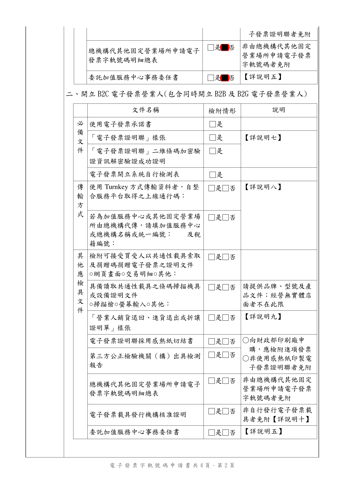
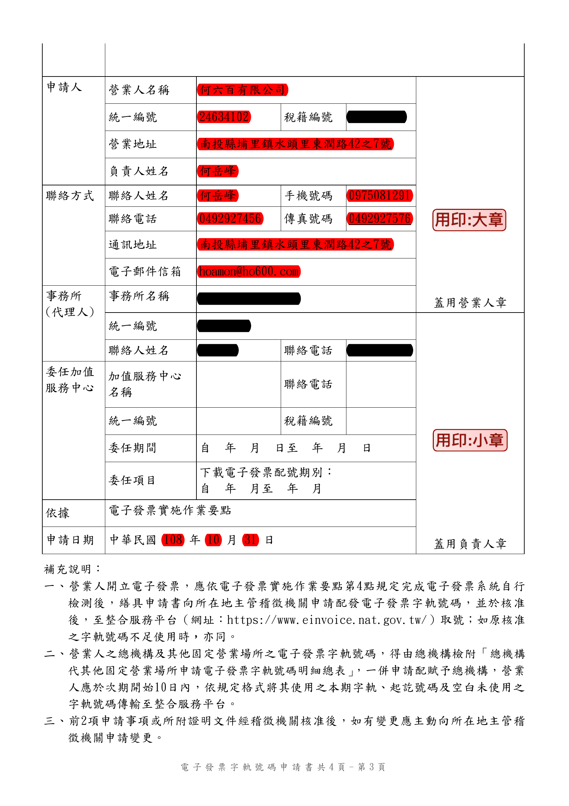
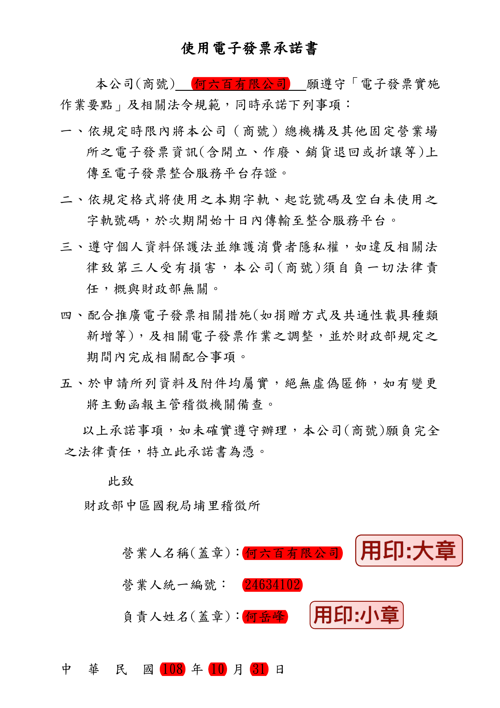

營業人辦理電子發票相關業務
===============================================================================

一般來說，本文中的「營業人」身份代換成一般組織、團獨、政府機關後，只須在操作步驟上，\
把「工商憑證」換成相對應的「XCA 憑證」或「GCA 憑證」。

必須使用憑證的理由
-------------------------------------------------------------------------------

電子發票與傳統紙本發票相比，可以「簡化成一堆文字、數字」而己，不須要列印成紙本，\
用 PDF 或是圖檔形式的電子檔足以擔任「電子發票」讓買受人核銷、向稅務機關申報。

那麼，我們這些有「數位專長」的人，是不是可以「破解電子發票格式」，\
然後就「任意代表台積電開一張發票給聯電」呢?

**當然不行!**

這「憑證」的目的，就是在確保「電子發票」不會「被偽造」且「無法被否認」。

在建立一張合乎電子發票規範的數位訊息後，非得用憑證為這串數位訊息作一個簽章，\
而憑證是「通往現實世界的標誌」，自然人向戶政機關、\
營利單位、非營利組織、政府機關向所屬管理機關申請憑證，在申請的當下，\
由「管理機關」認證過「什麼人或什麼法人」要使用憑證，\
才授權「他/她/它」可使用該專屬憑證。

這樣該憑證在那張電子發票上所簽署的簽章，即可代表是「什麼人或什麼法人」所開出的，\
於此確保了「電子發票的開立人」是對的人，其「發票內容」也被開立人自證之。

所以要開立合法、有效的「電子發票」，其必要條件就是得使用至少一張憑證，\
而申辦自然人憑證的工本費目前是 250 元，工商憑證的工本費為 420 元。

營業人利用「電子發票整合服務平台」開立 B2B 電子發票
-------------------------------------------------------------------------------

本節說明的電子發票開立工作，限定是商家對商家(B2B)的這一種，\
也可把商家換成組織、團體或政府機關，\
交易對象主要是有「統編」的買家對上有「統編」的賣家。\

利用財政部自己所推出的「整合服務平台」，\
賣家無須開發自己的「開發票系統」，直接用「整合服務平台」就能開發票給買受人(買家)了。

本節主要目標，僅在教學如何使用「電子發票整合服務平台」來操作「線上銷項發票作業」\
及「多元發票交付」，如下圖紅框處:

.. figure:: merchant_only_b2b/merchant_only_b2b_operations.png 

在「線上銷項發票作業」中的「開立發票」作業中，\
其發票買受人須在它的「電子發票整合平台」上設定「發票接受方式」，\
而在「多元發票交付」的「開立存證發票」作業上，\
其發票買受人可為任何擁有統編的公司、非營利組織、政府單位。

事前準備事項:

* 自然人憑證或工商憑證
* 電子發票字軌申請書
* 使用電子發票承諾書

.. figure:: merchant_only_b2b/serial_number_01.png

* 受理機關: 請填寫貴司所屬之分局、稽徵所或服務處，敝司乃屬「財政部中區國稅局埔里稽徵所」
* 一般稅額計算/首次申請 1 組: 1 組會有 50 個發票號碼，此數值請按貴司慣例自行評斷
* 配號方式: 期配。 1 期為 2 個月，也是目前敝司購買紙本發票的習慣
* 申請整合服務平台帳號、密碼: 因為敝司採用「工商憑證」自行到「整合服務平台」開立帳號了，\
  所以此部份設定未勾選
* 委任加值服務中心下載…: 本節教學乃以營業人本身為操作主體，所以無須委任加值服務中心
* 本節操作乃營業人用最精簡方式開立電子發票，所以在檢具文件方面，只須要提供「電子發票承諾書」

申請人、聯絡方式、事務所、申請日期，請依貴司資料填寫，並蓋大章、小章。

.. figure:: merchant_only_b2b/serial_number_04.png

再附上「使用電子發票承諾書」，內容主要是提醒每期未開立之空白發票，\
記得 **在次期 10 日內傳輸至整合服務平台** 。還有不要亂開發票，遵守相關法律，\
財政部是不會幫忙負責的…。這份承諾書 **強烈建議** 要全部瀏覽一遍，\
再蓋上貴司之大、小章。

以上兩份文件，可親送或郵寄到所屬營業稅管理單位。\
接下來，便坐等「電子發票字軌號碼」申請通過。

實際操作流程
^^^^^^^^^^^^^^^^^^^^^^^^^^^^^^^^^^^^^^^^^^^^^^^^^^^^^^^^^^^^^^^^^^^^^^^^^^^^^^^

營業人在 B2B 電子發票上的操作，所關係的頁面如下:

* 營業人功能選單
    * 系統設定
        * 公司基本資料
    * 基本資料
        * 產品單位設定
        * 產品資料維護
        * 交易對象資料維護
        * 主憑證資料登錄作業
        * 營業人接收方式設定
        * 營業人電子發票資格查詢
    * 線上銷項發票作業
* 電子發票專用字軌號碼取號
    