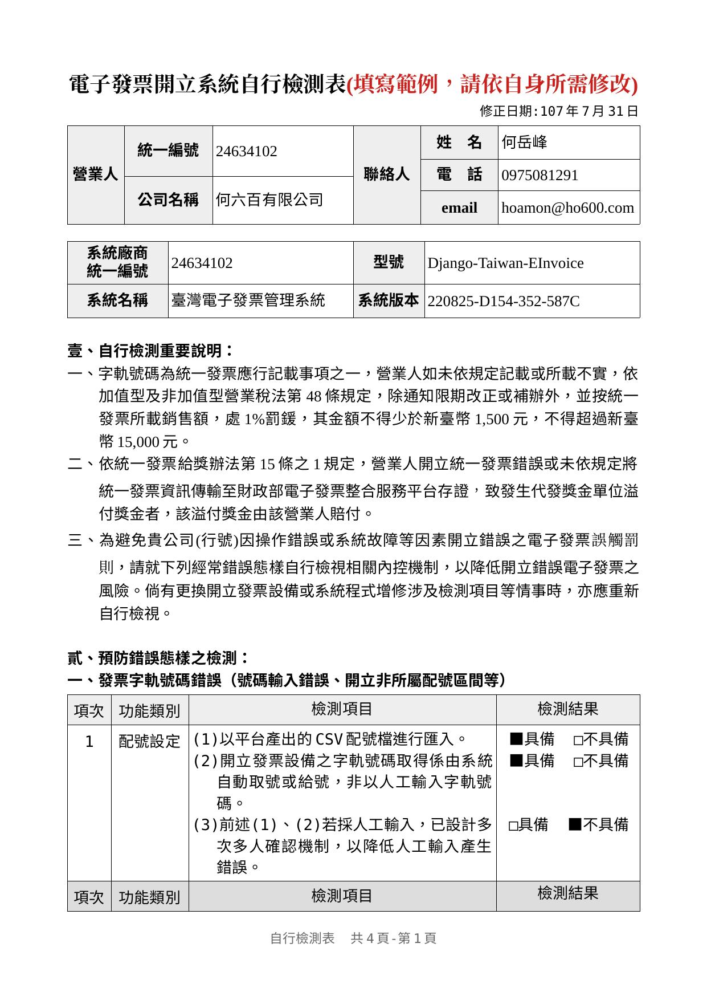
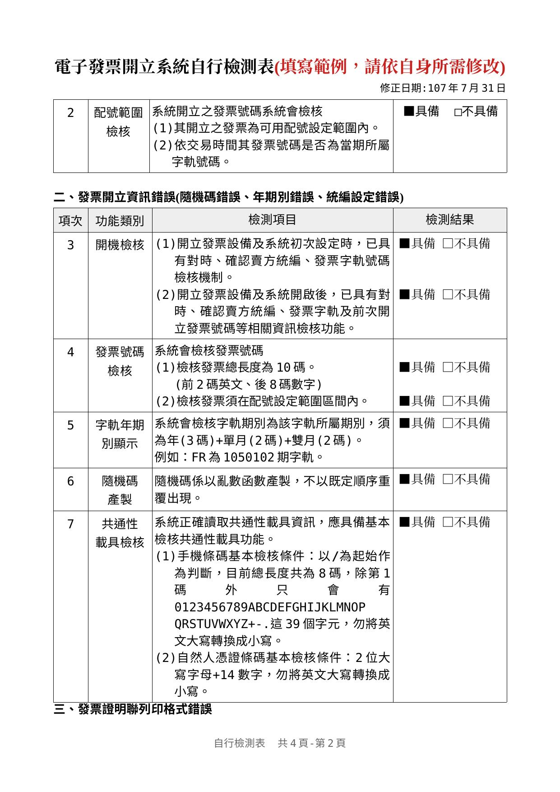
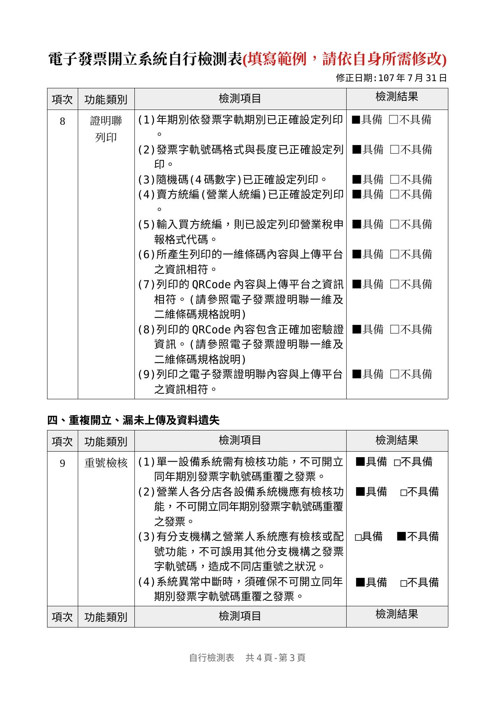
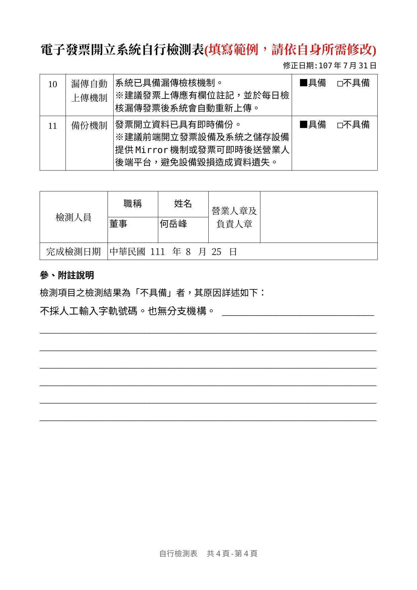

申請電子發票字軌號碼前的開立系統自行檢測作業
==============================================================================

在填寫「電子發票字軌號碼申請書」時，須附上「電子發票開立系統自行檢測表」，自行檢測表全文如下:

    第 1 頁

    第 2 頁

    第 3 頁

    第 4 頁

檢測人員須對 4 頁的檢測內容全部了解並確認檢測成功。