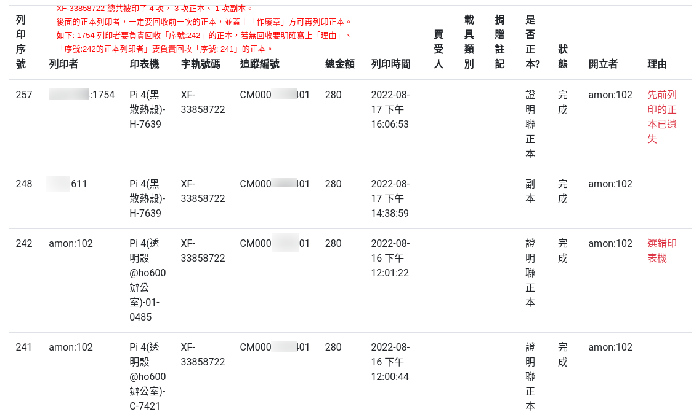
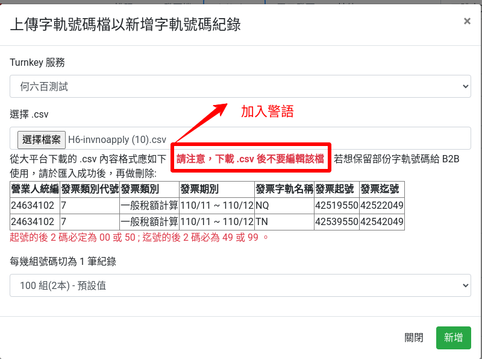
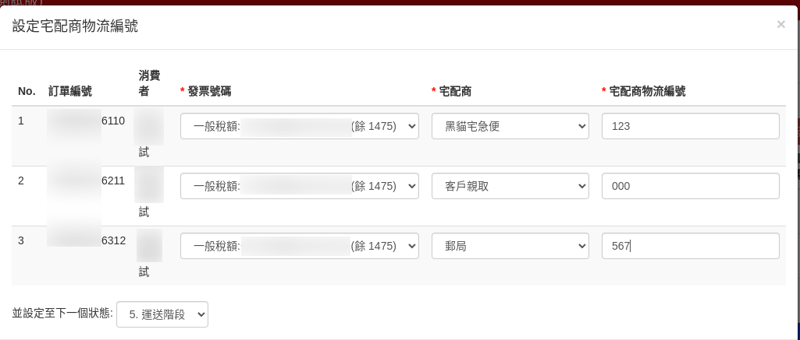
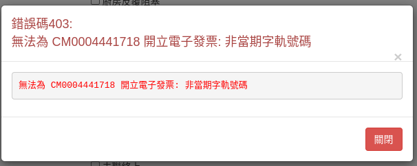
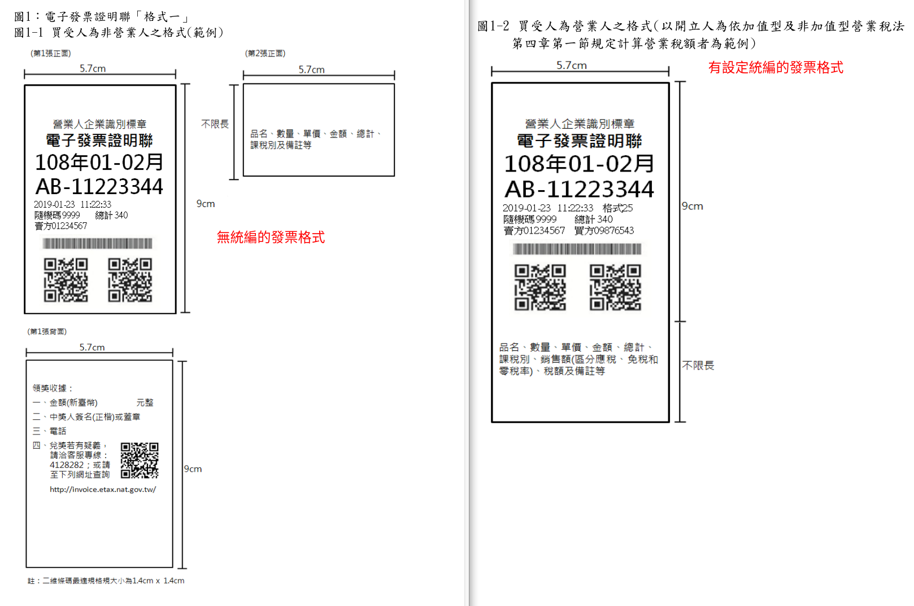
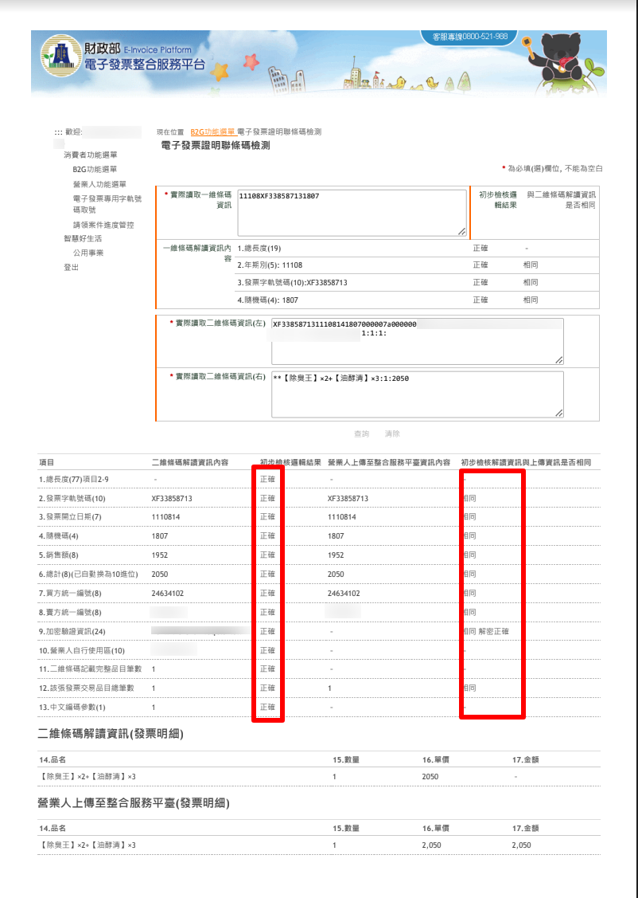
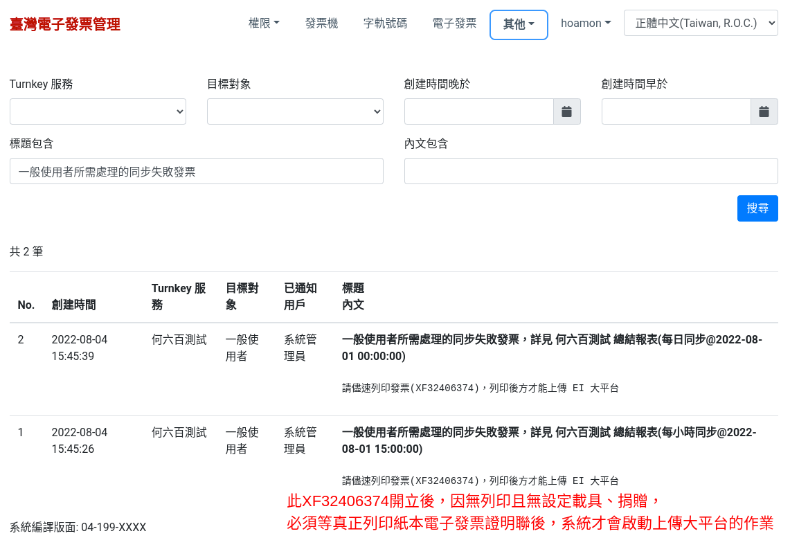

申請電子發票字軌號碼前的開立系統自行檢測作業
==============================================================================

在填寫「電子發票字軌號碼申請書」時，須附上「電子發票開立系統自行檢測表」，自行檢測表全文如下:

.. figure:: self_checklist_before_applying_track_no/001.jpeg
    :width: 600px

    第 1 頁

.. figure:: self_checklist_before_applying_track_no/002.jpeg
    :width: 600px

    第 2 頁

.. figure:: self_checklist_before_applying_track_no/003.jpeg
    :width: 600px

    第 3 頁

.. figure:: self_checklist_before_applying_track_no/004.jpeg
    :width: 600px

    第 4 頁

要確實完成自行檢測作業，表中紀錄的檢測人員須對 4 頁的檢測內容全部了解並確認檢測成功。\
其他工作人員則是依作業方式而須了解自身相關的檢測項目，\
如客服人員、出貨人員、會計人員、…等不同角色會涵蓋不同的電子發票相關作業，作業大致可分成 3 部份:

1. 字軌號碼設定: 一般是會計人員的工作
2. 開立電子發票: 可能是客服人員或是出貨人員
3. 列印電子發票證明聯: 可能是客服人員或是出貨人員

不同作業所相關的檢測項目列表如下，只要是有「經手該項作業，就須了解相對應的檢測項目」：

==================== ===================== ================= ===================
檢測項目\\作業       字軌號碼設定          開立電子發票      列印電子發票證明聯
==================== ===================== ================= ===================
壹                   ○                     ○                 ○     
貳之一               ○
貳之二                                     ○
貳之三                                                       ○
貳之四                                     ○                 ○
==================== ===================== ================= ===================

檢測項目: 壹
-------------------------------------------------------------------------------

須先確實閱讀「自行檢測重要說明」，了解「電子發票作業是於法有據」的，作業有缺失即有違法之虞::

    一、字軌號碼為統一發票應行記載事項之一，營業人如未依規定記載或所載不實，
    依加值型及非加值型營業稅法第48條規定，除通知限期改正或補辦外，
    並按統一發票所載銷售額，處1%罰鍰，其金額不得少於新臺幣1,500元，
    不得超過新臺幣15,000元。

若是誤用錯誤字軌來開立電子發票，如: 字軌號碼非當期或已配發給其他營業人，最高罰新臺幣 15,000 元。

第二條::

    二、依統一發票給獎辦法第15條之1規定，營業人開立統一發票錯誤或
    未依規定將統一發票資訊傳輸至財政部電子發票整合服務平台存證，
    致發生代發獎金單位溢付獎金者，該溢付獎金由該營業人賠付。

小平台(電商系統)開立電子發票並交給顧客後，卻未上傳該張發票資料至大平台(財政部系統)，\
最終到了統一發票開獎日，該發票又中獎，因為對顧客(善意第三人)而言，她/他拿到的發票是有效、合法格式的發票，\
財政部是會同意讓她/他領獎的，但事後因該發票資料未存在於大平台上，就換財政部向貴司請求賠償，顧客中 1000 萬，\
那貴司就要賠付 1000 萬。

本系統雖然有設定自動排程: 將開立後超過 1 小時未同步的發票設定警示。還是建議開立電子發票的人員，\
應在「完成開立」後的若干時間(約 1~2 小時)後，再次回到小平台檢查「是否有同步成功」，\
若還是處於未同步狀態，就要通知系統管理人員即早介入除錯。

另一種可能的錯誤，則是存在多張證明聯正本，除顧客正常持有外，還流出給其他人。若其他人先兌獎，致使顧客無法兌獎，\
該顧客獎金也是得由貴司賠付，貴司再於事後持證據向其他人索賠。\
要避免此種缺失，作業人員在「再列印正本」前，先確實在舊的正本證明聯蓋上「作廢章」並交由會計保管，\
方可「再列印正本」。本系統也會登記每一份正本的列印者為誰，便利事後究責。

.. warning::

    另外要注意的是，若有顧客因手上的證明聯正本汙損無法兌獎而要求貴司再次列印電子發票證明聯正本，\
    於法貴司必須拒絕，僅能提供副本(證明聯上文句會顯示「補印」2字)。\
    顧客可同時持汙損正本加清晰副本兌獎。

    除紀錄正本列印者外，也會紀錄副本列印者

第三條::

    三、為避免貴公司(行號)因操作錯誤或系統故障等因素開立錯誤之電子發票誤觸罰則，
    請就下列經常錯誤態樣自行檢視相關內控機制，以降低開立錯誤電子發票之風險。
    倘有更換開立發票設備或系統程式增修涉及檢測項目等情事時，亦應重新自行檢視。

這是提醒: 小平台的功能是會增加的，程式若有改版、更新，就應該再確認「本表所有的檢測項目」。

額外補充說明::

    電子發票與現行二聯、三聯、收銀機式發票、…是並存的，代表適用現行發票的法律，
    大部份也適用於電子發票上，而發票就是一種會計憑證，所以在「二聯、三聯、收銀機式發票、…」
    犯的錯，發生在「電子發票」上，那罰則也會差不多。

電子發票開立內容可能會出的錯是「金額錯誤」及「品項錯誤」，賣 1,000 元的商品，結果電子發票金額記載的是 10,000 元；\
又或是實際銷售 920 元的商品加 80 元的運費，發票內容明細卻變成 920 元的明細加 80 元的商品。\
所以「開立人」或是「列印人」都該檢查經手的每一張電子發票內容，有錯就必須作廢重開，如果是系統錯誤導致作廢重開還是錯的，\
那就考慮改以手開二聯或是三聯發票。

檢測項目: 貳之一
-------------------------------------------------------------------------------

1. 配號設定:
    (1) [具備] 以平台產出的 CSV 配號檔進行匯入。
    (2) [具備] 開立發票設備之字軌號碼取得係由系統自動取號或給號，非以人工輸入字軌號碼。
    (3) [否] 前述(1)、(2)若採人工輸入，已設計多次多人確認機制，以降低人工輸入產生錯誤。

本系統僅提供「上傳 .csv」功能來匯入字軌號碼，並不提供人工手動輸入的作業方式:

    上傳字軌號碼檔頁面有強調警語: 「下載 .csv 後不要編輯該檔」

開立電子發票的頁面，也僅提供「當期空白號碼餘…張」的選項，開立人無須也不能手動輸入「字軌號碼」:

    開立人無須也不能手動輸入「字軌號碼」

2. 配號範圍檢核:
    (1) [具備] 其開立之發票為可用配號設定範圍內。
    (2) [具備] 依交易時間其發票號碼是否為當期所屬字軌號碼。

配號是由系統自動選擇的，所選擇的號碼一定會介於起號與迄號之間。而挑選當期字軌號碼時，\
僅有一個時機可能會出現「非當期字軌號碼」的錯誤訊息提示如下:

    非當期字軌號碼的錯誤提示

若在雙數月最後 1 天接近單數月 1 日 0 時作「開立電子發票」，可能先抓取雙數月用字軌的選項，\
待真正開立時，系統時間已進入單數月 1 日 0 時之後，所以系統會跳出錯誤提示。\
此時，只要再點一次「開立電子發票」視窗，讓它重抓最新的「單數月字軌號碼」即可完成「開立發票」。

.. warning::

    本系統有特定限制「奇數月 1 日的 0 點 0 分到 0 點 3 分之間不能開立發票」，在此期間開立發票時，會顯示「非當期字軌號碼」的錯誤訊息。

檢測項目: 貳之二
-------------------------------------------------------------------------------

3. 開機檢核:
    (1) [具備] 開立發票設備及系統初次設定時，已具有對時、確認賣方統編、發票字軌號碼檢核機制。
    (2) [具備] 開立發票設備及系統開啟後，已具有對時、確認賣方統編、發票字軌及前次開立發票號碼等相關資訊檢核功能。

系統開立發票的作業是在「電商銷售系統」而不是在「發票機」上，所以只有 1 台伺服器作這個「開立發票作業」，\
伺服器也有做「自動校時同步」設定，賣方統編是在伺服器上完成初始設定即可，之後無須更改。\
發票字軌號碼檢核都是在伺服器上完成匯入作業的，不須把字軌號碼移到發票機上。

發票機是單純列印「電商銷售系統」傳來的「發票資訊」，發票資訊內容都是在小平台的單一伺服器上處理的。

4. 發票號碼檢核:
    (1) [具備] 檢核發票總長度為 10 碼。(前 2 碼英文、後 8 碼數字)
    (2) [具備] 檢核發票須在配號設定範圍區間內。

在小平台伺服器上選擇發票字軌號碼時，都有特定做「前 2 碼英文、後 8 碼數字」及「有無在配號設定範圍區間內」的檢查。

5. [具備] 字軌年期別顯示

字軌年期別是由字軌號碼起迄時間自動計算出來，不須人工輸入。

6. 隨機碼產製

使用亂數函式製作，並會檢查該隨機碼是否與近 1000 張發票隨機碼重覆，有重覆會再取新的亂數隨機碼。

7. 共通性載具檢核
    (1) [具備] 手機條碼
    (2) [具備] 自然人憑證條碼

手機條碼除驗證格式外，也使用「電子發票營業人應用API」驗證是否有註冊。\
自然人憑證條碼則單純檢查是否由「前 2 碼英文，後 14 碼數字」所組成。

檢測項目: 貳之三
-------------------------------------------------------------------------------

8. 證明聯列印
    (1) [具備] 年期別依發票字軌期別已正確設定列印。
    (2) [具備] 發票字軌號碼格式與長度已正確設定列印。
    (3) [具備] 隨機碼(4 碼數字)已正確設定列印。
    (4) [具備] 賣方統編(營業人統編)已正確設定列印。
    (5) [具備] 輸入買方統編，則已設定列印營業稅申報格式代碼。
    (6) [具備] 所產生列印的一維條碼內容與上傳平台之資訊相符。
    (7) [具備] 列印的 QRCode 內容與上傳平台之資訊相符。(請參照電子發票證明聯一維及二維條碼規格說明)
    (8) [具備] 列印的 QRCode 內容包含正確加密驗證資訊。(請參照電子發票證明聯一維及二維條碼規格說明)
    (9) [具備] 列印之電子發票證明聯內容與上傳平台之資訊相符。

1~5 請自行列印電子發票證明聯後比對，「電子發票實施作業要點」中的發票格式範例如下:

    右邊為買受人為營業人的格式

6~9 則須登入「大平台」後，進入「B2G功能選單 >電子發票證明聯條碼檢測」頁面，將「電子發票」上的一維條碼、左QRCode、右QRCode資訊輸入後查詢，可得:

    都得到「正確」、「相同」即可

檢測項目: 貳之四
-------------------------------------------------------------------------------

9. 重號檢核:
    (1) [具備] 單一設備系統需有檢核功能，不可開立同年期別發票字軌號碼重覆之發票。
    (2) [具備] 營業人各分店各設備系統機應有檢核功能，不可開立同年期別發票字軌號碼重覆之發票。
    (3) [否] 有分支機構之營業人系統應有檢核或配號功能，不可誤用其他分支機構之發票字軌號碼，造成不同店重號之狀況。
    (4) [具備] 系統異常中斷時，須確保不可開立同年期別發票字軌號碼重覆之發票。

系統是在單一伺服器上開立發票，其發票號碼存入資料庫時，會有 unique (惟一值)檢查，保證不會與舊紀錄重覆。\
本系統給公司中各部門使用時，也都是連上同一台伺服器。

當系統異常中斷時，若已開立電子發票，則會接受 unique 檢查，若未開立完成電子發票，\
則新開立電子發票也會拿先前的空白號碼來使用，不會有跳號情形。

10. [具備] 漏傳自動上傳機制

系統是「自動上傳已開立之電子發票」，預設是每 15 分鐘上傳 1 次，有設定載具、統編、捐贈的電子發票會自動上傳，\
而「索取紙本的電子發票」則是待「完成列印」後才會上傳。

系統在發票開立後，若超過 1 小時還未取得「已同步」的資訊，會自動產生警示通知使用者，如下:

    「索取紙本」的電子發票，若無完成列印，就不會上傳至大平台

11. [具備] 備份機制

系統在 AWS 雲端機房，所使用的資料庫系統位於 Multi-Zone ，同時有 2 台資料庫在運作，彼此之間有即時備份，且 2 台資料庫是處於不同物理位置的機房。